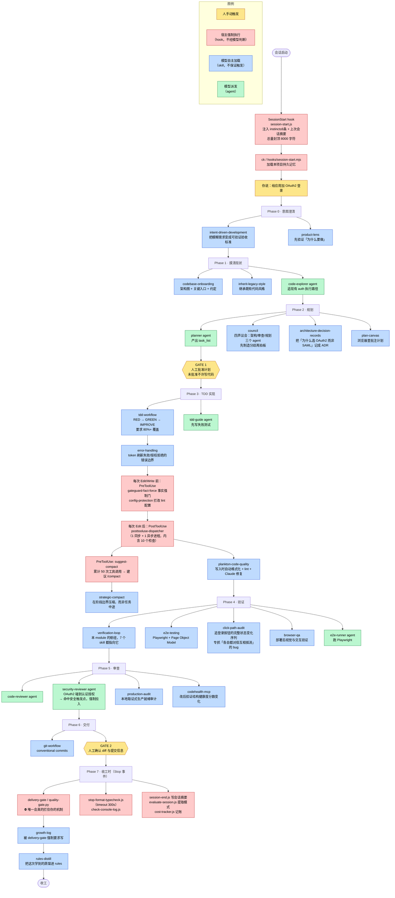
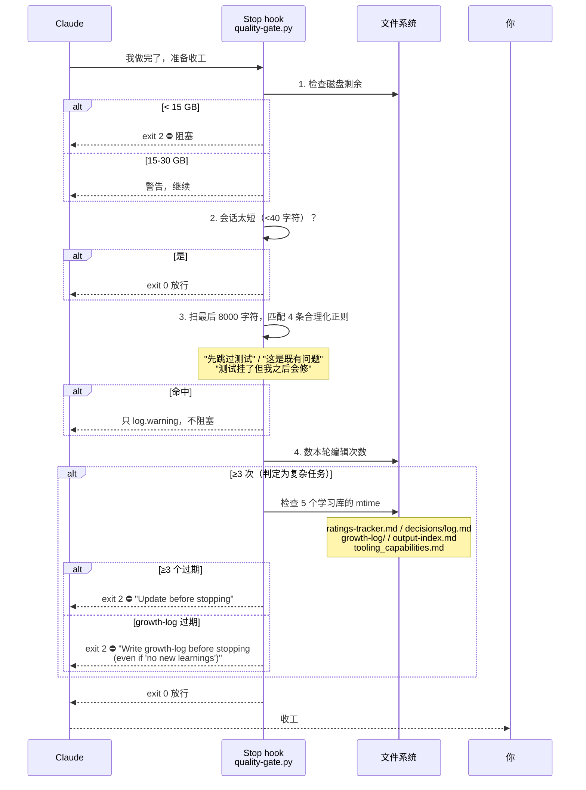

# workflow-quality 模块深度解析

> 对象：ECC v2.1.0 `manifests/install-modules.json` 里的 `workflow-quality` module
> 分析日期：2026-08-03　|　全部数据由脚本从仓库实测提取，非读 README
> 关联：[[01 ECC 工程化流程与工具分类]]（流程骨架）、[[解剖03 Skills 体系]]（这份是它的深挖版）

---

## 为什么这个 module 特殊

`manifests/install-modules.json` 里 34 个 module，**只有 6 个标了 `defaultInstall: true`**，其中**唯一一个 `kind: skills` 的就是它**：

```
workflow-quality | kind=skills | cost=medium | stability=stable | defaultInstall=true | 43 个 skill
```

换句话说：**281 个 skill 里，作者默认只推这 43 个，其余 238 个全部要 opt-in。** 这 43 个就是 ECC 认为"任何项目都该有"的那一层。

它们的常驻上下文成本是 **2,715 token/轮**（name + description），对比全装 281 个的 15,193 token——这也是 [[03 ECC 组件筛选报告（基于 Issue 实证）]] 里"差 7 倍"那个数字的来源。

---

## 一 · 文件构成：36 个单文件 vs 7 个带可执行部分

**这个区分很重要**：只有 SKILL.md 的 skill 是纯"写给模型看的指令"，模型读完照做；带附加文件的 skill 里有**真正能跑的代码**，是 ECC 里少数"不只靠模型自觉"的部分。

### 7 个带附加文件的（按文件数排序）

| skill | SKILL.md | 总文件 | 附加内容 | 可执行部分干什么 |
|---|---|---|---|---|
| **continuous-learning-v2** | 362 行 | **12** | `agents/observer-loop.sh`、`agents/observer.md`、`agents/session-guardian.sh`、`agents/start-observer.sh`、`config.json`、`hooks/observe.sh`、`scripts/detect-project.sh`、`scripts/instinct-cli.py`、`scripts/lib/homunculus-dir.sh`、`scripts/migrate-homunculus.sh`、`scripts/test_parse_instinct.py` | 一整套后台守护进程：`observe.sh` 挂 hook 记录工具调用 → `observer-loop.sh` 起 Haiku 子进程分析 → `instinct-cli.py` 管理 instinct 文件。⚠️ 但 `config.json` 里 `observer.enabled: false`，**默认不跑** |
| **ck** | 149 行 | **10** | `commands/{forget,info,init,list,migrate,resume,save,shared}.mjs`、`hooks/session-start.mjs` | 一套 Node 实现的每项目持久记忆 CLI，`session-start.mjs` 在会话启动时自动加载项目上下文 |
| **agent-self-evaluation** | 183 行 | **7** | `scripts/evaluate.py`、`references/evaluation-criteria.md`、`references/hook-integration.md`、`templates/evaluation-report.md`、`examples/high-score-example.md`、`examples/low-score-example.md` | 5 轴自评（准确性/完整性/清晰度/可执行性/简洁度）的评分脚本 + 评分标准 + 高低分范例。**是 43 个里唯一用了 references/ + templates/ + examples/ 三件套的**，最接近 Anthropic 官方 skill 规范 |
| **skill-stocktake** | 196 行 | **4** | `scripts/scan.sh`、`scripts/quick-diff.sh`、`scripts/save-results.sh` | 技能库存审计的三个脚本：全量扫描 / 只扫改动过的 / 存档结果。**[#1213](https://github.com/affaan-m/ECC/issues/1213) 那份 88-skill 审计就是用它跑出来的** |
| **rules-distill** | 266 行 | **3** | `scripts/scan-rules.sh`、`scripts/scan-skills.sh` | 扫描现有 rules 和 skills，提取横切原则 |
| **continuous-learning**（v1） | 133 行 | **3** | `config.json`、`evaluate-session.sh` | v1 的 Stop hook 提取器。**description 开头就写着 `[DEPRECATED - use continuous-learning-v2]`，但仍在默认安装面里** |
| **delivery-gate** | 127 行 | **2** | `hooks/quality-gate.py`（220 行） | **43 个里唯一一个自带"会真的拦住你"的 hook**，详见第四节 |

### 36 个纯 SKILL.md 单文件

按行数排序（行数≈内容密度）：

`windows-desktop-e2e` 889 · `git-workflow` 717 · `tdd-workflow` 584 · `ai-regression-testing` 387 · `configure-ecc` 386 · `error-handling` 378 · `intent-driven-development` 361 · `e2e-testing` 328 · `santa-method` 308 · `eval-harness` 272 · `code-tour` 255 · `click-path-audit` 246 · `plankton-code-quality` 238 · `codebase-onboarding` 235 · `agent-sort` 217 · `iterative-retrieval` 213 · `production-audit` 208 · `council` 205 · `ecc-guide` 191 · `architecture-decision-records` 181 · `codehealth-mcp` 168 · `inherit-legacy-style` 158 · `agent-introspection-debugging` 155 · `plan-canvas` 154 · `ecc-recipes` 150 · `loop-design-check` 144 · `strategic-compact` 143 · `skill-scout` 142 · `context-budget` 137 · `verification-loop` 130 · `hookify-rules` 129 · `growth-log` 129 · `config-gc` 121 · `browser-qa` 106 · `product-lens` 94 · `repo-scan` 80

> 🔑 `windows-desktop-e2e` 889 行是全 module 最长的，讲用 pywinauto 测 WPF/WinForms/Win32/Qt 桌面应用——**这东西被塞进"任何项目都该装"的默认集，说明这个默认集的筛选标准并不严格**。

---

## 二 · 43 个 skill 按职能分六组

### A 组 · 开发主流程质量（14 个）

| skill                   | 干什么                                                     | 文件       |
| ----------------------- | ------------------------------------------------------- | -------- |
| `tdd-workflow`          | 强制 TDD：RED → GREEN → IMPROVE，要求 80%+ 覆盖率（含单元/集成/E2E）    | 单        |
| `verification-loop`     | 会话级持续验证系统                                               | 单        |
| `eval-harness`          | 形式化评估框架，实现 eval-driven development（EDD）                 | 单        |
| `e2e-testing`           | Playwright E2E 模式、Page Object Model、CI/CD 集成、flaky 测试策略 | 单        |
| `browser-qa`            | 部署后用浏览器自动化做视觉与交互验证                                      | 单        |
| `windows-desktop-e2e`   | Windows 原生桌面应用 E2E（pywinauto + UI Automation）           | 单        |
| `ai-regression-testing` | AI 辅助开发的回归测试：沙箱模式 API 测试（不依赖数据库）、自动 bug 检查              | 单        |
| `click-path-audit`      | 追踪每个用户可点击的触点走完整状态变化序列，**专抓"每个函数单独都对但互相抵消"的 bug**        | 单        |
| `production-audit`      | 本地取证式生产就绪审计（不把仓库数据外发）                                   | 单        |
| `codehealth-mcp`        | 通过 CodeScene MCP 做实时结构健康度，改前审查、改后验证分数变化、卡住 commit/PR    | 单        |
| `plankton-code-quality` | 写入时质量强制：每次文件编辑触发自动格式化、lint、Claude 修复                    | 单        |
| `error-handling`        | TypeScript/Python/Go 的健壮错误处理：类型化错误、错误边界、重试、熔断           | 单        |
| `git-workflow`          | 分支策略、提交约定、merge vs rebase、冲突解决                          | 单        |
| **`delivery-gate`**     | **Stop hook：质检不过就不让 Claude 收工**。检测合理化开脱话术、过期学习日志        | **多(2)** |

### B 组 · 学习与记忆（6 个）

| skill                     | 干什么                                                                    | 文件    |
| ------------------------- | ---------------------------------------------------------------------- | ----- |
| `continuous-learning-v2`  | instinct 学习系统：hook 观察会话 → 生成带置信度的原子 instinct → 演化成 skill/command/agent | 多(12) |
| `continuous-learning`（v1） | **已标 DEPRECATED**，Stop hook 提取器                                        | 多(3)  |
| `growth-log`              | 教你怎么写"成长日志"——提取可复用模式，**不是写日记**                                         | 单     |
| `ck`                      | 每项目持久记忆：会话启动自动加载项目上下文，跟踪 git 活动                                        | 多(10) |
| `iterative-retrieval`     | 解决 subagent 上下文难题的渐进式检索模式（对应长篇指南那一节）                                   | 单     |
| `rules-distill`           | 扫 skills 提取横切原则，蒸馏成 rules 文件                                           | 多(3)  |

### C 组 · 元治理与自我审计（12 个）— **对已有大量自建 skill 的人最有用的一组**

| skill                           | 干什么                                                                        | 文件   |
| ------------------------------- | -------------------------------------------------------------------------- | ---- |
| `skill-stocktake`               | 技能与命令质量审计，支持快速扫描（只看改动）和全量盘点两种模式                                            | 多(4) |
| `config-gc`                     | 配置垃圾回收：扫 `~/.claude`（skills/memory/hooks/permissions/MCP/caches）找冗余、陈旧、孤儿项 | 单    |
| `skill-scout`                   | 建新 skill 之前先搜本地/市场/GitHub/网页有没有现成的                                         | 单    |
| `context-budget`                | 审计上下文窗口消耗（agents/skills/MCP/rules），找臃肿并给出优先级排序的省 token 方案                  | 单    |
| `agent-self-evaluation`         | 完成任务后按 5 轴自评并给出具体证据                                                        | 多(7) |
| `agent-introspection-debugging` | agent 失败后的结构化自我调试：捕获 → 诊断 → 受控恢复 → 内省报告                                    | 单    |
| `agent-sort`                    | 为特定仓库产出有证据支撑的 ECC 安装计划，把组件分进 DAILY / LIBRARY 两桶                            | 单    |
| `repo-scan`                     | 跨栈源码资产审计：分类每个文件、检出内嵌第三方库、按模块给四级结论                                          | 单    |
| `configure-ecc`                 | 交互式安装向导（引用了 **49 个** 其它 skill 名）                                           | 单    |
| `ecc-guide`                     | 读实时仓库再回答"ECC 现在有什么"                                                        | 单    |
| `ecc-recipes`                   | 把描述的工作流映射到正确的命令组，带执行顺序和停止条件                                                | 单    |
| `hookify-rules`                 | 教你写 hookify 规则（对话式创建 hook）                                                 | 单    |

### D 组 · 规划与决策（7 个）

| skill                           | 干什么                                                                | 文件  |
| ------------------------------- | ------------------------------------------------------------------ | --- |
| `intent-driven-development`     | 把模糊/高影响的变更，在实现之前变成有界、可验证的验收标准                                      | 单   |
| `council`                       | 为模糊决策召开**四声议会**，先制造结构化的分歧再拍板                                       | 单   |
| `santa-method`                  | 多 agent 对抗验证 + 收敛循环：**两个独立审查 agent 都通过才放行**                        | 单   |
| `architecture-decision-records` | 把会话中的架构决策记成 ADR，自动侦测决策时刻                                           | 单   |
| `product-lens`                  | 建之前先验证"为什么"，压测产品方向                                                 | 单   |
| `loop-design-check`             | 设计目标导向的 agent 循环，并审查它会怎么出错（空转烧 token / Goodhart 式糊弄验证器 / 把错答案跑到收敛） | 单   |
| `plan-canvas`                   | 在本地浏览器画布里打开计划，人类批注元素、对话、批准或要求修改                                    | 单   |

### E 组 · 上手与导览（3 个）

| skill                  | 干什么                                        |
| ---------------------- | ------------------------------------------ |
| `codebase-onboarding`  | 分析陌生代码库，产出架构图 + 关键入口 + 约定 + 一份起步 CLAUDE.md |
| `code-tour`            | 生成 CodeTour `.tour` 文件——带真实文件行号锚点的分步导览     |
| `inherit-legacy-style` | 让 AI 继承手写老项目的既有风格                          |

### F 组 · 上下文管理（1 个）

| skill               | 干什么                         |
| ------------------- | --------------------------- |
| `strategic-compact` | 在逻辑节点建议手动压缩，而不是让自动压缩在任务中途乱切 |

---

## 三 · 协同关系：必须区分「实锤」和「纸面」

这是本次深挖最重要的发现。**"skill 和 hook/agent 协同"分两种，可靠性差一个数量级。**

### ① 实锤协同：hook 真的会去调 skill —— 只有 3 个

我 grep 了 `hooks/hooks.json` 和 `scripts/hooks/*.js`（48 个脚本），**43 个 skill 里只有 3 个被 hook 层真正引用**：

| skill                    | 被谁引用                                                                                             | 机制                                                   |
| ------------------------ | ------------------------------------------------------------------------------------------------ | ---------------------------------------------------- |
| `continuous-learning`    | `hooks.json`、`scripts/hooks/evaluate-session.js`、`observe-runner.js`、`posttooluse-dispatcher.js` | Stop hook 调 `evaluate-session` 提取模式                  |
| `continuous-learning-v2` | `scripts/hooks/observe-runner.js`                                                                | PreToolUse/PostToolUse 观察器把工具调用记进 observations.jsonl |
| `plan-canvas`            | `hooks.json`、`scripts/hooks/plan-canvas-sessions.js`                                             | SessionStart 注册 plan canvas 会话                       |
| `ck`                     | `hooks.json`（自带 `hooks/session-start.mjs`）                                                       | SessionStart 自动加载项目记忆                                |

> 🔑 **剩下 39 个 skill 全靠模型自主判断加载**（读 description 觉得相关才展开）。这意味着：**你装了它们不等于它们会生效。** 一个 skill 是否被用上，取决于模型这一轮有没有认为它相关。

### ② 纸面协同：SKILL.md 正文里写"要用某个 agent / hook"

这类靠模型照着执行，不保证。实测提取如下：

**引用了 agent 的 skill（只有 6 个）**：

| skill | 指名要用的 agent |
|---|---|
| `council` | `architect`、`code-reviewer`、`planner`（四声议会的三个声音） |
| `code-tour` | `architect`、`security-reviewer` |
| `architecture-decision-records` | `planner` |
| `context-budget` | `planner` |
| `plankton-code-quality` | `security-reviewer` |

> 43 个 skill 里只有 5 个点名了 agent，且集中在 `architect` / `planner` / `code-reviewer` / `security-reviewer` 这 4 个——**正好是 [[01 ECC 工程化流程与工具分类]] 里 orch-pipeline 的 agent 映射表主力**。

**声明了 hook 事件的 skill（10 个）**：

| skill | hook 事件 | 对应 hook 脚本 |
|---|---|---|
| `continuous-learning-v2` | PreToolUse, PostToolUse, Stop | `observe-runner` |
| `continuous-learning` | PreToolUse, PostToolUse, Stop | `evaluate-session` |
| `delivery-gate` | PreToolUse, **Stop** | 自带 `quality-gate.py` |
| `plankton-code-quality` | PreToolUse, PostToolUse, Stop | — |
| `strategic-compact` | PreToolUse | `suggest-compact` |
| `verification-loop` | PostToolUse | — |
| `inherit-legacy-style` | PreToolUse | — |
| `ck` | SessionStart | 自带 `session-start.mjs` |
| `agent-self-evaluation` | Stop | — |
| `growth-log` / `iterative-retrieval` / `ecc-recipes` / `configure-ecc` | Stop | — |

**引用了 command 的 skill**：`continuous-learning-v2` → `/evolve` `/instinct-status` `/instinct-import` `/instinct-export` `/projects` `/promote`；`ecc-guide` → `/harness-audit` `/project-init` `/security-scan` `/skill-create` `/skill-health`；`hookify-rules` → `/hookify` 四件套；`plan-canvas` → `/plan` `/code-review` `/plan-canvas`；`delivery-gate` / `codehealth-mcp` → `/quality-gate`；`tdd-workflow` → `/plan`；`config-gc` → `/projects`；`council` → `/save-session`

### ③ skill 之间的引用网（谁被引用最多）

被 module 内其它 skill 提到最多的：

- **`verification-loop`** ← `santa-method`、`plankton-code-quality`、`production-audit`、`codehealth-mcp`、`agent-self-evaluation`、`agent-introspection-debugging`、`delivery-gate`（**7 个**）
- **`continuous-learning`** ← `iterative-retrieval`、`skill-stocktake`、`strategic-compact`、`config-gc`、`agent-introspection-debugging`、`ecc-recipes`、`configure-ecc`（7 个，但它自己已 DEPRECATED）
- **`skill-stocktake`** ← `rules-distill`、`agent-sort`、`skill-scout`、`config-gc`（4 个）
- **`tdd-workflow`** ← `production-audit`、`codehealth-mcp`、`strategic-compact`（3 个）

> 🔑 `verification-loop` 是这个 module 的**事实枢纽**——七个 skill 都指向它。但它本身只有 130 行，且 [#1213](https://github.com/affaan-m/ECC/issues/1213) 指出它与 `springboot-verification` 结构高度重叠。**枢纽做得比外围薄。**

---

## 四 · delivery-gate：43 个里唯一会真的拦住你的机制

`skills/delivery-gate/hooks/quality-gate.py`（220 行 Python，挂 Stop 事件）。这是整个 module 里唯一"不靠模型自觉"的强制点，值得单独看。

### 它检测什么

**① 合理化开脱话术（4 条正则，只警告不阻塞）**

```python
RATIONALIZE = [
    r'(?:this|that)\s+is\s+a\s+pre[- ]existing\s+(?:issue|bug)\b(?!\s+(?:that|which|and))',
    r'skipping\s+(?:tests?|lint|coverage|type[- ]check)\s+for\s+now',
    r'(?:tests?|coverage)\s+(?:are|is)\s+(?:failing|broken)\s+but\s+(?:I|we)\s+(?:\'ll|can|will)\s+(?:fix|address|resolve|handle)',
    r'(?:not\s+addressing|won\'t\s+fix|leaving)\s+the\s+(?:failing|broken)\s+(?:tests?|builds?|integration\s+tests?)',
]
```

翻译过来就是它在抓这四句话：
- "这是既有问题"（言下之意不是我造成的）
- "先跳过测试/lint/覆盖率/类型检查"
- "测试挂了但我之后会修"
- "不处理那些失败的测试"

> 🔑 **这四条正则是整个 ECC 里我见过最诚实的设计**——它承认 AI 会给自己找台阶下，并且把这些台阶写成了正则。可以直接抄。

**② 硬阻塞条件（`sys.exit(2)`，Claude 无法收工）**

| 条件 | 阈值 |
|---|---|
| 磁盘剩余空间不足 | < 15 GB（另有 50 GB 提醒 / 30 GB 警告两级） |
| 复杂任务且 ≥3 个学习库过期 | 复杂 = 本轮 ≥3 次编辑 |
| **复杂任务且 `growth-log` 过期** | 提示原文："Write growth-log before stopping (even if 'no new learnings')" |

它监控 5 个"学习库"文件的 mtime：`ratings-tracker.md`、`decisions/log.md`、`growth-log/`、`output-index.md`、`tooling_capabilities.md`。

**③ 一处踩过坑的注释**

```python
# No memory dir — setup incomplete.
# Warn but DO NOT block: blocking here deadlocks new users
# who haven't created the memory directory yet.
```

新用户还没建 memory 目录时如果阻塞，会直接死锁——所以这里只警告。

### 对你的意义

`delivery-gate` 和 `growth-log` 是**强绑定**的：装了前者，你每次做完复杂改动都必须写 growth-log 才能让 Claude 停下。这是个双刃剑——**强制沉淀，但也强制打断**。

---

## 五 · 一个开发例子：给 Web 应用加 OAuth2 登录

假设 `workflow-quality` + `hooks-runtime` + `agents-core` 都装了，你在 Claude Code 里说"给这个应用加 OAuth2 登录"。下面是**实际会发生什么**，以及每一步是谁触发的。

### 主流程



### 收工那一刻的细节（delivery-gate 的三级判定）



### 这个例子暴露的三件事

**① 真正确定性发生的只有红色那些（hook）。** 蓝色的 skill 全部是"模型觉得相关才加载"——你装了 `click-path-audit` 不等于它会在 Phase 4 被想起来。43 个里只有 4 个（`continuous-learning` v1/v2、`plan-canvas`、`ck`）被 hook 层真正引用。

**② 同一个环节有多个功能重叠的 skill 在竞争。** Phase 4 验证阶段同时有 `verification-loop`、`e2e-testing`、`browser-qa`、`click-path-audit`、`production-audit`、`codehealth-mcp` 六个候选，加上 `ai-regression-testing` 和 `windows-desktop-e2e`。模型一次只会挑一两个，**挑哪个不可控**。

**③ 收工阶段的 hook 最密集也最容易卡住你。** Stop 事件上挂着 6 个 hook（含 `stop-format-typecheck` 的 300 秒超时），而 `delivery-gate` 会因为你没写 growth-log 直接 exit 2。

---

## 六 · 对你的取舍建议

结合 [[03 ECC 组件筛选报告（基于 Issue 实证）]] 的 issue 实证和你的实际情况（金融背景、不写传统代码、靠 AI 主导项目、已有 79 个自建 skill）：

### ⭐ 值得单取（C 组元治理为主）

| skill | 理由 | 证据强度 |
|---|---|---|
| `skill-stocktake` | 审你那 79 个 skill 的臃肿。**有公开产出物为证**（#1213 的 88-skill 审计） | 高 |
| `config-gc` | 扫 `~/.claude` 找冗余/陈旧/孤儿项 | 中 |
| `skill-scout` | 建新 skill 前先搜有没有现成的，和你的 skill-fetch 思路重合可对照 | 中 |
| `rules-distill` | A 组零负面最高分（7 issue），和你的 `/learn` 互补 | 中高 |
| `strategic-compact` | **全仓仅 2 条正面表态之一**，且 HN 上唯一那条用户表态点名的就是它 | 高 |
| `context-budget` | 审上下文消耗——但要知道**它的数字是模型"心算"的**（SKILL.md 原文用词 "mentally"） | 中（打折） |
| `council` | 四声议会制造结构化分歧，适合你做决策时用 | 中 |
| `growth-log` | 教怎么写"提取可复用模式"而不是日记，契合你的沉淀习惯 | 中 |

### ❌ 明确别装

| skill | 理由 |
|---|---|
| `continuous-learning`（v1） | **description 自己写着 DEPRECATED**，#1213 建议删除未采纳 |
| `continuous-learning-v2` | 全仓 bug 之王（35 句负面/31 个 issue），Windows 全坏、macOS 后台"失败会自我掩盖"、instinct 从不主动注入 |
| `delivery-gate` | 那 4 条合理化正则**思想值得抄**，但装上它意味着每次复杂改动不写 growth-log 就无法收工 |
| `windows-desktop-e2e` / `plankton-code-quality` / `codehealth-mcp` | 分别绑 Windows 桌面、外部 Plankton 工具、CodeScene MCP，你都不用 |
| A 组测试类（`tdd-workflow` / `e2e-testing` / `ai-regression-testing` / `click-path-audit` / `browser-qa`） | 你不写传统代码；`tdd-workflow` 另有 #1213 指出的"非常 TS/Next.js 专属却没标注"问题 |

### 🔧 只抄设计不装本体

1. **`delivery-gate` 的 4 条合理化正则**——把它们做进你自己的 Stop hook，抓 AI 给自己找台阶
2. **`click-path-audit` 的问题定义**——"每个函数单独都对但互相抵消"这类 bug 的追查思路
3. **`loop-design-check` 的三种循环失效模式**——空转烧 token / Goodhart 式糊弄验证器 / 把错答案跑到收敛
4. **`santa-method` 的收敛条件**——两个独立审查 agent 都通过才放行
