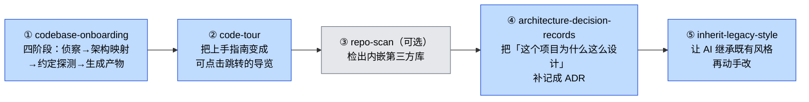
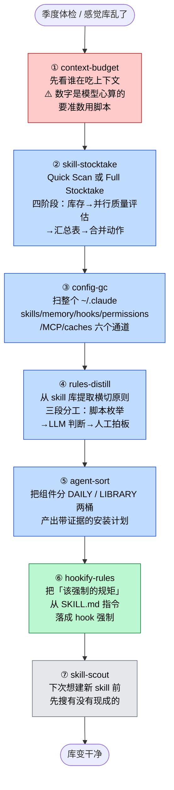

# workflow-quality 重点 skill 详解与调用时序

> 输入：你的 `重点关注的skills.md` 分类　|　对象：ECC v2.1.0 `workflow-quality` 43 个 skill
> 前置：[[05 workflow-quality 模块深度解析]]（构成与协同关系）、[[01 ECC 工程化流程与工具分类]]（流程骨架）
> 整理：2026-08-03

---

# 一 · 对你分类的评价

## 1.1 你漏了 3 个，其中一个是你第 4 个问题的答案

43 个里你只归类了 40 个。漏掉的是 ECC 的**自我导航三件套**：

| 漏掉的 | 是什么 | 该归到哪 |
|---|---|---|
| **`ecc-recipes`** | **把一段工作流描述映射到"该跑哪组命令、什么顺序、什么时候停"** | 🔴 **直接重点关注**——它就是你问的"编排 skill 的 skill"，详见第四节 |
| `ecc-guide` | 读实时仓库回答"ECC 现在有什么"，扁平目录式 | 清楚但不重要（你已经有我这套研究文档了，功能重叠） |
| `configure-ecc` | 385 行交互式安装向导，引用了 49 个其它 skill 名 | 清楚但不重要（你不打算全装，而且它会推着你装） |

## 1.2 建议升级的 2 个（你放在"清楚但不重要"里，我认为低估了）

**`error-handling`（378 行）→ 建议升级为「似乎需要重点关注」**

理由：你做 A 股量化（akshare / yfinance），而你自己的 memory 里就记着「东财高频请求触发 IP 临时限流（RemoteDisconnected，10-30min 解除）」这个坑。这个 skill 的 Python 部分正好覆盖：自定义异常层级、指数退避重试（Retry with Exponential Backoff）、熔断器（circuit breaker）。**这不是"写代码的人才需要"，这是"调外部数据源的人一定会踩"的东西。**

**`agent-sort`（217 行）→ 建议升级为「似乎需要重点关注」**

理由：它干的事就是你现在正在做的——**为一个具体仓库产出有证据支撑的安装计划，把组件分进 DAILY（日常必用）和 LIBRARY（按需查阅）两桶**。它的工作流是：读仓库 → 建证据表 → 判定 DAILY/LIBRARY → 建安装计划 → 建可选的 library 路由 → 验证结果。你要是早知道它，我们这几轮的筛选工作它能替你跑一遍。

## 1.3 建议降级的 2 个（你放在"直接重点关注"里）

**`plankton-code-quality` → 建议降到「不重要」**

它绑一个叫 Plankton 的外部工具，而且 #1213 审计明确指出「80% 的内容在讲那个外部工具的架构」。它做的事（每次编辑自动格式化+lint）你用 Claude Code 原生 hook 就能实现，不需要引入外部依赖。

**`tdd-workflow` → 保留关注，但要知道它的隐性绑定**

#1213 指出它「非常 TypeScript/Next.js 专属但没标注」。584 行里大量 Vitest/Playwright/Next.js 的具体写法。你做 Python 量化的话，能用的是它的**方法论骨架**（Step 0 探测测试运行器 → Step 1 写用户旅程 → Step 2 生成测试用例 → Step 3 跑测试确认失败 → Step 4 实现 → Step 5 再跑），具体代码要换。——重新搜索有没有TDD类的skill

## 1.4 「完全不清楚」那 2 个的处理建议

| skill | 是什么 | 建议 |
|---|---|---|
| `click-path-audit`（246 行，community） | 把每个用户能点的按钮/触点，追踪它引起的**完整状态变化序列**。专抓那类"每个函数单独测都对，但组合起来互相抵消/产生错误状态"的 bug。SKILL.md 末尾有一节叫 "Example: The Bug That Inspired This Skill" | ⭐ **纳入了解，不必深挖**。它的**问题定义**对你有价值（你做原型和需求验证时，这类 bug 正是"看起来都对但用起来不对"）。但它需要读源码追 state store，你不写代码用不上执行部分 |
| `codehealth-mcp`（168 行，community） | 通过 **CodeScene MCP**（外部商业 SaaS）做实时结构健康度评分，改前审查、改后验证分数变化 | ❌ **不必纳入**。强绑一个要注册/可能付费的外部服务，且 MCP 会常驻吃上下文 |

## 1.4b 「清楚但不重要」6 个的逐项确认

| skill | 你的判断 | 我的确认 |
|---|---|---|
| `windows-desktop-e2e`（889 行） | 不重要 | ✅ **同意**。pywinauto 测 WPF/WinForms/Win32/Qt，你不做 Windows 桌面。顺带一说：**它是全 module 最长的，889 行**，却被塞进"任何项目都该装"的默认集——这说明这个默认集的筛选标准并不严格 |
| `error-handling`（378 行） | 不重要 | ❌ **建议升级**，理由见 1.2 |
| `continuous-learning-v2`（362 行 + 12 文件） | 不重要 | ✅ **同意，且要更强烈**。它是**全仓 bug 之王**（35 句负面 / 31 个 issue）：Windows 双回归崩、macOS 后台"失败会自我掩盖"、[#1231](https://github.com/affaan-m/ECC/issues/1231) instinct 存了但从不主动注入。而且 `config.json` 里 `observer.enabled: false`，**默认根本不跑** |
| `continuous-learning`（v1） | 不重要 | ✅ **同意**。它的 description 第一句就是 `[DEPRECATED - use continuous-learning-v2]`，而 #1213 建议删除它作者没采纳——**一个自己标了废弃的 skill 还留在默认安装面里** |
| `agent-sort`（217 行） | 不重要 | ❌ **建议升级**，理由见 1.2 |
| `inherit-legacy-style`（158 行） | 不重要 | 🤔 **可保持，但别忘了它**。你接手别人项目时（xaue、zongzhu）它有用——**在动手改老代码之前**跑，防止 AI 用自己的风格污染既有代码。见场景 A 的第 ⑤ 步 |

## 1.5 你的分类整体评价

**判断质量：高。** 只凭 name + description 就把「元治理类」（skill-stocktake / skill-scout / config-gc / context-budget / agent-self-evaluation / agent-introspection-debugging / hookify-rules）和「规划决策类」（intent-driven-development / council / santa-method / ADR / product-lens / loop-design-check / plan-canvas）全部划进重点，这个方向完全正确——**这两类正是"不写代码但要主导工程"的人的主战场**。

一个值得说的观察：你把 `iterative-retrieval`、`strategic-compact`、`context-budget`、`delivery-gate` 都重复写了两次。这大概不是笔误，而是它们确实在你脑子里同时属于两个类别——**它们都是"上下文/交付质量的元控制"，跨了功能分类**。这个直觉是对的。

---

# 二 · 「直接重点关注」21 个详解

> 每个给：**本质一句话** → **实际怎么工作** → **对你的用法**

## A. 元治理组（治理你自己那 79 个 skill）

### `skill-stocktake`（196 行 + 3 个 shell 脚本）

**本质**：技能库存审计员。给你的 skill 库做体检，产出"该删/该改/该留"的判决表。

**怎么工作**：两种模式——Quick Scan（只扫改动过的）和 Full Stocktake（全量）。全量流程四阶段：
1. **Phase 1 库存** — 枚举所有 skill，记 mtime 和使用频率（7天/30天）
2. **Phase 2 质量评估** — 用 subagent 分批**并行**独立评估每个 skill
3. **Phase 3 汇总表** — 出一张判决表
4. **Phase 4 合并** — 给出删除/合并/改进的具体动作

**对你的用法**：这是本 module 里**证据最硬的一个**——[#1213](https://github.com/affaan-m/ECC/issues/1213) 那份 88-skill 审计就是用它跑出来的，有公开产出物。你有 79 个自建 skill，直接可用。它自带的 `scripts/scan.sh` / `quick-diff.sh` / `save-results.sh` 是能跑的，不只是提示词。

### `skill-scout`（142 行）

**本质**：造轮子之前的搜索关卡。

**怎么工作**：六步——① 捕获意图 → ② 搜本地已有 skill → ③ 搜远端（marketplace / GitHub / 网页）→ ④ 审查外部匹配项（安全、许可）→ ⑤ 排序 → ⑥ 给出决策选项。有 Anti-Patterns 一节。

**对你的用法**：和你现有的 `skill-fetch` + `github-research` 高度重合。**价值不在功能，在对照**——看它的"Step 4 Vet External Matches"审查项和你的做法有什么差别。

### `agent-self-evaluation`（183 行 + 7 个文件，含 `scripts/evaluate.py`）

**本质**：让 AI 完成任务后按 5 个维度给自己打分，且**必须给证据**。

**怎么工作**：5 轴 = 准确性（accuracy）/ 完整性（completeness）/ 清晰度（clarity）/ 可执行性（actionability）/ 简洁度（conciseness）。核心是 **The Evidence Rule**——打分必须附具体证据，不能只报数字。流程：收集原材料 → 每轴独立打分 → 产出评估报告 → 应用改进。附高分和低分两个范例文件。

**对你的用法**：⭐ 这是 43 个里**唯一用了 `references/` + `templates/` + `examples/` 三件套的**，最接近 Anthropic 官方 skill 规范——**当作"怎么写一个规范的 skill"的样板来读**，比它的功能本身更有价值。

### `agent-introspection-debugging`（155 行）

**本质**：AI 干活失败之后的复盘流程。

**怎么工作**：四阶段闭环——① **失败捕获**（Failure Capture，把现场记下来）→ ② **根因诊断** → ③ **受控恢复**（Contained Recovery，不是乱试）→ ④ **内省报告**（Agent Self-Debug Report）。有一节 Recovery Heuristics（恢复启发式）。

**对你的用法**：你反复遇到"AI 干偏了要纠偏"的场景（你的 CLAUDE.md 里有「2 轮收手」原则）。这个 skill 的四阶段可以和你的「2 轮收手」拼起来——**收手之后干什么，它给了流程**。

### `hookify-rules`（129 行）

**本质**：教你怎么用自然语言写 hook 规则，不用手写 JSON。

**怎么工作**：讲 hookify 规则文件格式（frontmatter 字段、多条件高级格式）、四类事件（bash / file / stop / prompt）、正则写法技巧和常见陷阱、怎么测试。

**对你的用法**：⭐ 直接契合你的既有偏好——你 memory 里就有「强制步骤用 hook 不用 SKILL.md 指令」这条。**这个 skill 教的正是把"规矩"落成"强制"的手艺。** 而且它是这 21 个里少数能提升"确定性"的（见第四节）。

### `strategic-compact`（143 行）

**本质**：在逻辑节点主动压缩上下文，而不是让自动压缩在任务中途乱切。

**怎么工作**：核心是一张 **Compaction Decision Guide**（什么时候该压）+ **What Survives Compaction**（压完什么会留下）。还有几节讲 token 优化模式：Trigger-Table Lazy Loading（触发表懒加载）、Context Composition Awareness（上下文组成感知）、Duplicate Instruction Detection（重复指令检测）。配套一个 PreToolUse hook（`suggest-compact`，累计 50 次工具调用提醒你）。

**对你的用法**：⭐⭐ **全仓仅 2 条正面表态之一，而且 HN 上唯一那条真实用户表态点名的就是它**。但那位用户同时说了：「这个效果你用一句话 + `/compact <message>` 就能复现」。所以——**读它的 Decision Guide，别装它的本体**。

## B. 规划决策组（你不写代码，但要定方向）

### `intent-driven-development`（361 行）

**本质**：把模糊需求逼成可验证的验收标准，在实现之前。

**怎么工作**：三档深度可选——**Quick Capture**（快速捕获）/ **Full Acceptance Brief**（完整验收说明）/ **Existing Specification Review**（审查已有规格）。工作流：① 确立目标与风险 → ② 发现上下文 → ③ 定义范围 → ④ 写验收标准 → ⑤ **只覆盖相关的边界情况**（不是所有边界）。

**对你的用法**：⭐⭐ 这个和你现有的 `grilling`、`deliver-acceptance-criteria`、`review-requirements` 是同一战场。**它多出来的东西是"三档深度"** —— 你的体系里缺一个"这次该做多深"的分级开关（这也是 ECC 的 right-sizing 思想）。

### `council`（205 行）

**本质**：为模糊决策开一个"四声议会"，**先制造分歧再拍板**。

**怎么工作**：① 提炼真问题 → ② 只收集必要上下文 → ③ **先形成 Architect 立场** → ④ **并行启动三个独立声音**（`architect` / `code-reviewer` / `planner` 三个 agent）→ ⑤ 带**偏见护栏**（bias guardrails）综合 → ⑥ 给出紧凑判决。有 Persistence Rule（判决要落盘）和 Multi-Round Follow-up。

**对你的用法**：⭐⭐ 这是 43 个里**唯一真正用了多 agent 并行的**。你做技术选型（比如 AI 测试平台选型那次）正需要这种"结构化对抗"。关键设计：**并行独立**（三个声音互相看不到，避免趋同）+ **偏见护栏**（综合时防止偏向先说的那个）。

### `santa-method`（308 行）

**本质**：两个独立审查 agent 都通过才放行，不通过就进收敛循环。

**怎么工作**：四阶段——① **Make a List**（生成）→ ② **Check It Twice**（两个独立审查，各带评分量表 rubric）→ ③ **Naughty or Nice**（判决门）→ ④ **Fix Until Nice**（收敛循环）。有 Rubric Design 一节讲怎么设计评分表。实现方式推荐用 Claude Code subagents。

**对你的用法**：⭐ 它的价值在**"双独立审查 + 收敛"这个结构**，和 `council` 的区别是：council 用于**决策前**（选哪条路），santa-method 用于**交付前**（这东西能不能发）。两个可以串起来用。

### `architecture-decision-records`（181 行）

**本质**：把会话里做出的架构决策记成标准格式的 ADR，而且**自动侦测决策时刻**。

**怎么工作**：ADR 格式固定五段——Context（背景）/ Decision（决策）/ **Alternatives Considered**（考虑过的备选，每个单列）/ Consequences（正面+负面+风险）。工作流分"记录新 ADR"和"读已有 ADR"两条。

**对你的用法**：⭐⭐ 你做的项目（xaue、zongzhu、测试平台选型）都有大量决策，而且你 memory 里明确要求「引用须精确到文档:行号」「不伪造出处」。**ADR 的"Alternatives Considered"那一段正是防止事后编造决策理由的机制**。

### `product-lens`（94 行）

**本质**：建之前先验证"为什么要做"。

**怎么工作**：四种模式——① 产品诊断 → ② 创始人审查 → ③ 用户旅程审计 → ④ 功能优先级排序。

**对你的用法**：和你已装的 `product-thinking` 三件套（incoming-request-advisor / product-brainstorming / problem-framing-canvas）功能重叠。**94 行是全 module 第二短的，内容单薄，优先级低于你已有的那三个。**

### `loop-design-check`（144 行）

**本质**：设计一个"AI 自动循环"，并审查它会怎么翻车。

**怎么工作**：两个动作。
- **动作 1 写一个循环（5 步）**：Step 0 **先做减法**——这循环该不该存在（4 条件门禁，任一不过就否决）→ Step 1 定义**机器可判定的目标**（原文说"the loop lives or dies here"）→ Step 2 选循环类型 → Step 3 选骨架 → Step 4 **加阻尼**（防振荡/防失控）→ Step 5 **三阶段落地**（别第一天就全自动）
- **动作 2 审查一个循环**：检查清单 = **五种失效模式**。开头有个"红线前提：两层反馈"

**对你的用法**：⭐⭐ 它的 description 里点明了三种循环翻车方式——**空转烧 token / Goodhart 式糊弄验证器 / 把错答案一路跑到收敛**。这三条对你评估任何"自动化 agent 流程"都直接可用。注意：它的 description 是 996 字符，**全 module 最长，单个就占 249 token 常驻**。

### `plan-canvas`（154 行）

**本质**：把计划开在本地浏览器里，你在页面上批注、对话、批准或要求改。

**怎么工作**：主要讲 Mermaid 图的规则和反模式。配套 `/plan-canvas` 命令和一个 SessionStart hook（`plan-canvas-sessions.js`）——**这是 43 个里仅 4 个被 hook 真正引用的之一**。

**对你的用法**：⭐ 你已经在用 plannotator（memory 里有记录）做 plan 批注。**两者功能重叠，但 plan-canvas 有 hook 支撑（会话级注册），plannotator 是插件。** 值得对照一下哪个更顺手。

## C. 开发主流程组（你让 AI 写代码时用）

### `tdd-workflow`（584 行）

**本质**：强制先写测试再写代码，要求 80%+ 覆盖率。

**怎么工作**：43 个章节。核心六步——Step 0 探测测试运行器 → Step 1 写用户旅程 → Step 2 生成测试用例 → Step 3 跑测试（**应该失败**）→ Step 4 实现代码 → Step 5 再跑测试。另有 Plan Handoff（从 `/plan` 接手）、Git Checkpoints（每个绿灯打点）。

**对你的用法**：骨架可用，具体代码要换（TS/Next.js 专属）。**关键是 Step 3——"跑测试确认它失败"这一步是 TDD 的真正门槛**，AI 最容易跳过（写完测试直接写实现，不验证测试真的会红）。

### `git-workflow`（717 行）

**本质**：分支策略 + 提交规范 + merge/rebase 决策 + 冲突解决。

**怎么工作**：52 个章节。三种分支策略对比（GitHub Flow 推荐 / Trunk-Based 高速团队 / GitFlow 复杂发布周期）+ Conventional Commits 格式 + 好坏示例对比 + merge vs rebase 的取舍。

**对你的用法**：⭐ 你有真实的 git 协作需求（sage-agents 的 Bitbucket develop 流程、ai-skills-library 的 feature 分支）。**717 行是全 module 第二长，当参考手册查，不要通读。**

### `browser-qa`（106 行）

**本质**：部署后用浏览器自动化做四轮验证。

**怎么工作**：**安全第一**——默认只读模式跑（"Safety first — blast radius"）。四阶段：① 冒烟测试 → ② 交互测试 → ③ 视觉回归 → ④ 无障碍检查。产出固定格式 QA 报告，末尾给判决（如 `SHIP WITH FIXES (2 issues, 0 blockers)`）。

**对你的用法**：你用 Chrome MCP 做过大量浏览器自动化（octok 测试、X 抓取）。**它的价值是那个四阶段清单和"默认只读"的安全默认值**，可以直接搬进你自己的浏览器测试流程。

### `delivery-gate`（127 行 + 220 行 Python hook）

**本质**：质检不过就不让 AI 收工的 Stop hook。

**怎么工作**：详见 [[05 workflow-quality 模块深度解析]] 第四节。核心是 4 条抓"AI 给自己找台阶"的正则 + 3 个硬阻塞条件（磁盘 <15GB / ≥3 个学习库过期 / **growth-log 过期**）。

**对你的用法**：❌ **本体别装**（装了就必须每次写 growth-log 才能收工），✅ **那 4 条正则直接抄进你自己的 Stop hook**。

### `iterative-retrieval`（213 行）

**本质**：解决"派出去的 subagent 返回的摘要不够用"这个问题。

**怎么工作**：四阶段循环——**DISPATCH**（派发时带上查询**和**更宏观的目标）→ **EVALUATE**（编排者评估返回的摘要够不够）→ **REFINE**（不够就追问）→ **LOOP**（最多 3 轮防死循环）。附两个实战例子（bug 修复取上下文 / 功能实现取上下文）和 Integration with Agents 一节。

**对你的用法**：⭐⭐ 这个和你的实际痛点直接相关——你派 subagent 做调研，回传的摘要经常漏关键细节（这轮 ECC 调研里就发生过）。**核心洞察：编排者有 subagent 没有的语义上下文，所以派发时必须传"目的"不只传"查询"。**

### `codebase-onboarding`（235 行）

**本质**：分析陌生代码库，产出结构化上手指南 + 一份起步 CLAUDE.md。

**怎么工作**：四阶段——① 侦察（Reconnaissance）→ ② 架构映射 → ③ 约定探测（Convention Detection）→ ④ 生成产物。产物包含：概览 / 技术栈 / 架构 / 关键入口 / 目录地图 / **请求生命周期** / 约定 / 常见任务。

**对你的用法**：⭐⭐ 你反复做这件事（TradingAgents 拆解、xaue 接手、ECC 本身）。**它的产物清单可以直接当你的拆解模板**，尤其"请求生命周期"这一项——那是理解一个系统怎么跑起来的关键切面。

### `code-tour`（255 行）

**本质**：生成带真实文件行号锚点的分步代码导览（`.tour` 文件，VSCode CodeTour 插件格式）。

**怎么工作**：五步——① 发现 → ② **推断读者是谁**（persona-targeted）→ ③ 读代码并**验证锚点**（行号必须对得上）→ ④ 写 `.tour` → ⑤ 校验。步骤类型有四种：目录 / 文件+行号 / 选区 / 纯内容。指名要用 `architect` 和 `security-reviewer` 两个 agent。

**对你的用法**：⭐ 和 `codebase-onboarding` 配对使用——后者产出文字指南，前者产出**可点击跳转的导览**。你做项目拆解交付时，这个形态比纯文档更好用。注意需要 VSCode + CodeTour 插件。

### `plankton-code-quality`（238 行）

**本质**：每次文件编辑时自动格式化 + lint + 让 Claude 修。

**建议降级**（见 1.3）。唯一值得看的是 **Config Protection（防规则套利）** 那一节——防止 AI 为了让 lint 通过而去改 lint 配置。这个思路和 ECC 自带的 `config-protection` hook 同源。

---

# 三 · 「似乎需要重点关注」11 个详解

### `verification-loop`（130 行）

**本质**：六阶段流水线式验证。

**怎么工作**：Phase 1 构建验证 → Phase 2 类型检查 → Phase 3 Lint → Phase 4 测试套件 → Phase 5 安全扫描 → Phase 6 **Diff 审查**。有 Continuous Mode（持续模式）和 Integration with Hooks。

**评价**：⭐ 它是这个 module 的**事实枢纽**——7 个 skill 都指向它（`santa-method`、`plankton-code-quality`、`production-audit`、`codehealth-mcp`、`agent-self-evaluation`、`agent-introspection-debugging`、`delivery-gate`）。**但它自己只有 130 行，且 #1213 指出它与 `springboot-verification` 结构高度重叠——枢纽比外围薄。** 值得读的是那个六阶段顺序（构建→类型→lint→测试→安全→diff），这是个通用的验证梯度。

### `eval-harness`（272 行）

**本质**：给 AI 会话做正式评估的框架，实现"评估驱动开发"（EDD）。

**怎么工作**：38 个章节。两类 eval——**能力评估**（Capability Evals）和**回归评估**（Regression Evals）。三种评分器——代码型 / 模型型 / 人工。两个关键指标：
- **pass@k** — k 次尝试至少一次成功（k=1:70% → k=3:91% → k=5:97%）
- **pass^k** — k 次必须全部成功（k=1:70% → k=3:34% → k=5:17%）

**评价**：⭐⭐ **这是本 module 里理论密度最高的一个**，而且这些内容在作者的长篇指南里有完整版（见 [[作者原文 长篇指南（中英对照）]] 的"验证回路与评估"节）。pass@k vs pass^k 的区分对你评估任何 AI 流程都直接有用：**要它能work就用 pass@k，要它稳定就用 pass^k**。

### `e2e-testing`（328 行）

**本质**：Playwright 端到端测试的工程实践。

**怎么工作**：测试文件组织 → **Page Object Model**（页面对象模型，把页面元素封装成类）→ Playwright 配置 → **Flaky 测试处理**（隔离 quarantine / 识别 / 常见原因与修法）→ 产物管理（截图/trace/视频）→ CI/CD 集成。

**评价**：你已经有 `frontend-test-pipeline` skill（自建，接 TestHub）。**这份的价值是 Flaky 测试那一节**——不稳定测试是自动化测试的头号杀手，它给了识别方法和修法。

### `ai-regression-testing`（387 行）

**本质**：专门针对"AI 写的代码"的回归测试策略。

**怎么工作**：核心问题定义（The Core Problem）→ **沙箱模式 API 测试**（不依赖数据库）→ Vitest + Next.js 配置 → 写回归测试 → 测**沙箱/生产一致性** → 集成进 bug 检查工作流。有个三步强制流程：Step 1 自动化测试（**mandatory, cannot skip**）→ Step 2 AI 代码审查 → Step 3 **每修一个 bug 就提议一个回归测试**。

**评价**：⭐ "每修一个 bug 就加一个回归测试"这条纪律是防止 AI 反复引入同一个 bug 的关键。技术栈是 Next.js 专属，但纪律通用。

### `production-audit`（208 行）

**本质**：上线前的生产就绪审计，**本地取证、不外发仓库数据**。

**怎么工作**：证据清单（Evidence Checklist）+ 五个**风险镜头**（Risk Lenses）——安全与认证 / 数据完整性 / 支付与 webhook / 运维 / 用户体验。有打分机制和固定输出格式。

**评价**：⭐ "五个风险镜头"是个好检查清单，尤其"支付与 webhook"那条——你做 xaue（黄金礼品卡）涉及支付，这一镜正对口。

### `context-budget`（137 行）

**本质**：审计上下文窗口被谁吃了。

**怎么工作**：四阶段——① 库存（Inventory，枚举 agents/skills/MCP/rules）→ ② 分类 → ③ **检测问题**（臃肿、冗余组件）→ ④ 报告（带优先级的省 token 方案）。指名要用 `planner` agent。

**评价**：⚠️ **打折使用**。我在 [[解剖09 Token 优化与可观测性]] 里核实过：**它没有任何脚本支撑，数字是模型"心算"的**（`token-budget-advisor/SKILL.md:37` 原文用词 "mentally"），同一份报告跑两次数字可能不同。**要真实数字，用我这轮写的那个脚本**（`~/harness-research/field-research/` 里的方法，逐个解析 frontmatter 字符数 ÷ 4）。

### `growth-log`（129 行）

**本质**：教你写"成长日志"——提取可复用模式，**不是写日记**。

**怎么工作**：三条规则——
- **Rule 1: Failures > Achievements**（失败比成就值钱）
- **Rule 2: The Bole Principle（伯乐原则）** — 用了中文典故命名
- **Rule 3: Must Be Transferable**（必须可迁移）

条目模板：标题写**模式而不是事件** → Context → 根因/核心洞察 → **The Pattern（可迁移的那部分）** → Related。附质量检查清单。

**评价**：⭐⭐ 这个和你的 `/learn` + memory 体系是同一件事，但**它的"三条规则"比你现在的做法更锋利**——尤其"标题写模式不写事件"这条。你的 memory 里有些条目是事件式命名的（比如"2026-05-15 DeepSeek key 泄露事故"），按这条规则应该改成模式式（"secret 对话 hygiene 三原则"——你其实已经这么做了）。

### `ck`（149 行 + 10 个 mjs 文件）

**本质**：每项目持久记忆，会话启动自动加载。

**怎么工作**：7 个命令——`/ck:init` 注册项目 / `/ck:save` 存会话状态 / `/ck:resume` **完整简报** / `/ck:info` 快速快照 / `/ck:list` 项目组合视图 / `/ck:forget` 移除 / `/ck:migrate` v1→v2 数据转换。配一个 SessionStart hook 自动加载。**是 43 个里仅 4 个被 hook 真正引用的之一。**

**评价**：⭐ 它和你自托管的 honcho 是竞品关系（都做跨会话记忆）。**ck 的优势是简单**（纯文件 + 10 个 mjs，无服务），honcho 的优势是语义检索。值得对照它的 `/ck:resume` 简报格式。

### `rules-distill`（266 行 + 2 个扫描脚本）

**本质**：从一堆 skill 里提取横切原则，蒸馏成 rules 文件。

**怎么工作**：三阶段——① **库存（确定性收集）**，靠 `scan-rules.sh` / `scan-skills.sh` 两个脚本 → ② **交叉阅读、匹配与判决（LLM 判断）**，有明确的提取标准和排除标准 → ③ **用户审查与执行**。输出格式是"每个候选一条"。

**评价**：⭐⭐ **A 组零负面最高分（7 个 issue 提及、零负面）**。它和你的 `/learn` 互补：`/learn` 从**会话**提炼，`rules-distill` 从**已有 skill 库**提炼。你有 79 个 skill，里面必然有重复的横切原则该上升为 rules。**它的"确定性收集 + LLM 判断 + 人工审查"三段分工是个好模式**——脚本干枚举，模型干判断，人干拍板。

### `config-gc`（121 行）

**本质**：`~/.claude` 的垃圾回收。

**怎么工作**：设计哲学 → **扫描通道**（skills / memory / hooks / permissions / MCP servers / caches）→ 工作流 → 示例扫描命令 → 反模式 → 最佳实践。

**评价**：⭐ 和 `skill-stocktake` 配对：后者管 skill 质量，前者管**整个 `~/.claude` 目录的卫生**（含 permissions、MCP 配置、缓存）。你的 `~/.claude` 里有 daemon、cache、paste-cache、file-history 等一堆东西，值得扫一遍。

### `repo-scan`（80 行，community）

**本质**：跨栈源码资产审计——给每个文件分类，检出内嵌的第三方库。

**怎么工作**：核心能力 → **分析深度分级**（Analysis Depth Levels）→ 工作原理 → 示例。产出"按模块的四级结论"。

**评价**：**80 行是全 module 最短的**，内容单薄且需要安装外部工具（有 Installation 一节）。优先级低。它的"检出内嵌第三方库"这个点有用（老项目里常有 vendor 进来的代码），但你可以用 repomix 达到类似目的。

---

# 四 · 真实开发中的调用顺序与使用时机

我按你的三种真实场景给时序，而不是给一个通用流程图——因为你的工作性质和写代码的程序员不同。

## 场景 A：接手/理解一个陌生项目（你做过 xaue、zongzhu、TradingAgents、ECC）

**时机要点**：`codebase-onboarding` 必须最先跑（其它都依赖它产出的架构图）；`inherit-legacy-style` 必须在**动手改之前**跑，不然 AI 会用自己的风格污染老代码。

## 场景 B：从需求到落地做一个新功能

```mermaid
flowchart TD
    B0(["需求进来"]) --> B1["① product-lens<br/>先验证「为什么要做」<br/>四模式：诊断/创始人审查<br/>/旅程审计/优先级"]
    B1 --> B2["② intent-driven-development<br/>把模糊需求逼成可验证验收标准<br/>⚠️ 先选深度档：<br/>Quick / Full Brief / Review"]
    B2 --> B3{"有多条<br/>可行路径？"}
    B3 -->|是| B4["③ council<br/>四声议会：architect 先立场<br/>→ 三个 agent 并行独立发声<br/>→ 带偏见护栏综合"]
    B3 -->|否| B5
    B4 --> B4b["④ architecture-decision-records<br/>把判决和「考虑过的备选」<br/>落成 ADR"]
    B4b --> B5["⑤ plan-canvas<br/>浏览器里批注计划<br/>（人工批准闸门）"]
    B5 --> B6["⑥ tdd-workflow<br/>骨架六步<br/>Step 3「确认测试真的失败」<br/>是 AI 最爱跳过的一步"]
    B6 --> B7["⑦ iterative-retrieval<br/>派 subagent 取上下文时<br/>必须同时传「目的」不只传「查询」<br/>最多追问 3 轮"]
    B7 --> B8["⑧ error-handling<br/>数据源失败/API 限流的<br/>退避重试与熔断"]
    B8 --> B9["⑨ verification-loop<br/>六阶段梯度：构建→类型<br/>→lint→测试→安全→diff 审查"]
    B9 --> B10["⑩ santa-method<br/>两个独立审查 agent<br/>都过才放行，否则收敛循环"]
    B10 --> B11["⑪ production-audit<br/>五个风险镜头<br/>（含支付与 webhook）"]
    B11 --> B12["⑫ browser-qa<br/>四阶段：冒烟→交互<br/>→视觉回归→无障碍<br/>默认只读跑"]
    B12 --> B13["⑬ git-workflow<br/>conventional commits"]
    B13 --> B14["⑭ growth-log<br/>写「模式」不写「事件」<br/>失败 > 成就"]
    B14 --> B15["⑮ agent-self-evaluation<br/>5 轴打分，必须给证据"]
    B15 --> DONE(["交付"])

    style B1 fill:#fde68a,stroke:#b45309,color:#000
    style B2 fill:#fde68a,stroke:#b45309,color:#000
    style B4 fill:#bbf7d0,stroke:#15803d,color:#000
    style B5 fill:#fde68a,stroke:#b45309,color:#000
    style B10 fill:#bbf7d0,stroke:#15803d,color:#000
    style B14 fill:#ddd6fe,stroke:#6d28d9,color:#000
    style B15 fill:#ddd6fe,stroke:#6d28d9,color:#000
```

**四段分色**：🟡定方向 → 🔵做实现 → 🟢多 agent 对抗验证 → 🟣沉淀

**时机要点**：
- `product-lens` → `intent-driven-development` 这个顺序不能反：先问"该不该做"，再问"做成什么样才算对"
- `council` 只在**真有多条路**时开，否则是浪费（它自己有 "When NOT to Use" 一节）
- `iterative-retrieval` 不是一个独立步骤，是**贯穿整个实现期**的模式（每次派 subagent 都适用）
- `santa-method` 和 `verification-loop` 的分工：后者跑确定性检查（构建/lint/测试），前者跑**需要判断的审查**

## 场景 C：定期治理你自己那 79 个 skill（这条对你最实用）

**时机要点**：`skill-stocktake`（管 skill 质量）→ `config-gc`（管目录卫生）→ `rules-distill`（把共性上升为 rules）这个顺序是有依赖的——**必须先知道有哪些 skill、哪些该删，才能提炼共性**。最后用 `hookify-rules` 把"提炼出的规矩"变成"强制执行"，这是整条链的落点。

---

# 五 · 核心问题解答：有没有编排 skill 的 skill？

## 5.1 直接回答：有，但它只是顾问，不是调度器

**ECC 里有三个半"编排层"，都不是运行时调度器：**

| 候选 | 在哪 | 它声称做什么 | 硬伤 |
|---|---|---|---|
| **`ecc-recipes`** | ✅ **workflow-quality（默认装）** | "把工作流描述映射到该跑哪组命令、**什么顺序、什么时候停**"，在扁平命令目录之上加**族群分组 + 执行顺序 + 停止条件** | 它自己的 description 第一句限定：**`Advisory only`（仅建议）**。而且明确写 "Do Not Use When: User wants the task done now — **route to the actual command, don't describe it**" |
| `orch-pipeline` | ❌ agentic-patterns（需 opt-in） | 真正的 7 阶段流程引擎，带 agent 映射表和两道人工闸门 | 原文写着 **"gated, not autonomous"**，且必须人手敲 `/orch-*` 才启动 |
| `plan-orchestrate` | ❌ agentic-patterns | 读计划文档 → 为每步设计 agent 链 → 产出可粘贴的编排命令 | description 明写 **"Generative only — never invokes `/orchestrate` itself"**，产出物要**人一条条贴** |
| `agent-sort` | ✅ workflow-quality | 把组件分 DAILY / LIBRARY 桶 | 只管**安装期**分桶，不管运行时调度 |

`ecc-recipes` 自己在 SKILL.md 里写清了它填的是哪个空白：

> `ecc-guide` — 列命令和读文档的位置，但是**扁平目录**
> `prompt-optimizer` — 把任务匹配到组件，但输出**单个 prompt**，不是带执行顺序的多命令组
> 本 skill 加的是：**族群分组 + 执行顺序 + 停止条件**

**所以精确的答案是：有一个 skill 专门回答"该按什么顺序调用哪些东西"，但它只会告诉你答案，不会去执行。**

## 5.2 你的担心完全成立，而且比你想的更严重

**这不是 ECC 的设计缺陷，是 Claude Code skill 机制本身的性质。** 我核实过的机制层事实：

| 事实 | 后果 |
|---|---|
| skill 靠模型读 description 自主判断是否加载 | **触发是概率性的，不是确定性的** |
| 43 个 skill 里**只有 4 个**被 hook 层真正引用（`continuous-learning` v1/v2、`plan-canvas`、`ck`） | **其余 39 个装了不等于会生效** |
| Claude Code **没有 `disabledSkills` 设置**（[#1579](https://github.com/affaan-m/ECC/issues/1579) 实证） | 也就没有"启用/停用/优先级"这套机制 |
| skill frontmatter **没有依赖声明字段**，没有 "requires" / "after" / "before" | 无法声明"我必须在 X 之后跑" |
| 43 个里有 6 个 skill 在同一个环节竞争（Phase 4 验证阶段） | **模型一次挑一两个，挑哪个不可控** |

**量化一下漏调用风险**：你装了 21 个"直接重点关注"的 skill，它们的 name+description 会常驻上下文（约 1.4k token）。模型每一轮要在这 21 个 + 你原有 79 个 = 100 个 skill 的名片墙里判断"这次该翻开哪几本"。**没有任何机制保证它翻对**。

## 5.3 四条实际可行的解法（按确定性从高到低）

### ① hook —— 唯一 100% 确定的手段

宿主在生命周期节点强制执行，**不经模型判断，模型想跳过也跳不过**。

- 例子：`delivery-gate` 的 Stop hook 会因为你没写 growth-log 直接 `exit 2`
- 代价：只能做**确定性检查**（文件存在吗、命令跑通了吗、正则匹配到了吗），做不了需要判断的事
- 你的现成武器：`hookify-rules` skill（教你怎么写）+ 你 memory 里已有的偏好「强制步骤用 hook 不用 SKILL.md 指令」

👉 **规则是：凡是"绝对不能漏"的步骤，写成 hook，不要写成 skill 指令。**

### ② command —— 人替模型做调度决策

你手敲 `/orch-add-feature`，等于你自己完成了"该走哪条流程"的判断。

- 代价：要记命令名，而且要记得敲
- ECC 的实现：6 个 `/orch-*` 命令壳子 → 调对应 skill → 走 `orch-pipeline` 引擎
- 你的现成武器：你已经在用这个模式（`/learn`、`/doc`、你的 project-lifecycle 系列）

👉 **规则是：把编排逻辑写进一个 skill 的正文，然后用一个 command 做显式入口。** 这样模型不需要"想起来"，你敲命令就是。

### ③ rules 常驻 —— 高概率但非确定

`rules/` 下的文件每轮都在上下文里，模型看得见。

- ECC 的实现：`rules/common/development-workflow.md`（6 步流程）+ `rules/common/agents.md`（明写 "No user prompt needed: 复杂需求→planner，写完代码→code-reviewer"）
- 代价：**永远占常驻 token**，所以只能放最核心的
- 你的现成武器：你的 `~/.claude/rules/` 已有 presentation.md / work-principles.md / project-lifecycle.md

👉 **规则是：流程的"骨架"放 rules（常驻，模型每轮都看见），流程的"细节"放 skill（按需加载）。**

### ④ description 写法优化 —— 最不可靠但成本最低

把触发条件写得更精确来提高命中率。

- 你的现成武器：你有 `skill-description-optimizer` skill（数据驱动的 train/test 分割 + 重复触发采样）和 `name-description-authoring` skill
- 代价：**永远无法达到 100%**

### 第五条路：你自己的体系在这一点上已经比 ECC 做得好

这是我这轮研究下来一个意外的结论。对比：

| 能力 | ECC 的 workflow-quality | 你的体系 |
|---|---|---|
| 流程编排器 | `ecc-recipes`（**Advisory only**，只给建议） | `project-lifecycle` skill（**明确 orchestrates stages in order and hands off between them**，是真编排） |
| 强制门禁 | `delivery-gate`（1 个 Stop hook） | `check-skill-build-gates.py`（skill-builder 的门禁 hook）+ Stop hook 沉淀提醒 |
| 依赖顺序 | 无声明机制，靠 skill 正文里写"See Also" | project-lifecycle 里写死了 grilling→调研→to-prd→to-issues→skill-builder 的顺序 |
| 分级（该做多深） | `intent-driven-development` 有三档深度；`orch-pipeline` 有 4 档 right-sizing（但不在这个 module） | **这块你确实缺**——可以直接搬 ECC 的 right-sizing 表 |

👉 **所以对你的建议不是"从 ECC 找编排器"，而是：把 ECC 的 right-sizing 分级表补进你自己的 `project-lifecycle`，并且把那些"绝对不能漏"的检查从 skill 指令改写成 hook。**

## 5.4 一句话结论

**skill 机制天生是"概率性推荐"，不是"确定性调度"。想要确定性，唯一的路是 hook；想要可控性，路是 command 显式入口；想要覆盖率，路是 rules 常驻。三者组合使用，skill 只承担"按需展开的知识",不承担"保证被执行的流程"。**

ECC 43 个 skill 里只有 4 个被 hook 引用这个事实，本身就是这个结论的实证——**连作者也没能靠 skill 机制实现自动编排。**
