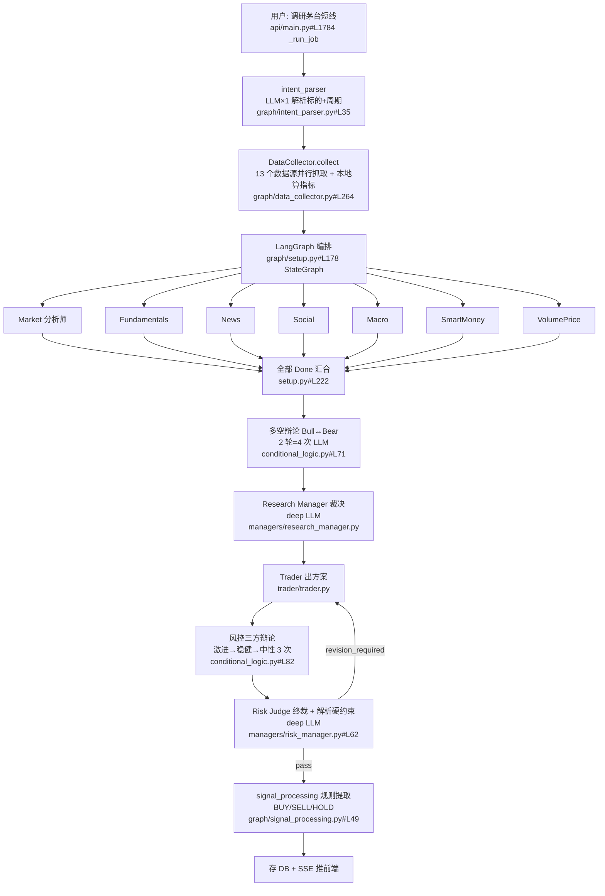

---
tags:
  - TradingAgents
  - AI-Agent
  - LangGraph
  - 项目拆解
  - A股投研
  - 五问拆解
项目: TradingAgents-AShare
类型: 源码实测-高置信
拆解日期: 2026-07-29
深度: 深拆-五问+改造点定位
license: PolyForm Noncommercial + Apache-2.0 双许可
---

> 拆解日期：2026-07-29 ｜ 模式 B（AI 代拆）｜ 深度档：**深拆（五问 + 改造点定位）**
> 目标仓库：[KylinMountain/TradingAgents-AShare](https://github.com/KylinMountain/TradingAgents-AShare)
> 拆解基准：`main` 分支，clone 于 2026-07-29（最后上游 push 2026-07-24）
> 证据约定：所有路径相对仓库根；行号可点击跳 GitHub `main`

---

## 实测元数据（`gh api` 实跑，非记忆）

| 项 | 值 |
|---|---|
| stars / forks | **736 / 220** |
| 创建 / 最后 push | 2026-03-02 / **2026-07-24**（活跃） |
| 是否 fork | **否**（独立仓库，架构衍生自 TauricResearch/TradingAgents 94.9k★ Apache-2.0） |
| license | **NOASSERTION** → 实为**双许可**，见下方风险节 |
| 语言 / 体积 | Python + TypeScript / 10.7 MB |
| 归档 / open issues | 否 / 16 |
| 代码规模 | `tradingagents/` 9983 行 · `api/` 8787 行 · `frontend/` 10856 行 TS · `tests/` 3928 行 |

### ⚠️ license 前置检查（铁律 #4）

`LICENSE` 全文是自定义拼接许可，GitHub 无法识别故返回 `NOASSERTION`：

- 从上游继承的核心逻辑 → **Apache-2.0**
- **新增 `api/`、`frontend/`，以及对 `tradingagents/` 的重大修改 → PolyForm Noncommercial License 1.0.0**

> **结论（本次用途：个人自用/学习研究）**：不构成障碍，可自由改、可搬代码。
> **但如果日后转商用**（进公司产品、对外服务、SaaS 收费），api/ + frontend/ + 改造过的 tradingagents/ 一行都不能逐字用，只能重写。**这个边界要现在就记住**，因为一旦在它上面长出几千行自己的代码，再想剥离出商用版本成本极高。

附带信号：README 有 3 处同一家 API 中转服务的 aff 推广链接（`windapi.ai/sign-up?aff=eMfU`），作者有变现动机——与非商业条款是一致的商业策略。

---

## 第 0 问｜我为什么拆它

- **我的需求**：想以这个项目为底座做二次开发，加约束或功能。三个明确方向：**① 数据源改造**（接自有数据/换 akshare/加港美股）、**② Agent 团队结构**（加减 Agent、改辩论轮次、换裁决逻辑）、**③ LLM 层与成本/输出约束**（换模型、prompt 硬约束、控 token 成本、审计留痕）。个人自用，非商业。
- **期望假设**（AI 代起草，第④问核销）：
  1. 假设它是标准 LangGraph ReAct 多智能体系统，每个 Agent 自己调工具取数据 → 加 Agent 要处理 tool calling 循环
  2. 假设数据源已有抽象层，加一个 provider 就能接自有数据
  3. 假设 15 个 Agent 意味着 token 成本高且不可预测
  4. 假设"约束"需要从零加，项目本身没有约束机制
- **借鉴成本上限**：预算——深拆档，AI 拆前估 1.5-2 小时；放弃红线——个人自用无硬红线。

---

## ①｜这是什么（30 秒电梯稿）

它把一次 A 股个股研判，拆成 **15 个固定角色的 LLM 分工流水线**（6-7 名分析师并行出报告 → 多空研究员辩论 → 研究总监裁决 → 交易员出方案 → 激进/稳健/中性三方风控辩论 → 组合经理终裁），配一套 Web 界面把全过程流式可视化，输出结构化研报（方向/置信度/目标价/止损价）+ 自选股定时分析 + 持仓追踪。给**想用 AI 做个股尽调、但不想自己搭 agent 编排的散户/研究者**用。

它**不是**量化系统——没有回测引擎（`api/services/backtest_service.py` 259 行只做研报事后跟价对比，不是策略回测）、没有下单执行、没有组合优化。它是**研报生成器**，不是交易系统。也不是"通用 TradingAgents 中文版"——CLI 已被移除，只剩 Web 形态。

> 证据：[README 第 3 行](https://github.com/KylinMountain/TradingAgents-AShare/blob/main/README.md) 定位句；[`LICENSE`](https://github.com/KylinMountain/TradingAgents-AShare/blob/main/LICENSE) "The original CLI components have been removed in this version."

---

## ②｜流程怎么走（trace 一条主链路）

一次典型分析：用户在前端输入「调研茅台短线」。



> 图为我基于源码手绘（铁律 #5：AI 生成图是导航地图）。你可自查两个外部视角交叉验证：
> - 架构全景图：把 URL 的 `github.com` 换成 `gitdiagram.com` → https://gitdiagram.com/KylinMountain/TradingAgents-AShare
> - 中文讲解 wiki：换成 `zread.ai` → https://zread.ai/KylinMountain/TradingAgents-AShare （浏览器打开，脚本抓会 403）

**每个环节对应文件**：

| 环节 | 文件 | 关键行 |
|---|---|---|
| HTTP 入口 + job 编排 | `api/main.py` | [#L1784](https://github.com/KylinMountain/TradingAgents-AShare/blob/main/api/main.py#L1784) 构造 graph |
| 意图解析 | `tradingagents/graph/intent_parser.py` | [#L35](https://github.com/KylinMountain/TradingAgents-AShare/blob/main/tradingagents/graph/intent_parser.py#L35) |
| 数据预抓取 | `tradingagents/graph/data_collector.py` | [#L264](https://github.com/KylinMountain/TradingAgents-AShare/blob/main/tradingagents/graph/data_collector.py#L264) `_fetch_all` 13 任务并行 |
| 数据源路由 | `tradingagents/dataflows/interface.py` | [#L125](https://github.com/KylinMountain/TradingAgents-AShare/blob/main/tradingagents/dataflows/interface.py#L125) `route_to_vendor` |
| 图编排 | `tradingagents/graph/setup.py` | [#L178-281](https://github.com/KylinMountain/TradingAgents-AShare/blob/main/tradingagents/graph/setup.py#L178) |
| 流转条件 | `tradingagents/graph/conditional_logic.py` | [#L71](https://github.com/KylinMountain/TradingAgents-AShare/blob/main/tradingagents/graph/conditional_logic.py#L71) / [#L82](https://github.com/KylinMountain/TradingAgents-AShare/blob/main/tradingagents/graph/conditional_logic.py#L82) / [#L94](https://github.com/KylinMountain/TradingAgents-AShare/blob/main/tradingagents/graph/conditional_logic.py#L94) |
| 状态定义 | `tradingagents/agents/utils/agent_states.py` | [#L147](https://github.com/KylinMountain/TradingAgents-AShare/blob/main/tradingagents/agents/utils/agent_states.py#L147) `AgentState` |
| 决策提取 | `tradingagents/graph/signal_processing.py` | [#L49](https://github.com/KylinMountain/TradingAgents-AShare/blob/main/tradingagents/graph/signal_processing.py#L49) |

**LLM 调用次数（默认配置 `max_debate_rounds=2`, `max_risk_discuss_rounds=1`）**：

| 环节 | 次数 | 档位 |
|---|---|---|
| intent_parser | 1 | quick |
| 7 名分析师 | 7 | quick |
| 多空辩论（2 轮 × 2 人） | 4 | quick |
| Research Manager | 1 | **deep** |
| Trader | 1 | quick |
| 风控三方（1 轮 × 3 人） | 3 | quick |
| Risk Judge | 1 | **deep** |
| signal_processing | 0-1 | quick（规则失败才调） |
| **基础合计** | **18** | 16 quick + 2 deep |
| 触发 revision 回路 | +3（Trader+Aggressive+Judge） | 最坏 **21** |

> 置信度：**中（~65%）**。次数由代码推算（`conditional_logic.py#L75` count≥2×rounds、`#L85` count≥3×rounds、`setup.py#L245` Trader→Aggressive 是无条件边），**未实跑验证**。你自查方式：跑一次分析，`LOG_LEVEL=DEBUG` 看 `[LLM Client]` 与 `[LLM Response]` 日志条数（`llm_clients/openai_client.py#L45`）。

---

## ③｜核心抽象（最聪明的 3 个设计决策）

| # | 设计决策 | 聪明在哪 / 不这么做会怎样 | 证据 |
|---|---|---|---|
| 1 | **抛弃 ReAct tool calling，改成"先一次性抓全数据，再单轮推理"** | 每个 Agent 恰好 1 次 LLM 调用，成本和延迟从「不可预测的多轮循环」变成「可数的固定次数」；13 个数据源并行抓取一次，7 个分析师共享同一份缓存（refcount 管理）。不这么做：ReAct 下每个分析师要 3-8 轮 tool call，成本翻 3-5 倍、延迟不可控，且 7 个分析师会各自重复抓同一份 K 线 | 全仓 **0 处 `bind_tools`**（实测 grep）；数据直接拼进 HumanMessage [`market_analyst.py#L58-63`](https://github.com/KylinMountain/TradingAgents-AShare/blob/main/tradingagents/agents/analysts/market_analyst.py#L58)；缓存 refcount [`data_collector.py#L420-438`](https://github.com/KylinMountain/TradingAgents-AShare/blob/main/tradingagents/graph/data_collector.py#L420) |
| 2 | **把所有算术和模式识别下沉到 Python，LLM 只做解释** | 技术指标用 stockstats 本地算；量价分析（VPA）用 172 行 numpy 规则预先判定"顶部背离/卖出高潮/放量滞涨"，再把结论表格喂给 LLM。不这么做：LLM 算 RSI/MACD 会算错，且要吃掉几千 token 的原始 K 线还未必看对——**这是把"LLM 不擅长的确定性计算"和"LLM 擅长的语义解释"切开** | 本地算指标 [`data_collector.py#L317-351`](https://github.com/KylinMountain/TradingAgents-AShare/blob/main/tradingagents/graph/data_collector.py#L317)；VPA 规则引擎 [`data_collector.py#L73-244`](https://github.com/KylinMountain/TradingAgents-AShare/blob/main/tradingagents/graph/data_collector.py#L73)，注释原话"All numerical comparisons are done here so the LLM only needs to interpret" |
| 3 | **数据源多级 fallback 链 + 记忆层换成 BM25 去掉 embedding 依赖** | `route_to_vendor` 按 category 配置 vendor 链，任一 provider 抛异常自动降级到下一个（akshare→baostock→investoday→yfinance），单个数据源挂了不影响整轮分析；记忆检索用 BM25 而非向量库，**换任何 LLM provider 都不需要另配 embedding 服务**（原版 TradingAgents 依赖 ChromaDB + OpenAI embedding）。不这么做：akshare 一被反爬整个系统瘫；换 DeepSeek 还得额外买 embedding | fallback 链 [`interface.py#L108-176`](https://github.com/KylinMountain/TradingAgents-AShare/blob/main/tradingagents/dataflows/interface.py#L108)；BM25 [`memory.py#L1-7`](https://github.com/KylinMountain/TradingAgents-AShare/blob/main/tradingagents/agents/utils/memory.py#L1) 注释"no API calls, no token limits, works offline with any LLM provider" |

**次一级但值得记的设计**：
- 生产事故驱动的超时防御：`FETCH_ALL_TIMEOUT` + 带超时的 per-key 锁，注释直接写明踩过"64/64 线程僵死 → 前端 524"（[`data_collector.py#L38-41`](https://github.com/KylinMountain/TradingAgents-AShare/blob/main/tradingagents/graph/data_collector.py#L38)、[`#L389-395`](https://github.com/KylinMountain/TradingAgents-AShare/blob/main/tradingagents/graph/data_collector.py#L389)）
- 决策提取三级降级：`<!-- VERDICT: {json} -->` 注释 → 正则抓"最终裁决：" → 关键词+否定词窗口 → 才调 LLM（[`signal_processing.py#L136-163`](https://github.com/KylinMountain/TradingAgents-AShare/blob/main/tradingagents/graph/signal_processing.py#L136)）
- `max_retries=0` 显式禁用 LLM 重试，理由写在注释：避免 thinking 模型重复扣费（[`openai_client.py#L89-91`](https://github.com/KylinMountain/TradingAgents-AShare/blob/main/tradingagents/llm_clients/openai_client.py#L89)）

---

## 深拆｜三个改造方向的落点定位

### 方向 ① 数据源改造 —— 结构最干净，改起来最省力

**抽象层已就绪**，加一个自有数据源是三步：

```
① 写 tradingagents/dataflows/providers/my_provider.py
   继承 BaseMarketDataProvider（providers/base.py#L4），实现 10 个抽象方法
   ⚠️ 所有方法返回值都是 str（CSV 或 Markdown 文本），不是 DataFrame
② 在 providers/registry.py#L28 build_default_registry() 里 register 一行
③ 在 default_config.py#L38 data_vendors 的对应 category 里把名字排到最前
```

改造点清单：

| 要做的事 | 改哪 | 注意 |
|---|---|---|
| 加自有数据源 | 新建 provider + `registry.py#L28` + `default_config.py#L38` | 返回值必须是 str；`name` property 是路由 key |
| 加新数据类型（如龙虎榜之外的指标） | `interface.py#L8` `TOOLS_CATEGORIES` 加 category → `agent_utils.py` 加 @tool → `data_collector.py#L276` `tasks` 加一项 | 三处必须同步改，漏一处数据到不了 Agent |
| 加港美股 | `context_utils.py` `infer_instrument_context` 识别符号 + `yfinance_provider` 已存在 | A 股专用逻辑（涨跌停、龙虎榜）要按市场分支 |
| 关掉某个数据源 | `default_config.py#L38` 把名字从 chain 移除 | 但 `_resolve_vendor_chain#L112-120` 会**自动把所有已注册 provider 追加进 fallback 链**——移除配置不等于禁用 |

> 🔑 **这里有个坑必须知道**：[`interface.py#L160-168`](https://github.com/KylinMountain/TradingAgents-AShare/blob/main/tradingagents/dataflows/interface.py#L160) 的 `except Exception` 会吞掉**所有**异常并降级到下一个 provider。配置 chain 之外的 provider 也被自动追加（`#L112-120`）。后果：查 A 股 `600519.SH` 时若前三个国内源都失败，会 fallback 到 **yfinance**——它可能返回空数据或错误标的数据，而 Agent 拿到的只是一段"看起来正常"的文本，**没有任何"这不是权威数据源"的标记进入 prompt**。你要加约束，第一条就该是数据溯源标记。

### 方向 ② Agent 团队结构 —— 比想象的简单，但有死代码要先清

**加一个新分析师（例如"股东结构分析师"）的完整改动点**：

| 步骤 | 文件 | 具体 |
|---|---|---|
| 1 | `agents/analysts/shareholder_analyst.py` | 新建。**照抄 `market_analyst.py` 骨架**：`create_xxx_analyst(llm, data_collector)` 返回 async node，读 `data_collector.get()`，拼 messages，`llm.astream()`，返回 `{"xxx_report": ..., "analyst_traces": [...]}` |
| 2 | `agents/utils/agent_states.py#L176` | `AgentState` 加 `shareholder_report` 字段 |
| 3 | `prompts/zh.py` + `prompts/en.py` | 加 `shareholder_system_message`（**两个文件都要加**，`catalog.py#L29` 中文缺失会回落英文） |
| 4 | `graph/setup.py#L98` | `_load_agent_factories()` 加 import 和 dict 项 |
| 5 | `graph/setup.py#L108` | 加 `if "shareholder" in selected_analysts:` 分支 |
| 6 | `graph/conditional_logic.py` | 加 `should_continue_shareholder`（**见下方死代码说明——这一步其实是仪式，但 `setup.py#L213` 用 getattr 反射拿它，不加会 AttributeError**） |
| 7 | `graph/trading_graph.py#L188` | `_create_tool_nodes()` 加 `"shareholder": ToolNode([...])`（同样是仪式，但 `setup.py#L112` 会索引它，不加会 KeyError） |
| 8 | `graph/data_collector.py#L276` | `tasks` 加数据抓取项 |
| 9 | `api/main.py` | `ANALYST_ORDER` / `ANALYST_AGENT_NAMES` / `ANALYST_REPORT_MAP` 三张表加映射（前端进度条靠它） |
| 10 | `frontend/` | 加卡片渲染 |

> 🔑 **重大发现：setup.py 里 7 组 ToolNode + 条件边全是不可达死代码**。
> 实证三步：① 全仓 `grep bind_tools` = **0 命中**；② 15 个 Agent 全部走 `llm.astream(prompt)`，没有一个绑定 tools；③ 初始 state 的 `messages` 是 `[("human", ...)]`（[`propagation.py#L51`](https://github.com/KylinMountain/TradingAgents-AShare/blob/main/tradingagents/graph/propagation.py#L51)），human 消息没有 `tool_calls` 属性 → [`conditional_logic.py#L19`](https://github.com/KylinMountain/TradingAgents-AShare/blob/main/tradingagents/graph/conditional_logic.py#L19) 的 `getattr(last_message, "tool_calls", None)` 恒为 None → **`should_continue_*` 永远返回 "done"，`tools_xxx` 节点永远不执行**。
>
> 这是从上游 ReAct 架构改造成"预抓取+单轮"时**留下的骨架残留**。对你的意义：
> - **好消息**：加 Agent 不用处理 tool calling 循环，心智负担小得多
> - **坏消息**：步骤 6、7 是纯仪式代码，不写会崩（反射 + 字典索引），写了也不执行——第一次改会被这个绕晕
> - **建议**：改造前先做一次"清死代码" commit（删 7 个 ToolNode + 7 组条件边 + 7 个 should_continue_*，把 `add_conditional_edges` 换成 `add_edge(analyst, analyst_done)`），能砍掉 setup.py 约 40% 的行数，后续每加一个 Agent 少改 2 处。**注意 `tests/` 3928 行里可能有测试断言这些边的存在，清之前先跑一遍测试**。

**改辩论轮次/裁决逻辑**：

| 想改什么 | 改哪 | 说明 |
|---|---|---|
| 多空辩论轮数 | `default_config.py#L22` `max_debate_rounds`（默认 2）或环境变量 `TA_MAX_DEBATE` | 停止条件 `count >= 2 × rounds`（`conditional_logic.py#L75`） |
| 风控辩论轮数 | `default_config.py#L23` `max_risk_discuss_rounds`（默认 1）或 `TA_MAX_RISK` | 停止条件 `count >= 3 × rounds` |
| 风控打回重做次数 | `propagation.py#L84` `max_retries`（硬编码 1） | 想改成 2 次要改这里，不是配置项 |
| 换裁决逻辑 | `managers/risk_manager.py` + `debate_utils.py` `extract_risk_judge_result` | 终裁靠 LLM 输出里的结构化块解析出 verdict/hard_constraints |
| 加 Agent 间新流转（如分析师之间互质疑） | `setup.py#L200-278` 边定义区 | LangGraph 原生支持，但要在 `AgentState` 加对应状态字段 |

### 方向 ③ LLM 层 + 成本与输出约束

**换模型 / 加 provider**：

- 只有**两个档位**：`deep_think_llm`（用于 Research Manager + Risk Judge 共 2 次）和 `quick_think_llm`（其余 16 次），配置在 [`default_config.py#L11-15`](https://github.com/KylinMountain/TradingAgents-AShare/blob/main/tradingagents/default_config.py#L11)
- 加新 provider：`llm_clients/factory.py#L31` 加分支。OpenAI 兼容的（含你公司 newapi 网关）**不用改代码**，配 `llm_provider=openai` + `backend_url` 即可
- ⚠️ 硬编码 base_url 陷阱：[`openai_client.py#L104-118`](https://github.com/KylinMountain/TradingAgents-AShare/blob/main/tradingagents/llm_clients/openai_client.py#L104) 里 xai / openrouter / ollama 三个 provider **无条件覆盖** `base_url`，只有 deepseek 尊重传入值（`#L116`）。想让 xai 走中转网关必须改代码
- ⚠️ [`#L91`](https://github.com/KylinMountain/TradingAgents-AShare/blob/main/tradingagents/llm_clients/openai_client.py#L91) `max_retries = 0`：任何一次 LLM 调用网络抖动 → 整轮 18 次调用的分析全废。想加重试，这是唯一开关

**成本约束能挂在哪**：

| 想加的约束 | 挂载点 | 难度 |
|---|---|---|
| 全局 token 计数 + 超限中断 | `trading_graph.py#L89` 已有 `callbacks` 透传到 LLM 构造函数 → 写一个 LangChain `BaseCallbackHandler` 统计 `on_llm_end` 的 usage | **低**，是最干净的切入点 |
| 单次分析预算上限 | 同上 callback 里抛异常，或在 `setup.py` 每个节点前加检查 | 低 |
| 按 Agent 分配不同模型（省钱） | `setup.py#L60-72` 只接收 quick/deep 两个 llm 实例 → 要改成传 dict 才能按 Agent 分模型 | 中 |
| 审计留痕（谁在什么时候调了什么模型） | 同 callback，`openai_client.py#L41-46` 已有 DEBUG 级日志雏形 | 低 |

**输出约束能挂在哪 —— 这里是最重要的发现**：

项目**已有一套约束机制**，且是双向的，但**全部是 prompt 级软约束**：

```
输入侧：UserContext.constraints（agent_states.py#L78 "Hard trading constraints"）
          ↓ normalize_user_context（context_utils.py#L118-123）
          ↓ summarize_user_context 拼成文本 "硬约束：xxx; yyy"（context_utils.py#L205-207）
          ↓ build_agent_context_view 分角色下发（context_utils.py#L213）
          ↓ 【只有 Trader 和 Risk Manager 读到完整硬约束】
            analyst / research 角色被裁剪成 3 行，硬约束不下发（#L220-227）

输出侧：Risk Judge 的 LLM 输出里解析出结构化约束（risk_manager.py#L62-69）
          → hard_constraints / soft_constraints / execution_preconditions / de_risk_triggers
          → 存进 risk_feedback_state（agent_states.py#L135-144）
          → should_revise_after_risk_judge 打回 Trader 重写（conditional_logic.py#L94，最多 1 次）
```

> 🔑 **核心判断**：这套约束是**建议**，不是**强制**。它全程是拼进 prompt 的自然语言 + 依赖 LLM 自己在输出里声明遵守，**没有任何代码级校验**。举例：你设 `constraints=["单票仓位不超过 10%"]`，如果 LLM 输出"建议满仓买入"，系统不会拦——`signal_processing.py` 只从文本里抠 BUY/SELL/HOLD，不校验方案是否违反约束。
>
> **要加真正的硬约束，正确的位置是在 `signal_processing.py` 之后、写库之前加一个校验层**：拿 `final_trade_decision` 文本 + `user_context.constraints` 做结构化校验，违反则改判 HOLD 或标记 `constraint_violated`。这一层项目里**不存在**，是你要新建的。
> 顺带：约束不下发给分析师（`context_utils.py#L220-227`）是有意设计——保持分析师不带偏见。你加约束时要想清楚是"约束分析视角"还是"约束最终方案"，前者要改这段裁剪逻辑。

---

## ④｜回扣核销

### 需求满足了吗

**满足，三个方向都有明确落点**，且难度排序清晰：

| 方向 | 结论 | 主要工作量 |
|---|---|---|
| ① 数据源 | ✅ 抽象层就绪，加 provider 3 步 | 写 provider（10 个方法返回 str）+ 处理 fallback 污染 |
| ② Agent 结构 | ✅ 可行但有 10 处改动点 + 建议先清死代码 | 10 处同步改（含 3 张前端映射表），跨 Python+TS |
| ③ LLM/成本约束 | ✅ callbacks 通道现成，是最干净的切入点 | 成本约束低难度；**输出硬约束层需从零建** |

### 假设核对

| 拆前假设 | 结果 | 差在哪 |
|---|---|---|
| 1. 标准 LangGraph ReAct，Agent 自己调工具 | ❌ **错，而且错得关键** | 已改成"预抓取+单轮推理"，0 处 `bind_tools`。ToolNode 骨架留着但不可达。**这个错如果不纠正，你会花大量时间给新 Agent 设计 tool calling 循环——完全白做** |
| 2. 数据源有抽象层，加 provider 就能接 | ✅ **对** | 比预期还干净（registry + fallback chain）。但 fallback 会自动追加未配置的 provider，这是意外的坑 |
| 3. 15 个 Agent → token 成本高且不可预测 | 🟡 **一半对** | 成本确实高（18-21 次调用），但**完全可预测**——固定次数，因为没有 ReAct 循环。可预测比高更重要 |
| 4. 约束需要从零加 | ❌ **错** | 已有完整的约束数据结构 + 打回重做回路。但全是 prompt 级软约束，**代码级校验层才是要从零加的** |

**4 个假设错 2 个、半对 1 个**——两个错都在"高估了它的标准程度"：它比典型 LangGraph 项目更简（无 tool calling），同时比预期更全（已有约束骨架）。

### 意外收获（拆前没想到，但值得记）

1. **BM25 替代向量库，但中文分词失效——实锤 bug**
   `memory.py#L33` 用 `re.findall(r'\b\w+\b', text.lower())` 分词。我实测：
   ```
   文档「高通胀伴随利率上升，消费者支出下滑」→ ['高通胀伴随利率上升', '消费者支出下滑']
   查询「通胀高企且利率走高，消费下滑」    → ['通胀高企且利率走高', '消费下滑']
   交集 = set()  ← BM25 得分 0
   ```
   中文被整段当成一个 token，两句语义高度相似的中文检索得分为 0。英文分词正常。**修法**：换 jieba 分词或按字 bigram。

2. **"从历史决策学习"是死链路**
   `reflect_and_remember`（`trading_graph.py#L468`）在 `api/`、`scheduler/` 中**零调用**（实测 grep）；且 `memory` 是纯内存无持久化（`memory.py#L23-24`），而 `api/main.py#L1784` 每个 job 新建 `TradingAgentsGraph` → 5 个 memory 永远是空的 → 所有 agent prompt 里的 `past_memory_str` 永远是空字符串。**这条链路要想真跑起来，等于从零做：持久化 + 收益回填 + 调用时机**。

3. **`api/main.py` 是 4775 行单文件**，54 个路由、129 个函数。任何后端改动都在这个巨型文件里，是二次开发的主要摩擦源。`api/services/` 已有 17 个模块（说明作者在往外拆），但主流程还在 main.py。

4. **决策提取的关键词优先级有偏向风险**
   `signal_processing.py#L128-133` 顺序是 buy → sell → hold，文本里只要出现一个未被否定的"建仓/买入"就判 BUY，即使后文结论是观望。否定词检测窗口只有前 6 个字符（`#L122`）。作者 2026-07-10 有 commit `fix(signal): negation-aware keyword matching to stop biased BUY decision` 说明踩过，但窗口式检测仍不完备。**你加约束时这是第二个必改点。**

5. **`intent_parser` 有双路径**：走 chat 入口时在 `chat_completions` 预解析，直接 POST `/v1/analyze` 时才兜底调用（`api/main.py#L1805-1811`）——省一次 LLM 调用的小优化，但也意味着两条路径的 intent 质量可能不一致。

6. **dual-horizon 被主动阉割**：`api/main.py#L1795-1796` 强制 `horizons` 只取第一个，注释"避免 dual-horizon 双倍开销"。代码里 `_process_horizon` 双周期能力还在（`#L1851`），是被配置关掉的——你如果要中线分析，这是现成的开关。

### 搬运成本判定

**判定：借（可直接作为底座）**，理由：结构清晰度超出预期，三个改造方向都有明确落点，且个人自用下 license 无阻。

实际成本 vs 上限：AI 拆前估 1.5-2 小时（深拆档），**实际约 55 分钟**（clone + 读 20 个核心文件 + 2 处实测验证 + 写报告），**未超上限**。

改造工作量估算（置信度中 ~60%，未实跑）：

| 任务 | 估时 |
|---|---|
| 环境跑通（Docker + 配 LLM + 跑一次分析验证 18 次调用） | 1-2 小时 |
| 清死代码（7 组 ToolNode + 条件边）+ 跑测试 | 2-3 小时 |
| 加 1 个自有数据源 provider | 3-5 小时 |
| 加 1 个新分析师 Agent（含前端） | 4-8 小时（跨 Python+TS） |
| 加 token 成本 callback + 预算中断 | 2-3 小时 |
| 加输出硬约束校验层（从零） | 6-10 小时（含约束 DSL 设计） |

### 坑（汇总）

| # | 坑 | 严重度 |
|---|---|---|
| 1 | **license 双轨**：个人自用无碍，但转商用时 api/ + frontend/ + 改造过的 tradingagents/ 一行不能用 | 🔴 高（长期） |
| 2 | **7 组 ToolNode 死代码**：不理解会白做 tool calling 设计；步骤 6/7 是不写会崩、写了不执行的仪式代码 | 🔴 高 |
| 3 | **BM25 中文分词失效**（实测）+ 记忆链路整体未接入 | 🟡 中（当前功能本就没生效，不影响主流程） |
| 4 | **fallback 链自动追加未配置 provider** + `except Exception` 全吞：A 股可能静默 fallback 到 yfinance 拿到垃圾数据，且无溯源标记 | 🔴 高（影响结论可信度） |
| 5 | **`max_retries=0`**：一次网络抖动废掉整轮 18 次调用的分析 | 🟡 中 |
| 6 | **决策提取 BUY 偏向** + 否定词窗口仅 6 字符 | 🟡 中 |
| 7 | `api/main.py` 4775 行单文件，改动摩擦大 | 🟡 中 |
| 8 | 加 Agent 要跨 Python + TypeScript 改 10 处，漏一处静默失败（前端不显示） | 🟡 中 |
| 9 | 上游 `TauricResearch/TradingAgents` 仍活跃（94.9k★，2026-07-18 push），但本项目已大幅改造，**上游更新基本无法合并回来** | 🟢 低（接受即可） |

---

## 下一步建议顺序

1. **先跑通再动手**：Docker 起一次，跑一个标的，`LOG_LEVEL=DEBUG` 数 LLM 调用次数，验证我上面 18 次的推算
2. **第一个 commit 清死代码**：删 ToolNode + 条件边，跑 `tests/`（3928 行）确认没断
3. **第二个 commit 加成本 callback**：最干净的切入点，立刻能看到每次分析花多少钱
4. **再动数据源**：写你的 provider，同时给 `route_to_vendor` 加数据溯源标记（坑 #4）
5. **最后加 Agent 和约束校验层**：这两个改动面最大，等前面熟悉了再做
