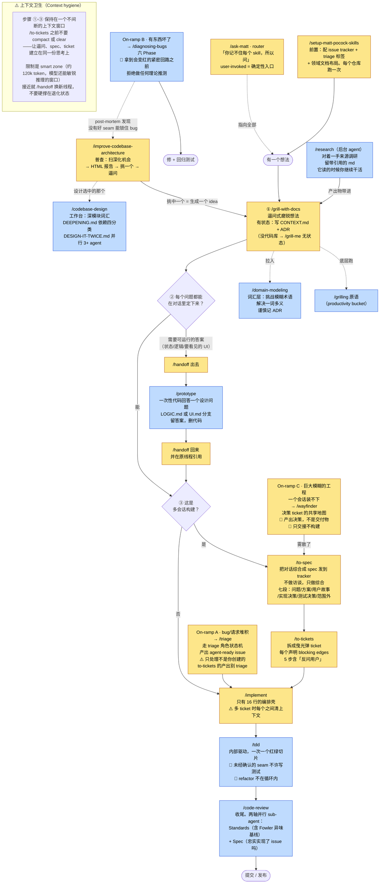

# mattpocock/skills · engineering 目录 17 个 skill 深度详解

> 仓库：[mattpocock/skills](https://github.com/mattpocock/skills)（MIT，1.2 MB，plugin v1.2.0）
> 分析日期：2026-08-03　|　全程只读，浅克隆在 `~/harness-research/mattpocock-skills`
> 作者：Matt Pocock（Total TypeScript / aihero.dev），你已经在用他的 `grilling` / `to-prd` / `to-issues`
> 对比参考：[[../ECC Harness 研究/05 workflow-quality 模块深度解析|ECC workflow-quality 深度解析]]、[[02 mattpocock vs ECC 设计对比]]

---

# 一 · 组织哲学（这部分比 skill 本身更值得学）

## 1.1 六个 bucket + 「promoted」制度

`CLAUDE.md` 里定死了目录制度：

| bucket | 含义 | 数量 | 进 plugin？ | 有 docs 页？ |
|---|---|---|---|---|
| `engineering/` | 日常代码工作 | **17** | ✅ | ✅ |
| `productivity/` | 日常非代码工作流 | 5 | ✅ | ✅ |
| `misc/` | 留着但很少用，不推广 | 4 | ❌ | ❌ |
| `personal/` | 绑他自己的环境，不推广 | 2 | ❌ | ❌ |
| `in-progress/` | 还没准备好出货的草稿 | 9 | ❌ | ❌ |
| `deprecated/` | 不再使用 | 4 | ❌ | ❌ |

只有前两个是 **promoted（已推广）**。规则原文：

> Every skill in `engineering/` or `productivity/` (the **promoted** buckets) must have a reference in the top-level `README.md` and an entry in `.claude-plugin/plugin.json`'s `skills` array (the Claude Code plugin ships **exactly** the promoted set). Skills in `misc/`, `personal/`, `in-progress/`, and `deprecated/` **must not appear in either**.

我核实了 `plugin.json`：**ship 22 个 = engineering 17 + productivity 5，精确对应 promoted 集合，一个不多一个不少。**

> 🔑 **对比 ECC**：ECC 把 description 第一句写着 `[DEPRECATED - use continuous-learning-v2]` 的 `continuous-learning` 留在**默认安装面**里。mattpocock 这边 deprecated 的 4 个（`design-an-interface`、`qa`、`request-refactor-plan`、`ubiquitous-language`）**既不进 plugin、也不进 README、也没 docs 页**，而且 `link-skills.sh` 里显式 `-not -path '*/deprecated/*'` 排除掉。

## 1.2 user-invoked vs model-invoked 的硬二分

**这是这个仓库最重要的设计，直接回答了你上一轮问的"AI 会不会漏调用"。**

每个 SKILL.md 必须明确属于两类之一：

| 类型 | 怎么实现 | 谁能触发 | engineering 里的数量 |
|---|---|---|---|
| **user-invoked** | `disable-model-invocation: true`（Claude Code）+ `policy.allow_implicit_invocation: false`（`agents/openai.yaml`，Codex） | **只有人打字才能触发** | **9 个** |
| **model-invoked** | 不加上述字段，且 description 写"丰富的触发措辞" | 模型可自主触发，人也能调 | **8 个** |

**9 个 user-invoked**：`ask-matt`、`grill-with-docs`、`triage`、`improve-codebase-architecture`、`setup-matt-pocock-skills`、`to-spec`、`to-tickets`、`implement`、`wayfinder`

**8 个 model-invoked**：`prototype`、`diagnosing-bugs`、`research`、`tdd`、`domain-modeling`、`codebase-design`、`code-review`、`resolving-merge-conflicts`

**这个二分的逻辑很清楚**：
- **需要人做判断的流程节点**（该不该开 grilling、要不要拆 ticket、这次算不算多会话工程）→ user-invoked，**不给模型自主决定的机会**
- **需要在干活过程中被随时拉进来的参考/工具**（怎么写测试、怎么设计模块、怎么诊断 bug）→ model-invoked

👉 **ECC 43 个 skill 全部是 model-invoked（没有一个用 `disable-model-invocation`），所以每一个都可能漏触发。mattpocock 把关键流程节点做成人手敲，从根上避免了这个问题。**

## 1.3 CONTEXT.md：一份领域词汇表

仓库根有个 `CONTEXT.md`，是 DDD 式的 ubiquitous language（统一语言）文件，定义了 4 个术语：

- **Issue tracker** —— 托管仓库 issue 的工具（GitHub Issues / Linear / 本地 `.scratch/` markdown 约定）。附 **_Avoid_: backlog manager, backlog backend, issue host**（明确禁用的同义词）
- **Issue** —— issue tracker 里的一个被跟踪工作单元。_Avoid_: ticket
- **Decision ticket** —— `wayfinder` 的单元，是 `wayfinder:map` 的子 issue，装的是一个**问题**，其解决产出的是决策而非可执行的构建切片
- **Triage role** —— triage 期间打在 issue 上的规范状态机标签

还有一节 **Flagged ambiguities（已标记的歧义）**，记录已解决的用词混乱：

> "backlog" 之前同时用来指*托管 issue 的工具*和*里面的工作总量*——已解决：工具叫 **Issue tracker**，"backlog" 不再作为领域术语使用。

> 🔑 **这份文件是"怎么防止一个 skill 集合的用词漂移"的范本。** ECC 281 个 skill 完全没有这一层，所以出现了 `verification-loop` 和 `springboot-verification` 结构重叠、`api-design` 和 `backend-patterns` 内容重复这类问题。

## 1.4 两种安装哲学（README 原文）

> Two ways in, two philosophies. **The Claude Code plugin** installs the whole set as a **managed, read-only bundle** that updates when I ship — **you subscribe rather than fork**. **skills.sh** copies **editable** skill files into your project, so you can hack on them and make them your own. Pick one — **installing both leaves you with every skill twice**.

```bash
claude plugins install mattpocock-skills
```

⚠️ `scripts/link-skills.sh` 是**维护者专用**，脚本里自己写着 "This is a dev-only script... **It is not a supported installer.** Modifications to it — or requests for modifications — will not be approved."

## 1.5 全部 17 个都有 `agents/openai.yaml`

**17/17，100% 覆盖。** 每个 skill 都做了 Codex/OpenAI 侧的适配声明（含 `policy.allow_implicit_invocation`）。

对比 ECC：281 个 skill 里只有 39 个有 `.agents/` 镜像（14%），而且镜像是**删掉 metadata 的平行副本**，不是声明文件。

---

# 二 · 17 个 skill 的构成总览

| skill | 行数 | 文件 | 类型 | 附加文件 |
|---|---:|---:|---|---|
| `diagnosing-bugs` | 135 | 3 | model | `scripts/hitl-loop.template.sh` |
| `wayfinder` | 129 | 2 | **USER** | — |
| `setup-matt-pocock-skills` | 117 | 7 | **USER** | `domain.md`、`triage-labels.md`、`issue-tracker-{github,gitlab,local}.md` |
| `codebase-design` | 115 | 4 | model | `DEEPENING.md`、`DESIGN-IT-TWICE.md` |
| `triage` | 113 | 4 | **USER** | `AGENT-BRIEF.md`、`OUT-OF-SCOPE.md` |
| `to-tickets` | 106 | 2 | **USER** | — |
| `code-review` | 90 | 2 | model | — |
| `ask-matt` | 79 | 2 | **USER** | — |
| `to-spec` | 76 | 2 | **USER** | — |
| `domain-modeling` | 75 | 4 | model | `ADR-FORMAT.md`、`CONTEXT-FORMAT.md` |
| `improve-codebase-architecture` | 72 | 3 | **USER** | `HTML-REPORT.md` |
| `tdd` | 37 | 4 | model | `tests.md`、`mocking.md` |
| `prototype` | 27 | 4 | model | `LOGIC.md`、`UI.md` |
| `implement` | 16 | 2 | **USER** | — |
| `resolving-merge-conflicts` | 15 | 2 | model | — |
| `research` | 13 | 2 | model | — |
| `grill-with-docs` | 8 | 2 | **USER** | — |

**统计**：SKILL.md 总计 **1,223 行**，中位 **76 行**，最短 8 行，最长 135 行。**纯单文件 0 个，100% 都有附加文件**（至少一个 `agents/openai.yaml`）。name+description 常驻成本 **≈800 token/轮**。

> 🔑 **和 ECC 的形态完全相反**：ECC 的 43 个里 36 个（84%）是纯单文件，最长 889 行；mattpocock 这边 SKILL.md 极短（中位 76 行），细节全在附加文件里。**这才是 progressive disclosure 的正确实现——SKILL.md 只做触发判断和路由，模型确认相关后再读附加文件。**

---

# 三 · 逐个详解（按作者自己的分组）

我用 `ask-matt` 里作者自己的分组，而不是另发明一套——他的分组本身就是设计意图。

## 3.0 前置：`setup-matt-pocock-skills`（117 行，7 文件，USER）

**本质**：一次性配置向导。跑一次，把这个仓库配好 issue tracker、triage 标签词汇、领域文档布局。

**怎么工作**：5 步——① 探索 → ② 呈现发现并提问 → ③ 确认并编辑 → ④ 写入（分四块：agent skills / issue tracker / triage labels / domain docs）→ ⑤ 完成。

**附带 4 个模板**：`issue-tracker-github.md` / `issue-tracker-gitlab.md` / `issue-tracker-local.md`（三种 tracker 各一份）+ `triage-labels.md` + `domain.md`。

**为什么重要**：**其它 skill 全都假设它已经跑过了**。`to-spec`、`to-tickets`、`triage`、`code-review` 的正文里都引用它。**这是整个体系唯一的硬依赖。**

> ⚠️ 一处小瑕疵：它的正文引用了 `qa` skill，但 `qa` 已经被移进 `deprecated/`。按作者自己在 `CLAUDE.md` 里定的规矩（"a router that lies" 不可接受），这是个待修的不一致。

## 3.1 主流程：idea → ship

### `grill-with-docs`（8 行，USER）—— 起点

**本质**：用逼问的方式把想法磨锐利，**同时留下纸面痕迹**。

**怎么工作**：它只有 8 行，因为它是个**包装器**——底层跑 `grilling` 原语（在 productivity bucket，12 行，**你已经装了**）。区别在状态：
- `grill-with-docs` —— **有状态**，把学到的东西留在 `CONTEXT.md` 和 ADR 里
- `grill-me` —— **无状态**，什么都不存，给"没有代码库"的场景

原文一句总结：**"Both run the same `/grilling` primitive; `grill-with-docs` is the one that leaves a paper trail."**

**对你的用法**：⭐⭐ 你已经在用 `grilling`。**升级路径是加上 `grill-with-docs` + `domain-modeling`，让每次 grilling 的产出沉淀进项目的 CONTEXT.md 和 ADR**，而不是只留在对话里。这对你的 xaue / zongzhu 这类长期项目价值很大。

### `prototype`（27 行，4 文件，model）—— 步骤 2 的绕道

**本质**：写一个**一次性**原型来回答一个设计问题。

**怎么工作**：先"选分支"——`LOGIC.md`（可运行的终端程序，测状态模型/业务逻辑是否顺）或 `UI.md`（几个可切换的 UI 变体）。然后是"两者都适用的规则"。核心纪律：**从第一天就是一次性的——留下答案，删掉代码**。

**在流程里的位置**：当一个问题需要"可运行的答案"（状态、业务逻辑、必须看见的 UI）时才绕道，而且**双向都用 `/handoff` 桥接**——handoff 出去开新会话做原型，做完 handoff 回来引用。

**对你的用法**：⭐ 你已经有 `prototype-designer`（做双端 HTML 原型墙）。**mattpocock 这个的差别是"回答一个设计问题"而不是"产出可交付的原型"**——目的不同。它的 `LOGIC.md` 分支（用终端程序验证状态模型）是你现在没有的角度。

### `to-spec`（76 行，USER）

**本质**：把当前对话变成 spec 并发布到 issue tracker，**不做访谈，只做综合**。

**怎么工作**：固定七段结构——Problem Statement / Solution / User Stories / **Implementation Decisions** / **Testing Decisions** / Out of Scope / Further Notes。

**关键设计**：description 里明确 **"no interview, just synthesis of what you've already discussed"**——访谈是 `grilling` 的活，它只负责收拢。**职责单一。**

**对你的用法**：⭐⭐ 和你装的 `to-prd` 是同一位作者的东西。差别是 `to-spec` 会**发布到 issue tracker**（不只是写文件），而且有 Testing Decisions 这一段——你写需求文档时常缺这块。

### `to-tickets`（106 行，USER）

**本质**：把 plan/spec/对话拆成一组**曳光弹式（tracer-bullet）ticket**，每个声明自己的**阻塞边（blocking edges）**。

**怎么工作**：5 步——① 收集上下文 → ② 探索代码库（可选）→ ③ **起草垂直切片** → ④ **反问用户（Quiz the user）** → ⑤ 发布到配置好的 tracker。

每个 ticket 的固定结构：Parent / What to build / Acceptance criteria / **Blocked by**。

**两种 tracker 的差异**（这是个好设计）：
- 本地 tracker → 阻塞边是**一个文件一个 ticket 的文本**（`.scratch/<feature>/issues/`），手动按阻塞顺序做
- 真 tracker → 阻塞边变成**原生的 blocking link**，任何阻塞项已完成的 ticket 都能直接拿来做

**对你的用法**：⭐⭐ 和你装的 `to-issues` 同源。"每个 ticket 声明 blocking edges" 这个设计比单纯的任务清单强——**它让"下一个能做什么"变成可计算的**。

### `implement`（16 行，USER）

**本质**：按 spec 或 ticket 集合来构建。

**怎么工作**：只有 16 行，因为它是个**编排壳**——它的工作是驱动别人：
> `/implement` builds each issue by driving **`/tdd`** internally — one red-green slice at a time — then closes out by running **`/code-review`**, a two-axis review (Standards + Spec) of the diff, before committing.

**关键纪律**（来自 ask-matt）：多 ticket 场景下，**每个 ticket 之间清上下文**（clearing context between each one）。

**对你的用法**：⭐⭐ **这 16 行是整个体系里"编排"的落点**。它证明了一件事：**编排不需要长文档，需要的是明确的"我驱动谁、什么顺序、什么条件收尾"。** 你的 project-lifecycle 可以照这个思路瘦身。

### `tdd`（37 行，4 文件，model）—— 你那条批注的答案

**本质**：不是流程清单，是**"让红绿循环产出值得保留的测试"的参考**。原文：

> TDD is the red → green loop. This skill is the reference that makes that loop produce tests worth keeping... **Every section applies on every cycle — consult them before and during the loop, not after.**

**四节内容**：

**① 什么是好测试** —— 通过公共接口验证行为，不测实现细节。"代码可以完全改变，测试不该变。好测试读起来像规格说明。"

**② seam（缝）—— 测试放在哪**。seam = 你观察行为的公共边界。有一条**硬规则**：

> **Test only at pre-agreed seams.** Before writing any test, write down the seams under test and **confirm them with the user**. **No test is written at an unconfirmed seam.** You can't test everything — agreeing the seams up front is how testing effort lands on the critical paths and complex logic instead of every edge case.

**③ 三个反模式，每个都给了"识别信号（the tell）"**：

| 反模式 | 是什么 | 识别信号 |
|---|---|---|
| **Implementation-coupled** | mock 内部协作者、测私有方法、走侧信道验证（查数据库而不用接口） | **重构时测试挂了，但行为没变** |
| **Tautological（同义反复）** | 断言用**和代码相同的方式**重算期望值（`expect(add(a,b)).toBe(a+b)`） | **构造上必然通过，永远不可能和代码不一致**。期望值必须来自独立真值源——已知的字面量、手算的例子、规格 |
| **Horizontal slicing（水平切片）** | 先写所有测试，再写所有实现 | 批量测试验证的是**想象中的行为**——你测的是东西的**形状**而不是用户可见的行为，而且在理解实现之前就锁定了测试结构 |

**④ 循环的规则三条**，其中一条**反常识**：

> **Refactoring is not part of the loop.** It belongs to the **review stage** (see the `code-review` skill), not the red → green implementation cycle.

**它把 refactor 从经典的 red-green-refactor 里拿掉了**，理由是重构属于审查阶段。这是个有主张的决策。

**附 `tests.md`（77 行）** 给了好/坏测试的具体代码对照，tautological 那个例子最清晰：

```typescript
// BAD: 期望值用和代码一样的方式算出来
const expected = items.reduce((sum, i) => sum + i.price, 0);
expect(calculateTotal(items)).toBe(expected);

// GOOD: 期望值是独立的已知字面量
expect(calculateTotal([{ price: 10 }, { price: 5 }])).toBe(15);
```

**对你的用法**：⭐⭐⭐ **这就是你要的 TDD skill，而且比 ECC 的 `tdd-workflow`（584 行）好得多**：

| | ECC `tdd-workflow` | mattpocock `tdd` |
|---|---|---|
| 行数 | 584（+ 43 个章节） | **37**（+ tests.md 77 + mocking.md） |
| 核心要求 | **80%+ 覆盖率** | **先和用户约定测哪些 seam**——承认测不完所有东西 |
| 技术栈 | 大量 Vitest/Playwright/Next.js 具体写法（#1213 指出"TS/Next.js 专属却没标注"） | TypeScript 示例，但**规则本身与语言无关** |
| 反模式 | 无专门章节 | **三个反模式各带识别信号** |
| refactor | 在循环内（red-green-refactor） | **移出循环，归入 review** |

👉 **建议：用这个替代 ECC 的 tdd-workflow。** 覆盖率指标是个容易被 Goodhart 化的目标（为了数字写无意义测试），"先约定 seam"是更诚实的约束。

### `code-review`（90 行，model）

**本质**：审查某个固定点以来的改动，**沿两个轴**。

**怎么工作**：5 步——① **钉住固定点**（commit / branch / tag / merge-base）→ ② 确定 spec 来源 → ③ 确定标准来源 → ④ **并行 spawn 两个 sub-agent** → ⑤ 汇总。

**两个轴**：
- **Standards 轴** —— 代码符合本仓库有文档记录的编码标准吗？（README 补充：**外加一条 Fowler smell baseline**，即 Martin Fowler 的代码异味基线）
- **Spec 轴** —— 代码忠实实现了源 issue/PRD 吗？

有一节专门解释 **"Why two axes"**。

**对你的用法**：⭐⭐ **"两轴分离 + 并行 sub-agent"这个结构值得抄**。你现在让 AI review 时通常是一个笼统的"审一下"，结果它容易只看代码质量不看"是不是做了要求的事"。**把这两件事分成两个独立 agent 跑，互不干扰。**

## 3.2 三个 On-ramp（汇入主流程的起点）

### `triage`（113 行，4 文件，USER）

**本质**：让 issue 和外部 PR 走过一个**triage 角色状态机**。

**怎么工作**：Roles（角色）→ Invocation → 显示需要注意的 → triage 特定 issue/PR → 快速状态覆写 → needs-info 模板 → Triage Notes → **恢复之前的会话**。附 `AGENT-BRIEF.md`（写 agent-ready 简报的格式）和 `OUT-OF-SCOPE.md`。

**一条关键边界**（来自 ask-matt）：

> Triage is only for issues **you didn't create** — bug reports, incoming feature requests, anything that arrives raw. Tickets that `/to-tickets` produced are **already agent-ready, so don't triage them**.

**对你的用法**：你目前是单人项目为主，triage 的价值在**你接手别人的项目**时（xaue 的 14 份源文档、zongzhu 的任务卡）。`AGENT-BRIEF.md` 那个"写给 agent 看的简报格式"可以直接借用。

### `diagnosing-bugs`（135 行，3 文件，model）—— 最长的一个

**本质**：硬 bug 和性能回归的诊断循环。

**怎么工作**：**六个 Phase**——

| Phase        | 干什么                                                                                    | 完成判据               |
| ------------ | -------------------------------------------------------------------------------------- | ------------------ |
| **1. 建反馈回路** | 想办法构造一条"已经会因为**这个** bug 而变红"的命令。有"按大致这个顺序试"的构造方法清单、怎么收紧回路、非确定性 bug 怎么办、**真的建不出回路时怎么办** | **一条紧密的回路，而且它是红的** |
| 2. 复现 + 最小化  | 复现后做最小化                                                                                | —                  |
| 3. 假设        | 提出假设                                                                                   | —                  |
| 4. 埋点        | instrument                                                                             | —                  |
| 5. 修 + 回归测试  | —                                                                                      | —                  |
| 6. 清理 + 事后复盘 | post-mortem                                                                            | —                  |

**核心纪律**（ask-matt 原文）：

> It **refuses to theorise until it has a tight feedback loop** — one command that already goes red on *this* bug — then fixes with a regression test.

**它的 post-mortem 有个出口**：如果真正的发现是"没有好的 seam 能锁住这个 bug"，就交接给 `improve-codebase-architecture`。

附一个 `scripts/hitl-loop.template.sh`（human-in-the-loop 循环模板）。

**对你的用法**：⭐⭐⭐ **"拒绝在拿到会变红的回路之前做任何理论推测"这条纪律，是我在这两个仓库里见过最有价值的单条规则。** 它精确对治 AI 调试的头号毛病——**上来就猜原因，然后改一堆东西，然后说"应该好了"**。你的 CLAUDE.md 里有「2 轮收手」，这条是它的上游：**先建回路，就不会有 2 轮盲猜**。

### `wayfinder`（129 行，USER）—— 最烧脑的

**本质**：规划一块**大到一个 agent 会话装不下**的工作，做法是在 issue tracker 上建一张**决策 ticket 的共享地图**，一次解决一个，直到通往目标的路清晰。

**怎么工作**：核心原则第一条就是 **"Plan, don't do"**（只规划，不执行）。地图（The Map）的结构：
- Destination（目的地）
- Notes
- **Decisions so far**（至今做出的决策）
- **Not yet specified**（还未确定的）
- Out of scope
- Tickets（每个是一个 Question）

有 Ticket Types 分类，共 17 节。

**关键设计**（ask-matt 原文）：
- 它产出的是 **decisions, not deliverables**（决策，不是交付物）
- 地图清晰后 **"it hands off, it doesn't build"** —— 从 `/to-spec` 汇入主流程
- **警告**：直接把地图接进 `/implement` 会跳过"收拢"这一步，把链接的细节全丢掉
- **警告**：它"更慢更密"，只用于真正装不下的工程，**never a well-scoped feature**

**对你的用法**：⭐⭐ 你的项目里 **xaue** 和 **公司 AI 测试平台选型**正是这种"雾很大、一个会话装不下"的类型。它和你的 `project-lifecycle` 的区别：**project-lifecycle 假设需求能在一个流程里走完，wayfinder 假设你连"要做什么"都还没搞清，所以先产出一串决策**。

## 3.3 Codebase health（不是功能开发，是维护）

### `improve-codebase-architecture`（72 行，3 文件，USER）

**本质**：扫代码库找**深化机会（deepening opportunities）**，做成可视化 HTML 报告，然后你挑一个进入逼问循环。

**怎么工作**：3 步——① 探索 → ② **把候选做成 HTML 报告呈现**（格式见 `HTML-REPORT.md`）→ ③ 逼问循环（跑 `grilling`）。

**在体系里的位置**：它是**survey（普查）**，找候选；`codebase-design` 是 **bench（工作台）**，设计选中的那个。挑中一个 = **生成一个 idea**，可以带进主流程的 `grill-with-docs`。

**对你的用法**：⭐ "扫出候选 → HTML 报告 → 挑一个 → 逼问"这个模式可以套用到任何"我有一堆待改进项但不知道先做哪个"的场景。

## 3.4 底层词汇层（跑在其它 skill 底下）

作者把这两个称为 **"Vocabulary underneath"**——每个是它那套词汇的**唯一真值来源**。

### `domain-modeling`（75 行，4 文件，model）

**本质**：构建并磨锐项目的**领域语言**。

**怎么工作**：文件结构 → 会话期间做什么 → **对着词汇表挑战术语** → **磨锐模糊用语** → 讨论具体场景 → **和代码交叉引用** → 就地更新 `CONTEXT.md` → **谨慎地提供 ADR**（Offer ADRs sparingly）。

附 `ADR-FORMAT.md` 和 `CONTEXT-FORMAT.md` 两个格式定义。

典型场景（ask-matt 原文）：挑战一个模糊术语、解决一个**一词多义**的词（"account 同时干三件事"）、把难以逆转的决策记成 ADR。

**对你的用法**：⭐⭐⭐ **这个对你价值极高。** 你 memory 里有一条硬规范：「XAUE 需求以原始 PRD 为根本——后续生成文档都可能有错、引用须精确到「文档:行号」」。**这正是"领域语言漂移"造成的问题**——多份文档对同一个概念用不同的词。`domain-modeling` + 仓库根的 `CONTEXT.md` 就是治这个的机制。注意它的一句设计约束：**"Offer ADRs sparingly"**（别动不动就记 ADR）。

### `codebase-design`（115 行，4 文件，model）

**本质**：设计**深模块（deep module）**的共享词汇——大量行为藏在小接口后面，接口开在干净的 seam 上。

**词汇表**：module / interface / **depth（深度）** / **seam（缝）** / **adapter** / **leverage（杠杆）** / **locality（局部性）**

**章节**：Glossary → **Deep vs shallow** → Principles → **Designing for testability** → Relationships → **Rejected framings（被否决的表述方式）** → Going deeper

**两个附加文件是精华**：

**`DEEPENING.md`（37 行）—— 依赖四分类**，决定了深化后怎么跨 seam 测试：

| 类别 | 是什么 | 怎么测 |
|---|---|---|
| **1. In-process** | 纯计算、内存状态、无 I/O | **总是可深化**。合并模块，直接测新接口。不需要 adapter |
| **2. Local-substitutable** | 有本地测试替身的依赖（PGLite 代 Postgres、内存文件系统） | 替身存在就可深化。seam 是内部的，外部接口不需要 port |
| **3. Remote but owned** | 你自己的服务跨网络边界（微服务、内部 API） | 在 seam 上定义 **port**（接口）。深模块拥有逻辑，传输层作为 **adapter** 注入。测试用内存 adapter，生产用 HTTP/gRPC adapter |
| **4. True external** | 你不控制的第三方（Stripe、Twilio） | 外部依赖作为注入的 port，测试提供 mock adapter |

**Seam discipline 里有一句可以直接拿去判断过度设计的话**：

> **One adapter means a hypothetical seam. Two adapters means a real one.** Don't introduce a port unless at least two adapters are justified (typically production + test). **A single-adapter seam is just indirection.**

**测试策略：replace, don't layer（替换而非叠加）**：
> 浅模块上的旧单元测试，一旦深化后模块的接口测试存在，就变成了废物——**删掉它们**。**接口就是测试面（The interface is the test surface）**。

**`DESIGN-IT-TWICE.md`（44 行）—— 基于 Ousterhout《A Philosophy of Software Design》**："你的第一个想法不太可能是最好的。"

流程：
1. **框定问题空间** —— 先给用户写一份问题空间说明（约束、依赖类别、一段粗略的示意代码"只为把约束具体化，不是提案"）。**给用户看完立刻进第 2 步——用户在读和思考的同时 sub-agent 并行工作**
2. **并行 spawn 3+ 个 sub-agent**，每个必须产出一个**根本不同（radically different）**的接口，各给不同约束：
   - Agent 1: **最小化接口** —— 1-3 个入口点，最大化每个入口的 leverage
   - Agent 2: **最大化灵活性** —— 支持多种用例和扩展
   - Agent 3: **为最常见的调用者优化** —— 让默认情况变得平凡
   - Agent 4: 围绕 ports & adapters 设计跨 seam 依赖

每个 sub-agent 的 brief 里要同时包含 SKILL.md 的架构词汇**和** CONTEXT.md 的领域词汇，**这样几个 agent 命名一致**。

**对你的用法**：⭐⭐⭐ 三点直接可用：
1. **"一个 adapter 是假 seam，两个才是真的"** —— 判断抽象是否过度的单条判据
2. **"接口就是测试面 + 删掉旧的浅层单元测试"** —— 对治"重构后测试越攒越多"
3. **Step 1 让用户读、Step 2 并行开工** —— 这个"不浪费人的等待时间"的编排技巧可以用在任何需要人审的流程里

## 3.5 Standalone（不在主流程上）

### `research`（13 行，model）

**本质**：把阅读的活派给**后台 agent**——它对着**一手来源**调研一个问题，然后在仓库里留一份带引用的 markdown。

**关键设计**（ask-matt 原文）：**"Keep working while it reads."**（它读的时候你继续干活。）而且明确定位：**"research feeds the thinking, it doesn't replace it"**——它产出的文件是要**带进** `grill-with-docs` 的原料。

**对你的用法**：⭐ 和你的 `agent-reach` / `deep-research` 功能重叠，但**"后台跑、你继续干"这个模式**和你现在的用法不同（你现在通常等它跑完）。

### `resolving-merge-conflicts`（15 行，model）

**本质**：一个 hunk 一个 hunk 地解决进行中的 git merge/rebase 冲突。

**关键纪律**（README 描述）：**按意图解决，且意图要追溯到每一边的一手来源，然后完成这次操作——never `--abort`。**

**对你的用法**：⭐ "never --abort" 这条很实用——AI 遇到冲突最爱干的就是 abort 重来，结果丢掉已经解决的部分。

## 3.6 Router：`ask-matt`（79 行，USER）

**本质**：一个 router（路由器）。开头一句话就是设计动机：**"You don't remember every skill, so ask."**（你记不住每个 skill，所以问。）

它定义了两个概念：
- **flow（流）** = 穿过若干 skill 的一条路径
- 大多数路径跑在**一条主流程**上，两个 **on-ramp** 汇入它，其余是 standalone 或跑在底下的词汇层

**维护契约**（写在仓库 `CLAUDE.md` 里，很硬）：

> whenever you add, rename, remove, or change how a user-reachable skill fits the flows, re-read `ask-matt`'s `SKILL.md` and update it so the map stays accurate — **a new skill it never mentions, or a stale one it still routes to, is a router that lies.**

**对你的用法**：⭐⭐⭐ **这是你上一轮那个问题的最佳答案。** 对比：

| | ECC `ecc-recipes` | mattpocock `ask-matt` |
|---|---|---|
| 触发方式 | model-invoked（模型可能想不起来） | **user-invoked**（你打字，确定性入口） |
| 内容来源 | **运行时读 `commands/` 目录**再分类 | **手写的地图**，含每个分支的判据 |
| 定位 | `Advisory only` | 同样只给建议，但**给的是完整流程图 + 判据 + 反例** |
| 维护契约 | 无 | **有，而且写进了仓库的 CLAUDE.md** |
| 覆盖 | 命令目录（会变） | 每个 user-reachable skill（含跨 bucket 的 20 个） |

---

# 四 · 调用时序（直接来自 `ask-matt` 的地图）



🟡 = user-invoked（只有你打字才触发）　🔵 = model-invoked（模型可自主拉入）

## 时序里的五条关键纪律

1. **`/setup-matt-pocock-skills` 必须最先跑一次**——其它 skill 全都假设它跑过了
2. **步骤 ①-③ 保持在一个上下文窗口里**，`/to-tickets` 之前不要 compact/clear。接近 smart zone（约 120k）就 `/handoff` 换线程，**不要在退化状态下硬撑**
3. **每个 `/implement` 从干净上下文开始**，只带 ticket
4. **`/handoff` forks，`/compact` continues** —— 前者开新会话引用文件，后者留在同一会话让早期轮次被摘要。**别在 phase 中途 compact**
5. **`/wayfinder` 只交接不构建**——地图清晰后必须经 `/to-spec` 收拢，直接接 `/implement` 会把链接的细节丢掉

---

# 五 · 五个可以直接偷的设计

按对你的价值排序：

## 1. 「拿到会变红的回路之前，拒绝做任何理论推测」（`diagnosing-bugs` Phase 1）

这一条精确对治 AI 调试的头号毛病：上来就猜原因、改一堆东西、然后说"应该好了"。**它把"先建一条会红的命令"设成 Phase 1 的完成判据**，没有回路就不许进入假设阶段。

配合你的「2 轮收手」：**2 轮收手是止损，先建回路是防损**。

## 2. 「一个 adapter 是假想的 seam，两个才是真的」（`codebase-design/DEEPENING.md`）

> Don't introduce a port unless at least two adapters are justified (typically production + test). **A single-adapter seam is just indirection.**

单条判据，用来判断任何抽象是不是过度设计。

## 3. 「未经确认的 seam 不许写测试」（`tdd`）

> **No test is written at an unconfirmed seam.** You can't test everything — agreeing the seams up front is how testing effort lands on the critical paths.

比"80% 覆盖率"诚实得多——**覆盖率是个容易被 Goodhart 化的指标**（为了数字写无意义测试），先约定 seam 是把测试投入引导到关键路径上。

## 4. 「Step 1 给用户读，Step 2 立刻并行开工」（`DESIGN-IT-TWICE.md`）

> Show this to the user, then **immediately proceed to Step 2. The user reads and thinks while the sub-agents work in parallel.**

不浪费人的等待时间。这个编排技巧可以用在任何"需要人审但审的同时可以并行干活"的流程里。

## 5. user-invoked vs model-invoked 的硬二分

**需要人做判断的流程节点 → 不给模型自主决定的机会。**

具体实现：`disable-model-invocation: true` + `agents/openai.yaml` 里 `policy.allow_implicit_invocation: false`。

你已经在用这个（memory 里那条：product-thinking 三件套 `disable-model-invocation` 勿撤）。**mattpocock 是把它系统化了——9 个流程节点全部 user-invoked，8 个参考工具全部 model-invoked，没有中间态。**

---

# 六 · 对你的取舍建议

## ✅ 建议装（这个仓库值得整套订阅）

**理由**：22 个 skill 常驻成本只有约 800 token/轮（对比 ECC 全装 18.9k），MIT 许可，plugin 是**只读托管 bundle**（作者发版你就更新，不用管维护），而且你**已经在用他的 grilling / to-prd / to-issues**——同一套设计语言。

```bash
claude plugins install mattpocock-skills
```

⚠️ **别同时用 skills.sh 装**——README 明确警告会让每个 skill 出现两次。

## ⭐ 装了之后最该先用的 5 个

| 优先级 | skill | 为什么 |
|---|---|---|
| 1 | **`tdd`** | 替代 ECC 的 `tdd-workflow`。你那条批注的答案 |
| 2 | **`diagnosing-bugs`** | Phase 1 那条纪律，对治 AI 盲猜 |
| 3 | **`domain-modeling`** | 对治你 xaue 项目那个"多份文档对同一概念用不同词"的根本问题 |
| 4 | **`ask-matt`** | 你记不住 22 个 skill，问它 |
| 5 | **`codebase-design`** | 两个附加文件（DEEPENING / DESIGN-IT-TWICE）密度极高 |

## 🤔 和你现有 skill 重叠、需要决定留哪个

| mattpocock | 你现有的 | 建议 |
|---|---|---|
| `to-spec` | `to-prd`（同作者）+ 你的 xaue 需求文档规范 | **两个都留**——`to-prd` 产出 PRD，`to-spec` 发布到 issue tracker，出口不同 |
| `research` | `agent-reach` + `deep-research` | 留你自己的（更强），但**借它"后台跑、你继续干"的模式** |
| `prototype` | `prototype-designer` | 都留——目的不同（回答设计问题 vs 产出可交付原型） |
| `code-review` | `/review`（内置）+ `security-review` | **借它的两轴结构**（Standards + Spec 分成两个并行 agent） |

## ⚪ 你用不上的

`resolving-merge-conflicts`（你不常处理 merge 冲突）、`triage`（单人项目为主）、`setup-matt-pocock-skills` 之外的 issue tracker 模板（你没有 GitLab）。

但它们常驻成本极低（每个几十 token），**不值得为了省这点而单独排除**——整套订阅更省心。

## 📌 一处待修的不一致（如果你要提 issue）

`setup-matt-pocock-skills` 的正文引用了 `qa` skill，但 `qa` 已被移进 `deprecated/`（不进 plugin、不进 README、被 link-skills.sh 排除）。按作者自己在 `CLAUDE.md` 里定的规矩，这属于"a router that lies"那类问题。严重性很低——只是文档引用了一个装不上的 skill。
