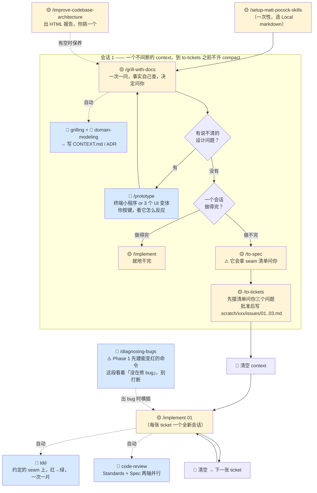

# 我的问题逐条解答 + 落地流程实例

> 依据：`~/harness-research/mattpocock-skills`（浅克隆，只读）。每条结论都标了出处文件，你可以自己核。
> 提问来源：[[../我对matt的思考]]　|　背景文档：[[01 engineering 17 个 skill 深度详解]]
> 日期：2026-08-04

---

## TL;DR

你 13 条里有 2 条需要纠正、1 条判断完全正确、1 条的答案藏在另一条里：

| # | 你的表述 | 结论 |
|---|---|---|
| 9 | diagnosing-bugs =「测试驱动的 Bug 修复」 | ⚠️ **要改**。核心不是测试，是「反馈回路」。failing test 只是 10 种构造方式里的第 1 种，很多 bug 根本没法写测试但都能建回路 |
| 3 | to-spec「只负责收拢内容」 | ⚠️ **漏了最重要的一件事**：它会主动画 seam 并要你确认。这就是 #6 的答案 |
| 8 | triage「对我暂时用不上」 | ✅ **完全正确**，而且原文明确支持你的判断 |
| 6 | 「我怎么知道什么 seam 是我想要的」 | 你不需要自己想。见 #6，给了你 3 条能独立执行的判据 |

---

## 🔑 先解决两个卡住理解的词

### Q1　model 是什么？和 skill 有什么区别

**model 是大脑，skill 是操作手册。**

- **model（模型）** = Claude / Opus 5 本身，那个会读、会写、会推理的东西。它是唯一的执行者。
- **skill** = 一个 markdown 文件（`SKILL.md`），里面写着「遇到 X 情况就按这几步做」。它不会运行，它只是被 model 读进去的文字。

类比：model 是分析师，skill 是他桌上的作业手册。手册不做事，分析师做事。手册的作用是让分析师不靠临场发挥。

**你在我文档里看到的 "model-invoked"，里面的 model 就是这个意思——「由模型自己决定要不要用」。** mattpocock 把 skill 硬分成两类（出处 `.agents/invocation.md`）：

| | 谁能启动 | frontmatter 标记 | description 写给谁看 |
|---|---|---|---|
| **user-invoked** | **只有你打字** `/xxx` | `disable-model-invocation: true` | 人看的一句话摘要 |
| **model-invoked** | 模型自己判断 + 你也能打字 | 不写这个字段 | 模型看的，要塞满触发词 |

**⚠️ 这里有一条硬约束，直接回答了你上次问的「没有编排 skill 的 skill」：**

> "A user-invoked skill may invoke model-invoked skills, but it can never reach another user-invoked skill."
> —— `.agents/invocation.md`

翻译：**user-invoked skill 之间不能互相调用。** 主流程 `grill-with-docs → to-spec → to-tickets → implement` 这四步全是 user-invoked，意味着**每一步都必须你亲手打字**。

这不是他忘了做编排，是故意的：**需要你拍板的节点，不给模型自主权。** 模型只能自动去拿「参考层」（tdd / code-review / codebase-design / domain-modeling 这些 model-invoked 的）。

所以你上次的担心——「AI 在某个节点会不会不调用 skill」——在他这套里被换掉了问法：**流程节点根本不指望 AI 自己想起来，指望你打字。**

> 📌 第三个 "model" 含义：`domain model`（领域模型）、`state model`（状态模型）里的 model = 「对一件事的结构化描述」，和上面完全无关。见 #12。

---

### Q2　issue tracker 和 ticket 到底是什么

**ticket（工单）= 一张写清楚「要做什么 + 做完算什么样」的卡片。** 一张 ticket 就是一个人（或一个 AI 会话）能一口气做完的一块活。

**issue tracker（问题追踪器）= 存放这些卡片的地方。**

程序员默认想到的是 GitHub Issues 那种网页系统。但对你来说关键的是：**mattpocock 原生支持「本地 markdown 当 tracker」**，不需要任何网站、任何账号。

`issue-tracker-local.md` 规定的形态：

```
.scratch/合并现金流量表/
├── spec.md                        ← to-spec 产出
└── issues/
    ├── 01-读取docx提取科目行.md      ← to-tickets 产出，一个文件 = 一张 ticket
    ├── 02-科目映射到标准表.md
    └── 03-合并输出.md
```

每个 ticket 文件的模板（`to-tickets` 的 local 版原文）：

```markdown
# 01 — 读取 docx 提取科目行

**What to build:** 从用户角度描述这一步做完之后能干什么
**Blocked by:** None — can start immediately
**Status:** ready-for-agent

- [ ] 验收标准 1
- [ ] 验收标准 2
```

### 👉 你的操作（装完第一件事）

跑 `/setup-matt-pocock-skills`，**Section A 选 "Local markdown"**。它一共问你三个问题，问完就写文件。选完之后 to-spec / to-tickets / wayfinder 全部改成往 `.scratch/` 写文件，你在 Obsidian 里能直接读。

三个问题的推荐答案：

| Section | 问题 | 选 |
|---|---|---|
| A | issue tracker 在哪 | **Local markdown**（除非这个项目本来就在 GitHub 上） |
| B | 保留默认 triage 标签吗 | **yes** |
| C | 领域文档布局 | **single-context**（默认，不会问你） |

> GitHub 只有一个功能是独占的：wayfinder 的**依赖关系在网页 UI 上可视化**。本地 markdown 只能靠 `Blocked by:` 文本行。对你现在的项目规模不构成差别。

---

### 术语速查（后面全在用）

| 词 | 一句话 |
|---|---|
| **spec** | = PRD。一份「做什么 + 为什么 + 测哪儿」的文档 |
| **ticket / issue** | 一张能被单个会话做完的活儿卡片 |
| **seam（接缝）** | 一个「从外面就能观察到行为」的口子。喂进去 A，看到 B 出来，不用知道里面怎么实现。测试站在这个口子外面 |
| **tracer bullet（曳光弹）** | 一条窄但**打穿所有层**的路径（数据 + 逻辑 + 界面 + 测试全碰一遍），做完能单独演示 |
| **vertical slice / horizontal slice** | 竖切 = 曳光弹。横切 = 这一张只做数据库、下一张只做界面，做完看不出任何效果 |
| **deep module（深模块）** | 大量行为藏在一个小接口后面。反面是浅模块 |
| **ADR** | Architecture Decision Record，一段 1-3 句话的「我们当时为什么这么定」 |
| **HITL / AFK** | Human In The Loop（要你在场）/ Away From Keyboard（AI 自己干） |

---

# 13 个 skill 逐条

---

## 1　grill-with-docs

**功能**：用逼问的方式把想法磨锐利，同时把产出沉淀进 `CONTEXT.md` 和 ADR。你理解对了。

**补一条你会想知道的**：这个 skill 的 SKILL.md 只有 **7 行**，正文就一句话——

> "Run a `/grilling` session, using the `/domain-modeling` skill."

真正的逼问逻辑在你已经装了的 `grilling`（12 行）里，纸面痕迹逻辑在 `domain-modeling` 里。**它本身是个组合器。** 这是他 skill 设计的典型手法：一个 user-invoked 的壳，把两个 model-invoked 的能力焊在一起。

**怎么用**：

| 情况            | 用哪个                         |
| ------------- | --------------------------- |
| 有代码库          | `/grill-with-docs`（有状态，留纸面） |
| 没代码库（纯想法、纯计划） | `/grill-me`（无状态，不写文件）       |

**grilling 原语的四条纪律**（这四条是它全部的价值）：

1. 一次只问一个问题，等你答完再问下一个——「一次问一堆是让人晕的」
2. 每个问题**它自己先给推荐答案**，你只需要说「对」或「不对，应该是 X」
3. **事实它自己查，决定问你。** 能靠读文件、跑命令知道的，不许问你
4. 达成共识前**不许开始动手**

---

## 2　prototype

> 你的问题：不是很懂这个 skill 的作用，写原型有什么意义么

**功能**：写一段一次性代码来回答一个设计问题。SKILL.md 第 8 行给了最紧的定义：

> "A prototype is **throwaway code that answers a question**. The question decides the shape."

**它的意义不在代码，在于把一个说不清的判断变成可以用手验证的东西。**

**为什么这个 skill 对你特别有用**：你是「说得出需求、说不出实现」的人。你最容易在纸面上同意一个方案，跑起来才发现不对。原型把这个发现**提前到写正式代码之前**。

LOGIC.md 第 67 行写得很直白——有价值的时刻是你说：

> "wait, that shouldn't be possible" 或 "huh, I assumed X would be different"

> **那是「想法」里的 bug，不是代码的 bug。这就是原型的全部产出。**

**两个分支，选错就整个原型白做**：

| 你想回答的问题 | 分支 | 产出的东西 |
|---|---|---|
| 「这个逻辑 / 状态模型对不对？」 | **LOGIC** | 一个终端小程序。你按键触发动作，屏幕上实时重画完整状态。按 `[a]` 加一个用户、`[t]` 推一下时钟，看状态怎么变 |
| 「这东西该长什么样？」 | **UI** | 同一个页面的 **3 个截然不同的版本**，靠 URL 参数 `?variant=A/B/C` 切换，屏幕底部一个浮动小条左右箭头翻页 |

**两个分支共同的 6 条规则**（挑对你有意义的讲）：

- **一条命令能跑起来**。加进项目现有的任务脚本，你不用记路径
- **默认不接数据库**，状态只在内存里。因为持久化正是原型要**检验**的东西，不该依赖它
- **不写测试、不做错误处理、不做抽象**。「需要测试的原型已经不是原型了」
- **每次动作后把完整状态打出来**，你才看得见变了什么
- **用完要归档**：验证过的决定折进正式代码，原型本身推到一个丢弃分支存档，在 ticket 上留个指针。主分支只留「验证过的决定」

**UI 分支两条实用细节**：

- 变体必须**结构上不同**——不同布局、不同信息层级。「三个稍微调过的卡片网格不是原型，是墙纸」
- 最常见的反馈是「我想要 B 的头 + C 的侧栏」——**那就是他们真正想要的设计**

**什么时候用**：主流程第 2 步的岔路。你在 grilling 里卡住了，某个问题需要一个能跑的答案，就岔出去做原型。

---

## 3　to-spec

> 你的问题：这个 skill 只负责收拢内容，具体内容由 grilling 实现；issue tracker 是什么

issue tracker 见 Q2。

**「只负责收拢」这个判断基本对，但漏了最重要的一件事。**

### ⚠️ 它会主动画 seam 并要你确认

原文 Process 第 2 步：

> "Sketch out the seams at which you're going to test the feature. Existing seams should be preferred to new ones. Use the highest seam possible... The fewer seams across the codebase, the better - **the ideal number is one.**
>
> **Check with the user that these seams match their expectations.**"

**这是 grilling 完全不做的一件事，而且它直接接上你 #6 的问题。** 你不需要自己想出 seam——这一步 AI 会把 seam 清单摆给你确认。判据在 #6。

### 它另外还做两件 grilling 不做的事

**① spec 有固定 7 段模板**，其中 User Stories 要求 "extremely extensive"：

```
## Problem Statement       ← 从用户视角说问题
## Solution                ← 从用户视角说方案
## User Stories            ← 一个很长的编号列表，「作为 X，我想要 Y，以便 Z」
## Implementation Decisions ← 要建/改哪些模块、接口、schema、API 契约
## Testing Decisions       ← 什么算好测试、测哪些模块、参考现有哪些测试
## Out of Scope            ← 明确不做什么
## Further Notes
```

**② 一条纪律：不许写具体文件路径和代码片段**——「它们很快就过期」。唯一例外：原型产出的状态机 / reducer / schema / 类型定义，因为这些**用代码表达比用散文表达更精确**，可以内联，但要注明来自原型，且只留决策相关的部分。

**怎么用**：`/to-spec`，不带参数。它读当前对话上下文 + 代码库，**不再采访你**。产出发到 tracker，自动打 `ready-for-agent` 标签（跳过 triage）。

---

## 4　to-tickets

> 你的问题：不是很懂这个 skill 具体是做什么的，和 to-spec 有什么区别

**它把一份 spec / 计划 / 对话，切成 N 张能独立做完的卡片，并标明谁卡谁。**

### 和 to-spec 的区别

| | to-spec | to-tickets |
|---|---|---|
| **产出** | 1 个文件：`spec.md` | N 个文件：`01-xx.md`、`02-xx.md`… |
| **回答的问题** | 做什么、为什么、测哪儿 | **按什么顺序做、谁卡谁** |
| **关键动作** | 画 seam 找你确认 | 切竖片 + 标 blocking 边 |
| **可以跳过吗** | 单会话做得完就跳 | 单会话做得完就跳 |

一句话：**spec 是「是什么」，tickets 是「怎么排队」。**

### 核心概念：曳光弹（tracer bullet）

每张 ticket 必须是一条**窄但打穿所有层**的路径——数据库、逻辑、界面、测试全碰一遍，做完**能单独演示或验证**。

反面是横切（horizontal slice）：这一张只做数据库、下一张只做界面。做完前两张你什么也看不见，而且这跟 tdd 那条反模式（#6 第 3 条）是**同一个错误**。

还有一条尺寸规则：**一张 ticket 装得进一个全新的 context window。**

### 一个重要例外：wide refactor

原文 line 40 单独处理了一种切不成竖片的活：**「宽重构」——一个机械性改动，但爆炸半径覆盖整个代码库**（重命名一个到处都在用的字段、给一个共享符号换类型）。改一处就同时打断上千个调用点，任何竖片都没法「做完是绿的」。

解法是 **expand–contract（先扩后缩）三段**：

1. **expand** — 新形式加在旧形式旁边，什么都不破
2. **migrate** — 按爆炸半径分批（按包、按目录）迁移调用点，**每批一张 ticket**，都被 expand 那张卡住。因为旧形式还在，每批之间 CI 都是绿的
3. **contract** — 没有调用方了，删掉旧形式。这张被**每一个** migrate 批次卡住

### 它会先来问你三个问题

Step 4 会把提议的清单摆给你（标题 / 被谁卡 / 交付什么行为），然后问：

1. 粒度对不对？（太粗还是太细）
2. 卡关系对不对——每张 ticket 是不是只依赖真正卡它的那些？
3. 有没有该合并或该再拆的？

**迭代到你批准为止**，才开始写文件。

**一个词：frontier（前沿）** = 所有卡它的 ticket 都做完了的那些 ticket。你每次从前沿里挑一张干。纯线性依赖时就是从上到下。

---

## 5　implement

> 你的问题：按 spec 或 ticket 集合来构建。具体构建什么？

**构建的就是你在 spec / ticket 里写的那个东西。它本身不决定做什么——做什么在前两步已经定了。**

它是全 17 个里**最短的一个，15 行**，正文 5 句话。它真正加的价值是四条纪律：

1. **尽可能用 `/tdd`，且只在事先约定好的 seam 上**
2. **频繁跑类型检查 + 单个测试文件，全套测试最后跑一次**（不是每改一行都跑全套）
3. **做完自动跑 `/code-review`**
4. **commit 到当前分支**

### 这是整套里唯一一个会自动串起下游 skill 的地方

因为 `tdd` 和 `code-review` 都是 **model-invoked**，而 user-invoked 的 `implement` 够得到 model-invoked 的（Q1 那条约束）。所以你打一次 `/implement`，实际拿到的是 implement + tdd + code-review 三个。

**用法纪律**（出处 `ask-matt` line 23、30）：多 ticket 项目要**每张 ticket 之间清空 context**。每个 `/implement` 从全新会话开始，只读那张 ticket。

---

## 6　tdd

> 你的问题 A：说先约定 seam，但对我一个不懂具体开发但想通过开发实现需求的人，我怎么知道什么 seam 是我想要的？
> 你的问题 B：3 个反模式是什么意思

### A. 你不需要自己想出 seam。三层保护。

**先给白话定义**：**seam = 一个「从外面就能观察到行为」的口子。** 你不需要知道里面怎么实现，只要能「喂进去 A，看到 B 出来」。测试站在这个口子外面。

**① 流程上，seam 是 AI 提案、你确认。**

`to-spec` Step 2「画 seam 并和用户确认」和 `tdd` 的「No test is written at an unconfirmed seam」是同一件事的两端。你的角色是**确认者**，不是提案者。

**② 你的确认标准不是技术标准，是「这句话我看得懂吗」。**

看 `tests.md` 里的正反对照——注意这两个测试的**名字**：

```typescript
// 好：user can checkout with valid cart
//     ← 你看得懂。这就是需求本身。
test("user can checkout with valid cart", async () => {
  const cart = createCart();
  cart.add(product);
  const result = await checkout(cart, paymentMethod);
  expect(result.status).toBe("confirmed");
});

// 坏：checkout calls paymentService.process
//     ← 你看不懂，因为这是实现细节，不是需求。
test("checkout calls paymentService.process", async () => {
  const mockPayment = jest.mock(paymentService);
  await checkout(cart, payment);
  expect(mockPayment.process).toHaveBeenCalledWith(cart.total);
});
```

> **👉 可执行判据：AI 报给你的每个 seam，让它写出对应的测试名。你读不出业务含义的，直接 push back。**

这条你能独立执行，不需要懂代码。

**③ 有三条硬规则帮你砍数量**（`to-spec` Step 2 原文）：

- 已有的 seam 优于新建的
- seam 位置尽量往**高**处放
- **越少越好，理想是 1 个**

所以 AI 给你报 5 个 seam，你可以直接问：「能不能合成 1-2 个？」——这是 skill 自己写的规则，你在替它执行。

**再给你一条口诀**：seam 应该在「你能用一句业务话描述输入输出」的地方。「喂 6 份财报进去，出来一张合并现金流量表」——这是好 seam。「调用 parseDocxParagraph 之后返回 Paragraph[]」——这不是你要的 seam。

### B. 三个反模式，白话 + 识别信号

**① Implementation-coupled（黏在实现上）**

测试去检查「怎么做的」而不是「做到了什么」：mock 内部模块、测私有方法、绕过接口直接查数据库。

> **识别信号：重构了代码但行为完全没变，测试却红了。**

那这个测试是**负资产**——它在阻止你改进代码。

反例（`tests.md`）：

```typescript
// 坏：绕过接口去数据库验证
test("createUser saves to database", async () => {
  await createUser({ name: "Alice" });
  const row = await db.query("SELECT * FROM users WHERE name = ?", ["Alice"]);
  expect(row).toBeDefined();
});

// 好：通过接口验证
test("createUser makes user retrievable", async () => {
  const user = await createUser({ name: "Alice" });
  const retrieved = await getUser(user.id);
  expect(retrieved.name).toBe("Alice");
});
```

**② Tautological（同义反复）— 这条对你最实用**

期望值用和代码一样的方式算出来，所以**构造上必然通过，永远不可能发现代码算错**。

> **金融类比**：你要审一家公司报的利润对不对。你拿公司自己那套算法重算一遍，然后核对——当然一致，因为你用了同一套算法。这个审计**结构上就不可能查出问题**。

正确做法：期望值必须来自**独立来源**——一个已知正确的数字、一个手工算过的例子、spec 里写死的值。

```typescript
// 坏：期望值是算出来的
test("calculateTotal sums line items", () => {
  const items = [{ price: 10 }, { price: 5 }];
  const expected = items.reduce((sum, i) => sum + i.price, 0);   // ← 和代码同一套算法
  expect(calculateTotal(items)).toBe(expected);
});

// 好：期望值是写死的独立字面量
test("calculateTotal sums line items", () => {
  expect(calculateTotal([{ price: 10 }, { price: 5 }])).toBe(15);  // ← 15 是你手算的
});
```

> **👉 这条你自己就能查**：看测试里的期望值是不是一个**写死的具体数字**。如果它是一段算出来的表达式，就有问题。

**③ Horizontal slicing（横切）**

先把所有测试写完，再写所有实现。三个坏处（原文 line 30）：

- 那批测试验的是**想象中的行为**——你测的是「形状」不是真实的用户行为
- 测试对真实改动变得不敏感
- 你在还没理解实现之前，就把测试结构定死了

正确做法：**一个测试 → 一段实现 → 再来一个**，每个测试是曳光弹，会根据上一轮学到的东西调整。

### C. 一条你会觉得反直觉的规则

> "**Refactoring is not part of the loop.** It belongs to the review stage."

经典 TDD 是 red-green-**refactor** 三段，他把 refactor 拿出来了，归到 `code-review` 阶段。理由：在红绿循环里顺手重构，等于在还没看清全貌的时候做结构决策。

### D. mocking 的一条硬线（`mocking.md`）

**只在系统边界 mock**：外部 API（支付、邮件）、时间和随机数、有时候数据库和文件系统。

**不许 mock**：你自己的类和模块、内部协作者、任何你控制得了的东西。

---

## 7　code-review

**功能**：你理解对了——不仅看代码质量，还看是不是做了要求的事。

**补关键机制**：两根轴**并行跑在两个独立的 subagent 里**，然后聚合，而且**明确禁止合并或重排两边的发现**。

理由（原文 line 82-89）：一个改动可以过一轴挂另一轴——

| 情况 | Standards | Spec |
|---|---|---|
| 代码规范全对，但做错了东西 | ✅ pass | ❌ fail |
| 完全按需求做了，但破坏了项目约定 | ❌ fail | ✅ pass |

合并会让一轴掩盖另一轴。所以最后的一句话总结也只报「**每一轴内部**最严重的问题」，不许跨轴选一个赢家。

**Standards 轴自带兜底**：12 条 Fowler 代码坏味道（《重构》第 3 章），**即使你的项目一个规范文档都没写也会检查**。两条约束：项目自己写的规范优先级更高；每条 smell 都是「判断题」不是「违规」，措辞是 "possible Feature Envy"。工具（linter / formatter）已经管的，跳过。

12 条里你能直接看懂的几条：

| smell | 是什么 | 怎么修 |
|---|---|---|
| **Mysterious Name** | 名字看不出它做什么 | 改名；改不出诚实的名字，说明设计本身糊 |
| **Duplicated Code** | 同一段逻辑出现在多个地方 | 抽出来，两边都调它 |
| **Speculative Generality** | 为了「以后可能要」加的抽象、参数、钩子，但 spec 没这需求 | 删掉。等真需求出现再说 |
| **Shotgun Surgery** | 一个逻辑改动逼你改一堆分散的文件 | 把「一起变的东西」收拢到一个模块 |
| **Divergent Change** | 一个文件因为好几个不相关的原因被改 | 拆开，让每个模块只因一个原因变 |
| **Middle Man** | 一个类/函数基本只是转发 | 砍掉，直接调真正的目标 |

**对你最有用的其实是 Spec 轴**，它报三类：

1. spec 要求了但**没做或只做一半**的
2. diff 里有 spec **没要求**的行为（scope creep，范围蔓延）
3. 看起来做了但**实现看起来是错的**

而且要求**每条发现都引用 spec 原文那一行**。

> **这是你唯一能自己验的一轴**——因为你看得懂 spec，你能核对它引的那一行。

**怎么用**：`/code-review` + 一个固定点（`main`、某个 commit SHA、`HEAD~5`）。它会先确认这个 ref 存在、diff 非空，**再**去开两个 subagent——不让错误在两个并行 agent 里面才爆。

---

## 8　triage

> 你的判断：针对于接手别人的项目，对我暂时用不上

### ✅ 完全正确，而且原文明确支持你

`ask-matt` line 40：

> "Triage is only for issues **you didn't create** — bug reports, incoming feature requests, anything that arrives raw. Tickets that `/to-tickets` produced are already agent-ready, so **don't triage them**."

`to-tickets` 产出的 ticket 直接带 `ready-for-agent` 标签，**跳过整个 triage**。triage 是给「别人扔进来的原始请求」用的。

**它管的东西**：两个类别角色（`bug` / `enhancement`）+ 五个状态角色（`needs-triage` / `needs-info` / `ready-for-agent` / `ready-for-human` / `wontfix`）的状态机。

**未来什么时候会用上**：你做的 skill / 工具给公司同事用了，他们开始提需求和报 bug——那时它就有价值了。里面有两个设计值得那时候再看：

- **每条 AI 发的评论强制加免责声明** `> *This was generated by AI during triage.*`
- **`.out-of-scope/` 知识库**：被拒的 feature request 写进这个目录。下次有人提类似的，triage 会先读这个目录，报「这个以前拒过，理由是 X」。**这是防重复讨论的机制**

> 📌 顺带一个我发现的小 bug：`setup-matt-pocock-skills` 的说明里引用了一个叫 `qa` 的 skill，但 `qa` 已经被移进 `deprecated/` 了。按作者自己 `CLAUDE.md` 定的规矩这算「a router that lies」。不影响使用。

---

## 9　diagnosing-bugs

> 你的表述：测试驱动的 Bug 修复。很重要

### ⚠️ 这句要改。这个 skill 的核心不是测试。

原文 Phase 1 标题下第一句就在强调：

> "**This is the skill. Everything else is mechanical.** If you have a **tight** pass/fail signal for the bug — one that goes red on _this_ bug — you will find the cause; bisection, hypothesis-testing, and instrumentation all just consume it."

Phase 1 要的是**一条反馈回路（feedback loop）**——一条你能反复跑、会因为这个 bug 变红、修好就变绿的命令。**failing test 只是构造这条回路的 10 种方式里的第 1 种。**

完整 10 种（按推荐顺序）：

| # | 方式 | 什么时候用 |
|---|---|---|
| 1 | **失败的测试** | 任何能碰到 bug 的 seam 上 |
| 2 | **curl / HTTP 脚本** | 打本地 dev server |
| 3 | **CLI 调用 + 快照 diff** | 有固定输入输出的工具 |
| 4 | **headless 浏览器脚本**（Playwright / Puppeteer） | UI 相关，断言 DOM / console / network |
| 5 | **重放抓下来的 trace** | 存一个真实请求 / 事件日志到磁盘，隔离重放 |
| 6 | **一次性 harness** | 搭一个最小子集（一个服务 + mock 依赖），一次函数调用就触发 bug |
| 7 | **属性 / fuzz 循环** | 「有时候结果不对」——跑 1000 个随机输入找失败模式 |
| 8 | **二分查找 harness** | bug 出现在两个已知状态之间，自动化成能 `git bisect run` |
| 9 | **差分对跑** | 同一输入过旧版和新版，diff 输出 |
| 10 | **HITL bash 脚本** | 最后手段。必须人点的时候，用 `scripts/hitl-loop.template.sh` 驱动**人**，保持回路结构化 |

**这个区别对你为什么重要**：很多 bug 根本没法写测试（浏览器上才复现、只在真实数据上出错、间歇性的），**但都能构造反馈回路**。如果你以为这个 skill 只会写测试，遇到这类 bug 你就不会想到用它。

### 最狠的一条规则

> "If you catch yourself reading code to build a theory before this command exists, **stop — jumping straight to a hypothesis is the exact failure this skill prevents. No red-capable command, no Phase 2.**"

Phase 1 的完成判据是四条勾选，而且**必须贴出你已经跑过至少一次的命令和它的输出**——不是「我打算跑」：

- [ ] **能变红** — 走真实的 bug 代码路径，断言的是**你描述的那个确切症状**。不是「跑起来没报错」，是**能抓到这个特定的 bug**
- [ ] **确定性** — 每次跑结论一样（间歇性 bug：钉住一个足够高的复现率）
- [ ] **快** — 秒级，不是分钟级
- [ ] **agent 能自己跑** — 不需要人盯着

> 「30 秒还会 flaky 的回路，比没回路好不了多少；2 秒确定性的回路是调试超能力。」

**间歇性 bug 的目标不是干净复现，是提高复现率**：循环触发 100 次、并行、加压力、缩小时间窗口、注入 sleep。「50% 概率的 bug 能调，1% 不能——一直拉高到能调为止。」

**建不出回路的时候**：明确停下来说明，列出试过什么，然后要三样东西之一——能复现的环境访问权、一个抓下来的产物（HAR 文件 / 日志 dump / 带时间戳的录屏）、或者在生产加临时探针的许可。**不许没有回路就开始猜。**

### 六个阶段全景

| Phase | 做什么 | 你要知道的关键点 |
|---|---|---|
| **1 建回路** | 上面那 10 种方式 | ⚠️ 这段看起来「没在修 bug」，**别打断** |
| **2 复现 + 最小化** | 跑到变红，然后**一次砍一个**元素再跑，直到「删任何一个都会变绿」 | 最小化不是洁癖：它缩小 Phase 3 的假设空间，且直接变成 Phase 5 的回归测试 |
| **3 生成假设** | **3-5 个排序过的可证伪假设**，每个必须说出预测：「如果 X 是原因，那么改 Y 会让 bug 消失」。说不出预测的叫 vibe，砍掉 | **它会先把清单给你看**——你不懂代码但懂业务，可能一眼看出「第 3 个我们上周刚改过」 |
| **4 埋探针** | 一次只动一个变量。优先调试器 / REPL（一个断点胜过十条日志），其次在**能区分假设的边界**上打日志。禁止「全打日志然后 grep」 | 所有调试日志打唯一前缀 `[DEBUG-a4f2]`，最后一次 grep 全清。**性能问题不要用日志**——先建基线测量再二分 |
| **5 修 + 回归测试** | **先写回归测试再修**——但只在有**正确的 seam** 时 | 见下面那条 |
| **6 清理 + 复盘** | 六条勾选 + 「什么本来能防住这个 bug」 | 猜对的那个假设要写进 commit message，让下一个调试的人学到 |

### Phase 5 有个诚实的出口

如果唯一可用的 seam 太浅（bug 需要多个调用方才出现，但只有单调用方的测试），在那儿放回归测试给的是**假信心**。

> "**If no correct seam exists, that itself is the finding.**"

记下来——代码结构本身在阻止这个 bug 被锁死。交给 `/improve-codebase-architecture`。而且这个建议**必须在修完之后再提**，不是修之前——「你现在掌握的信息比开始时多。」

---

## 10　wayfinder

> 你的理解：遇到一个大到一个会话无法实现的工作，在 issue tracker 上建一张决策 ticket 的共享地图，分割任务，逐步实现。很重要

**基本对，但有三个关键点搞错就白用。**

### (a) 它产出「决策」，不产出「东西」

原文有个专门的小节叫 **"Plan, don't do"**：

> "Wayfinder is **planning** by default: each ticket resolves a **decision**... The pull to just do the work is usually the signal you've reached the edge of the map and it's time to hand off. Absent that, **produce decisions, not deliverables.**"

你写的「逐步实现」这个词要换掉——它逐步**解决决策**。实现是交出去之后的事。

### (b) 每个会话只解一张 ticket（research 类除外）

不是效率问题——**每张 ticket 就是按「一个 100K token 会话」来 size 的**。

### (c) 战争迷雾（fog of war）—— 这是它和 to-tickets 最大的区别

地图**故意不完整**。你现在说不清的问题**不许**写成 ticket，只能写进地图的 "Not yet specified" 段。判据（原文 line 88）：

> "The test is whether you can **state** the question precisely now — _not_ whether you can **answer** it now."

| 状况 | 归到哪 |
|---|---|
| 问题已经问得很清楚（即使被卡住、现在动不了） | **开 ticket** |
| 还问不清楚 | **留在 Not yet specified**（迷雾） |

解掉一张 ticket 会**清掉它前面的迷雾**，让原本模糊的东西「毕业」成新 ticket——一次一个，直到通往目标的路清楚了、没有 ticket 剩下。

而且**不许把迷雾预先切成 ticket 大小的块**：一片迷雾可能毕业成好几张 ticket，也可能一张都不产生。

### 迷雾 vs Out of scope（另一个容易混的）

| | 是什么 | 会毕业吗 |
|---|---|---|
| **Not yet specified**（迷雾） | 朝着目标，但还看不清 | **会** |
| **Out of scope** | 已确认在目标**之外** | **永不**。除非目标被重画，那时算一个新的 effort，不是续上 |

判据是**范围**，不是**清晰度**。

### 地图的形态

```markdown
## Destination        ← 走到这张地图尽头是什么样。1-2 行。每个会话开工前先看这里
## Notes              ← 领域；每个会话都该用的 skill；这个 effort 的固定偏好
## Decisions so far   ← 索引，一行一个已关闭的 ticket：够判断相关性，细节点链接过去
## Not yet specified  ← 迷雾
## Out of scope       ← 已排除
```

**地图是索引，不是仓库**——一个决定只活在一个地方（它自己那张 ticket 里），地图只写要点 + 链接。

**一条人性化设计**：所有给人看的地方**只许用 ticket 的名字，不许用编号**。「一墙的 `#42, #43, #44` 是没法读的；名字一眼就懂。」

### 四种 ticket 类型

| 类型 | 人要在场吗 | 干什么 |
|---|---|---|
| **research** | AFK | 读文档 / 第三方 API / 知识库，捞一个决策等着的事实。派 `/research` **subagent** 解决，可以**并行开火** |
| **prototype** | HITL | 做一个便宜粗糙的具体东西让人有反应可给——大纲、草稿、stub，或用 `/prototype` 出 UI/逻辑代码 |
| **grilling** | HITL | 对话，一次一个问题。**默认类型** |
| **task** | 都可能 | 决策**之前**必须先做完的手工活：去注册个服务才能评估它的 API、开通权限、搬数据才能看到它的形状。**这是唯一一种「做事」而不是「决策」的类型**——它靠解锁一个决策才有资格进地图 |

**HITL 的硬约束**：「一个自己回答自己问题的 grilling agent 已经破坏了这件事。」AI 不许替人说话。

### 什么时候用 / 不用

`ask-matt` line 44 说得很直：wayfinder 是这里**认知负荷最高**的流程。

| | 用哪个 |
|---|---|
| 一个会话装得下的想法 | `/grill-with-docs` |
| 一个会话装不下的想法（新项目、大改造） | `/wayfinder` |
| **一个范围清楚的 feature** | ⚠️ **别用 wayfinder**。「it's slower and denser, so save it for exactly that, never a well-scoped feature」 |

### 地图清完之后：接 /to-spec，不要接 /implement

> "Looping the map straight into `/implement` skips that collapse and **throws the linked detail away**."

地图上那些散落在各个 ticket 里的决策，需要 `/to-spec` 收拢成一份可建造的计划。只有当这个 effort 最后发现其实很小，才直接接 `/implement`。

---

## 11　improve-codebase-architecture

> 你的问题：深化机会具体是什么东西

**深化机会（deepening opportunity）= 一处「把浅模块改成深模块」的重构机会。**

这个定义要先懂 #13 才完整（深/浅模块的定义在那里，配了金融类比）。这里讲**怎么识别**和**怎么用**。

### 识别信号（原文 Step 1 的 5 个问题）

它派 `Explore` subagent 走一遍代码库，不按死板启发式，就是找「哪里让人别扭」：

- 理解一个概念要在**很多个小模块之间来回跳**
- 模块很**浅**——接口的复杂度快赶上实现了
- **为了「方便测试」抽出来一堆纯函数，但真正的 bug 藏在「这些函数怎么被调用」里**（没有 locality）
- 紧耦合的模块从 seam 上**漏**出去了
- 哪些部分没测试，或者**从当前接口没法测**

第三条对 AI 生成的代码特别常见——AI 很喜欢抽纯函数因为「好测」，但 bug 在编排层。

### 一条判据：deletion test（删除测试）

假想把这个模块**删掉**：

| 结果 | 结论 |
|---|---|
| 复杂度会**散到 N 个调用方**身上 | ✅ 它在挣钱，别动 |
| 复杂度只是**搬了个地方** | ❌ 它是个纯通道，是深化候选 |

### 扫描范围纪律（YAGNI）

**不许全库乱扫。** 深化的回报来自「以后改这里更容易」，所以：

- 你指了方向（一个模块、一个子系统、一个痛点）→ 按你说的
- 你没指 → 走 `git log --oneline` 找**最近老改的热点区**，让那些路径优先吸引注意力
- 改动很分散、没有明显热点 → 才放宽范围

### 输出形态很特别

**一个自包含的 HTML 报告，写到系统临时目录**（`$TMPDIR`，落不进你的仓库），自动帮你打开，告诉你绝对路径。Tailwind + Mermaid 走 CDN。

每个候选一张卡片：

| 字段 | 内容 |
|---|---|
| **Files** | 涉及哪些文件 / 模块 |
| **Problem** | 当前架构为什么造成摩擦 |
| **Solution** | 大白话描述会改成什么样 |
| **Benefits** | 用 locality 和 leverage 说，以及测试会怎么变好 |
| **Before / After 图** | 并排，手绘，画出「浅」和「深化后」 |
| **Recommendation strength** | 徽章：`Strong` / `Worth exploring` / `Speculative` |

结尾一个 **Top recommendation** 段：它自己会先挑一个。

**用词纪律**：领域词用 `CONTEXT.md` 的，架构词用 `codebase-design` 的。「如果 CONTEXT.md 定义了 Order，就说 'the Order intake module'——不是 'the FooBarHandler'，也不是 'the Order service'。」

**ADR 冲突处理**：如果一个候选和已有 ADR 矛盾，只在摩擦真的大到值得重开那个 ADR 时才提，而且卡片上明确标出来：「与 ADR-0007 矛盾——但值得重开，因为……」。不许把 ADR 禁止的每一种理论重构都列一遍。

### 它故意不直接给方案

> "**Do NOT propose interfaces yet.** After the file is written, ask the user: 'Which of these would you like to explore?'"

你挑了一个，才进 grilling 环节（Step 3），过程中副作用**当场发生**：

- 深化后的模块要叫一个 `CONTEXT.md` 里没有的概念 → 当场加进 `CONTEXT.md`
- 对话中磨清了一个模糊术语 → 当场更新
- 你用一个**有承重理由**的原因否掉了这个候选 → 它问「要不要记成 ADR，这样以后的架构审查不会再提同一件事？」（只在这个理由是未来的探索者真的需要的时候才问，「现在不值得」这种一次性理由跳过）
- 想探索这个模块的其他接口设计 → 走 `codebase-design` 的 design-it-twice 并行 subagent 模式

**什么时候跑**：原文说 "whenever you have a spare moment"。**它是保养，不是功能开发。**

---

## 12　domain-modeling

> 你的理解：挑战一个模糊术语、解决一个一词多义的词，通过把难以逆转的决策记成 ADR，解决领域语言漂移问题

**对。补三个可执行的点——这个 skill 的全部价值就在这三条约束上。**

### (a) CONTEXT.md 有一个很凶的格式规定

```md
**Order**:
客户下的一笔采购请求。
_Avoid_: Purchase, transaction

**Invoice**:
交付之后发给客户的付款请求。
_Avoid_: Bill, payment request

**Customer**:
下订单的个人或组织。
_Avoid_: Client, buyer, account
```

四条规则：

- **要有立场。** 同一个概念有多个词的时候，挑最好的那个，其他的全塞进 `_Avoid_`
- **定义要紧。** 最多 1-2 句。定义「它**是**什么」，不是「它**做**什么」
- **只放这个项目特有的词。** 通用编程概念（超时、错误类型、工具模式）不许进，即使项目里大量用到。加词之前先问：这是这个上下文独有的概念，还是通用编程概念？
- 自然聚成簇的时候用子标题分组

> `_Avoid_` 这一行是整个机制的**牙齿**。它把「随便叫什么都行」变成「这个词是错的」。没有它，词汇表就是一堆没人看的定义。

### (b) CONTEXT.md 只准是词汇表

> "`CONTEXT.md` should be **totally devoid of implementation details**. Do not treat `CONTEXT.md` as a spec, a scratch pad, or a repository for implementation decisions. **It is a glossary and nothing else.**"

### (c) ADR 只在三条**同时**成立时才提议

1. **难以撤回** — 以后改主意的代价是实打实的
2. **没有上下文会让人困惑** — 未来的读者会看着代码想「他们到底为什么这么干」
3. **是一个真实权衡的结果** — 有过真的备选方案，你为了具体理由挑了一个

缺一条就不写。理由：容易撤回的，你反正会撤；不令人意外的，没人会问为什么；没有真备选的，除了「我们做了显然的事」没什么可记。

**模板极简——1 到 3 句话就是一个合格 ADR**：

```md
# {决定的简短标题}

{1-3 句：上下文是什么，我们决定了什么，为什么。}
```

「一个 ADR 可以就是一段话。价值在于记录**有过**一个决定和**为什么**，不在于填满 section。」

### 它在对话中主动做的五件事

| 动作 | 例子 |
|---|---|
| **对着词汇表挑战你** | 「你的词汇表把 cancellation 定义成 X，但你说的好像是 Y——到底是哪个？」 |
| **磨锐模糊语言** | 「你说的 account——你指的是 Customer 还是 User？这是两个东西。」 |
| **用具体场景压力测试** | 主动编边界场景，逼你说清概念之间的界限 |
| **和代码交叉核对** | 「你的代码取消的是整个 Order，但你刚说可以部分取消——哪个是对的？」 |
| **当场更新 CONTEXT.md** | 一个词定下来就当场写，**不许攒着批量写** |

### 一个区分（`.agents/invocation.md`）

**只是「读」CONTEXT.md 取词汇，不算这个 skill**——那是一行 prose 提示，任何 skill 都能做。只有**主动构建/磨锐**的那套纪律（挑战术语、编边界场景、写 ADR、当场更新）才是这个 skill。

---

## 13　codebase-design

> 你的问题：看不懂，不知道什么意思，更不知道怎么用

### 它是唯一一个「不做事」的 skill——它只提供一套词

作用：让 AI 在设计代码结构时**不飘**。它是 `tdd` 和 `improve-codebase-architecture` 两个 skill 共同的词汇底座。

### 先讲核心概念（用你的语言）

**深模块（deep module）= 大量行为藏在一个小接口后面。**

> **金融类比**：一只公募基金。你作为投资人，接口只有三个动作——**申购、赎回、查净值**。背后的选股、调仓、风控、估值、清算全部藏在里面。这就是**深**。

**浅模块（shallow module）= 接口的复杂度快赶上实现了。**

> 对应的反面：一只「基金」要求你自己指定买哪些股票、各买多少、什么时候调仓、怎么处理分红——那它跟你直接下单没区别，**这层封装白加**。

原文的图：

```
深模块                          浅模块（避免）
┌─────────────────────┐       ┌─────────────────────────────────┐
│   Small Interface   │       │       Large Interface           │
├─────────────────────┤       ├─────────────────────────────────┤
│                     │       │  Thin Implementation            │
│  Deep Implementation│       └─────────────────────────────────┘
│                     │
└─────────────────────┘
```

设计接口时问三句：能不能少几个方法？能不能简化参数？能不能把更多复杂度藏进去？

### 词表（每个词都带禁用替代词）

原文第一句：「**Use these terms exactly** — don't substitute 'component,' 'service,' 'API,' or 'boundary.' **Consistent language is the whole point.**」

| 词 | 意思 | 禁用替代词 |
|---|---|---|
| **module** | 任何「有接口 + 有实现」的东西。**故意不限尺度**：一个函数、一个类、一个包、一个跨层的切片都算 | unit, component, service |
| **interface** | 调用方为了正确使用它**必须知道的全部事实**——不只是类型签名，还包括不变量、调用顺序要求、错误模式、必需配置、性能特征 | API, signature（太窄，只指类型层面） |
| **implementation** | 模块里面的东西。和 **adapter** 区分：一个东西可以是小 adapter + 大 implementation（Postgres 仓库），也可以是大 adapter + 小 implementation（内存假实现） | — |
| **depth（深度）** | 接口上的**杠杆**：调用方（或测试）每学一份接口，能换到多少行为 | — |
| **seam（接缝）** | 一个「不用改这里就能改变行为」的位置；接口所在的**地点**。**放哪儿是一个独立的设计决策**，和「后面放什么」分开 | boundary（和 DDD 的 bounded context 撞车） |
| **adapter（适配器）** | 一个具体的东西，插在 seam 上满足接口。描述的是**角色**（填哪个槽），不是**内容**（里面是什么） | — |
| **leverage（杠杆）** | 调用方从深度里得到的：一份实现在 N 个调用点 + M 个测试上都能收租 | — |
| **locality（局部性）** | 维护者从深度里得到的：改动、bug、知识、验证都集中在一个地方。**修一次，处处修好** | — |

关系链：一个 module 有恰好一个 interface。depth 是 module 的性质，对着它的 interface 度量。seam 是 interface 所在的地方。adapter 坐在 seam 上满足 interface。depth 给调用方产生 leverage，给维护者产生 locality。

### 四条原则，其中三条你会天天用到

**① deletion test（删除测试）** —— 见 #11

**② "The interface is the test surface."（接口就是测试面）**

调用方和测试穿过的是**同一个口子**。如果你想测到接口**里面**去，说明这个模块形状不对。

> **这条把 #13 和 #6 绑在一起了**——seam 选对了，测试自然写在正确的地方。反过来，「这个东西很难测」通常不是测试的问题，是模块形状的问题。

**③ "One adapter means a hypothetical seam. Two adapters means a real one."**

一个适配器只是**假想**的接缝，两个才是**真的**。

翻译：不要为了「以后可能要换」而加一层抽象。只有当**现在真的有两个东西要插在这里**（最典型：生产用真的 + 测试用假的），这层抽象才成立。单适配器的 seam 只是**多余的一层间接**。

> **👉 这是你能拿去砸过度设计的单条判据。** AI 给你加了一层抽象，你问：「现在有几个东西插在这个 seam 上？」答「一个」→ 删掉。

**④ 深度是接口的性质，不是实现的性质。**

一个深模块内部完全可以由一堆小的、可 mock 的、可替换的零件组成——**它们只是不出现在接口上**。所以有**内部 seam**（私有的，它自己的测试用）和**外部 seam**（在接口上）的区分。不要因为测试用了内部 seam 就把它暴露到接口上。

### 他明确拒绝的定义（这条挺有意思）

Ousterhout 原书用「实现行数 / 接口行数」的比值定义深度——**他拒绝了**，理由：

> "rewards padding the implementation"（那会奖励把实现写得更长）

改用 depth-as-leverage。这是个很好的例子说明为什么要读原文而不是读二手总结。

### 怎么用

**平时不用管。** 它是 model-invoked，`tdd` 和 `improve-codebase-architecture` 会自己把它拉进来。

**你主动用它的时机**：AI 提了一个代码结构方案，你想验它是不是过度设计 → 让它**用 `codebase-design` 的词表复述这个方案**，然后你拿「两个适配器」和「删除测试」两条去砸。

### 两个附加文件

**`DEEPENING.md`** —— 怎么安全地深化一堆浅模块。按依赖分四类，类别决定怎么测：

| 依赖类别 | 例子 | 怎么办 |
|---|---|---|
| **1 in-process** | 纯计算、内存状态、无 I/O | **总能深化**。合并模块，直接穿新接口测。不需要 adapter |
| **2 local-substitutable** | 有本地替身（PGLite 替 Postgres、内存文件系统） | 替身存在就能深化。替身跑在测试套件里。seam 是**内部的**，不出现在模块外部接口上 |
| **3 remote but owned** | 你自己的微服务 / 内部 API | 在 seam 上定义一个 **port**（接口）。深模块拥有逻辑，传输层作为 **adapter** 注入。测试用内存 adapter，生产用 HTTP/gRPC adapter |
| **4 true external** | Stripe、Twilio 这类你不控制的 | 外部依赖作为注入的 port，测试提供 mock adapter |

还有一条硬纪律：**"replace, don't layer"（替换，不要叠加）**

> 深化完之后，原来那些浅模块上的单元测试**变成废物——删掉。** 不要留着叠加。

**`DESIGN-IT-TWICE.md`** —— 出自 Ousterhout 的「你的第一个想法不太可能是最好的」。

让 **3 个以上 subagent 并行**设计**截然不同**的接口，每个给不同约束：

| Agent | 约束 |
|---|---|
| 1 号 | **接口最小化**——1-3 个入口，每个入口的杠杆最大化 |
| 2 号 | **灵活性最大化**——支持很多用法和扩展 |
| 3 号 | **为最常见的调用方优化**——让默认场景变得不用想 |
| 4 号（如适用） | **围绕 ports & adapters 设计** |

每个 agent 输出 5 样：接口（类型/方法/参数 + 不变量/顺序/错误模式）、调用方怎么用的例子、seam 后面藏了什么、依赖策略和 adapter、trade-off（哪里杠杆高、哪里薄）。

然后**依次**展示让你逐个消化，再用散文对比——按 **depth**（接口上的杠杆）、**locality**（改动集中在哪）、**seam placement**（接缝放在哪）三个维度。

最后一条要求：

> "give your own recommendation... **Be opinionated — the user wants a strong read, not a menu.**"

**还有一个人性化细节**（Step 1）：spawn subagent **之前**先写一段面向你的「问题空间说明」给你看，然后**立刻**开始 spawn。「用户在读、在想的同时，subagent 在并行干活。」

---

# 落地一个新程序：完整流程实例

场景：**做一个工具，把 6 家公司的财报 docx 读进来，输出一张合并现金流量表。**

## 先选路径

| 项目规模 | 走哪条路 | 大概几个会话 |
|---|---|---|
| 一次性小脚本 | `/grill-with-docs` → `/implement` | **1** |
| 一个清楚的 feature，多会话 | `/grill-with-docs` →（可选 `/prototype`）→ `/to-spec` → `/to-tickets` → 每张 ticket 一个 `/implement` | **1 + N** |
| 大到说不清（新项目 / 大改造） | `/wayfinder` 画地图 →（逐张解决决策）→ `/to-spec` → `/to-tickets` → `/implement` × N | **很多** |

我们这个例子走中间那条。

## 流程图



> 🟡 = user-invoked，**必须你打字**　　🔵 = model-invoked，模型自己拿或被上面的自动拉进来

---

## 逐步走一遍

### 会话 0（一次性，每个 repo 一次）

```
/setup-matt-pocock-skills
```

它探测你的 repo，然后一次问一个 Section。按 Q2 那张表答。

**产出**：`docs/agents/issue-tracker.md`、`docs/agents/domain.md`、`docs/agents/triage-labels.md`，外加在 `CLAUDE.md` 里加一段 `## Agent skills`。

⚠️ **不要跳过这一步。** `to-spec` / `to-tickets` / `triage` / `code-review` / `wayfinder` 五个 skill 都会在开头检查这些文件在不在，不在就叫你回来跑。

---

### 会话 1 —— 从想法到 ticket（一个不间断的 context）

**① 打字：**

```
/grill-with-docs 我要做一个工具，把 6 家公司的财报 docx 读进来，输出一张合并现金流量表
```

会发生什么：

- 一次问你一个问题，**每个问题它自己先给推荐答案**，你说「对」或「不对，应该是 X」
- 它会**挑你的用词**：你说「报表」，它问「你指的是 statement 还是 report？这两个是不同的东西」。定下来当场写进 `CONTEXT.md`，带 `_Avoid_` 行
- 遇到「难撤回 + 会让人困惑 + 是真实权衡」的决定 → 它问你要不要记 ADR
- **事实它自己查**：它会去读你的 docx 看长什么样，不问你「文件里有几列」

**② 卡住了 → 打字：**

假设你卡在「科目对不上的时候该报错、跳过、还是猜」。

```
/prototype 我想看看科目对不上时不同处理方式的效果
```

它建一个终端小程序，你按键喂不同的脏数据，看它怎么处理。

**你说「等等，这种情况不该静默跳过」——这一步的全部价值就是这句话。**

> ⚠️ 如果原型要开新会话跑：先打 `/handoff`，它把当前对话压成一个 md 文件；新会话引用那个文件。**`/handoff` 是分叉，`/compact` 是继续。**

**③ 判断：这活一个会话做得完吗？**

- 做得完 → 直接 `/implement`，跳过 ④⑤
- 做不完 → 往下

**④ 打字：**

```
/to-spec
```

它不再采访你，直接读对话 + 代码库，写 `.scratch/合并现金流量表/spec.md`。

> ⚠️ **它会拿 seam 清单来问你。** 你的判据（#6）：
> - 每个 seam 对应的测试名，你能不能读出业务含义？读不出 → push back
> - 数量超过 2 个 → 问「能不能合成一个」

**⑤ 打字：**

```
/to-tickets
```

它先把 ticket 清单摆给你（标题 / 被谁卡 / 交付什么行为），问你三个问题（粒度、卡关系、要不要合并或再拆）。**你批准之后**才写文件：

```
.scratch/合并现金流量表/issues/01-读取docx提取科目行.md
.scratch/合并现金流量表/issues/02-科目映射到标准表.md
.scratch/合并现金流量表/issues/03-合并三家实体输出.md
```

> ⚠️ **到这里为止不许 compact / clear。** 原文要求 ①-⑤ 在一个不间断的 context 里，让 grilling、spec、tickets 建在同一套思考上。
>
> 上限是 **smart zone ≈ 120k token**——模型还能锐利推理的窗口。如果在 `/to-tickets` 之前就快到了，**不要在退化状态下硬撑**：`/handoff` 换个新线程继续。

---

### 会话 2、3、4 —— 每张 ticket 一个全新会话

**打字：**

```
/implement .scratch/合并现金流量表/issues/01-读取docx提取科目行.md
```

它会：

1. 读那张 ticket
2. **在事先约定的 seam 上跑 `/tdd`** —— 一个测试 → 一段实现 → 再来一个（不是先写完所有测试）
3. 频繁跑类型检查 + 单个测试文件，**全套测试最后跑一次**
4. **自动跑 `/code-review`** —— 两轴并行，你重点看 **Spec 轴**（它引用了 spec 哪一行，你能核对）
5. commit 到当前分支

⚠️ 做完 **清空 context**，下一张开新会话。

---

### 出问题时（横插，不在主流程上）

| 情况 | 打什么 | 注意 |
|---|---|---|
| 有 bug | `/diagnosing-bugs` | ⚠️ 它会先花很多时间建一条能变红的命令。**这段看起来「没在修 bug」，别打断**——这是这个 skill 全部的价值 |
| 想知道代码结构烂在哪 | `/improve-codebase-architecture` | 出 HTML 报告，你挑一个，它 grilling 之后回主流程 |
| 合并冲突 | 不用打，模型自己会拿 `resolving-merge-conflicts` | 它的硬规则：**永不 `--abort`** |
| 需要查外部资料 | `/research` | 后台 agent 去读，只用**一手来源**（官方文档、源码、规范），产出一个带引用的 md 文件。**你可以继续干别的** |
| 忘了该用哪个 | `/ask-matt` | 它就是为这个存在的 |

---

## 谁打字 / 谁自动 —— 完整对照

| 步骤 | 谁启动 |
|---|---|
| `setup-matt-pocock-skills` / `grill-with-docs` / `to-spec` / `to-tickets` / `implement` / `wayfinder` / `triage` / `improve-codebase-architecture` / `ask-matt` | 🟡 **你打字**（9 个，模型碰不到） |
| `grilling` / `domain-modeling` | 🔵 被 `grill-with-docs` 自动拉进来 |
| `tdd` / `code-review` | 🔵 被 `implement` 自动拉进来 |
| `prototype` / `diagnosing-bugs` / `research` / `codebase-design` / `resolving-merge-conflicts` | 🔵 模型自己判断，或你打字 |

**你手上真正要记的只有 4 个词**：

```
/grill-with-docs  →  /to-spec  →  /to-tickets  →  /implement
```

记不住就打 `/ask-matt`。

---

## 🔑 三条最容易踩的坑

### 1. context 卫生

`grill-with-docs` → `to-spec` → `to-tickets` **必须在一个不间断的 context 里**，中间不许 compact / clear。每个 `/implement` 反过来必须**从全新会话开始**。

搞反了的后果：前者会让 spec 丢掉 grilling 里的推理；后者会让第 3 张 ticket 带着前两张的一堆无关上下文，挤占 smart zone。

### 2. 别跳 `/setup-matt-pocock-skills`

五个 skill 会在开头检查配置文件，不在就中断叫你回来跑。**跑一次三个问题的事。**

### 3. 别拿 wayfinder 做范围清楚的 feature

它是全套里认知负荷最高的流程，为「一个会话装不下、而且路都还看不见」的活儿设计的。范围清楚的 feature 用 `grill-with-docs`。

---

## 附：你的 13 条之外，还有 4 个 skill

这 4 个你没列，但都在 `engineering/` 里，且都是 model-invoked（模型自己会拿）：

| skill | 一句话 | 值得知道的 |
|---|---|---|
| **research** | 派后台 agent 查资料，产出带引用的 md 文件 | 只用**一手来源**，「follow every claim back to the source that owns it」。你可以边等边干别的 |
| **resolving-merge-conflicts** | 逐个 hunk 解合并冲突 | 硬规则：**永不 `--abort`**；按「每一侧的原始意图」解，去读 commit message / PR / 原 issue，**不许发明新行为** |
| **codebase-design** | 见 #13 | — |
| **ask-matt** | 路由器：问「我这情况该用哪个」 | 它是**手写维护**的，作者 `CLAUDE.md` 里立了规矩：改任何 user-reachable skill 都要回来更新它，否则就是「a router that lies」 |

---

> **相关**：[[01 engineering 17 个 skill 深度详解]]（组织哲学 + 17 个全览）　|　[[02 mattpocock vs ECC 设计对比]]　|　[[00 索引 - 从这里开始]]
> **ECC 侧对照**：[[../ECC Harness 研究/06 workflow-quality 重点 skill 详解与调用时序]]（ECC 的编排问题）
