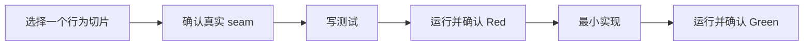
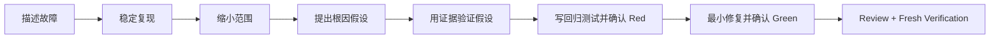

# 个人开发 Harness 流程使用说明书 v1

> 面向使用者的操作手册。你不需要先理解 ECC、Matt Pocock Skills 或 Superpowers。
>
> 目标平台：Codex Desktop / CLI / IDE
>
> 使用范围：个人、本地、当前工作区内的软件开发
>
> 当前状态：目标行为说明。Harness 尚未进入实现和安装阶段，文中的 `@develop`、`$develop` 和自动 Hooks 会在后续构建、测试并安装后可用。

---

## 第一部分：先会用，再理解

### 1. 你真正需要记住的内容

日常使用只需要记住一个入口：

- Codex Desktop：`@develop`
- Codex CLI / IDE：`$develop`
- 也可以直接说“帮我实现……”“继续当前开发任务”，由 Codex 自动选择 `develop`

最常用的四种说法：

```text
@develop 实现本地缓存功能
@develop 修复导出 CSV 中文乱码
@develop resume
@develop status
```

你不需要手动决定应该调用 TDD、Spec、Diagnose、Review 还是某个 subagent。`develop` 会根据当前工作区和已有证据选择下一步。

### 2. Harness 会替你完成什么

一次正常开发任务会经历：


这不是所有任务都必须生成一堆文档。一个改文案的小任务可能直接走：

```text
Intent Snapshot → 修改 → 验证 → Commit
```

一个复杂功能才会走完整路径：

```text
需求澄清 → Spec → Tickets → 逐 Ticket TDD
→ 双轴 Review → Fresh Verification → Commit
```

### 3. 你和 Harness 各自负责什么

你负责：

- 说明想达到的结果。
- 在产品、范围或架构出现实质选择时作决定。
- 检查 Harness 暂停时提出的问题。
- 必要时接受明确记录的剩余风险。

Harness 负责：

- 读取当前工作区和项目规则。
- 判断是新任务、Bug、架构任务还是半成品恢复。
- 判断任务规模 L0–L3。
- 调用正确的 Skills 和 subagents。
- 维护任务状态和证据。
- 防止跳过诊断、TDD、Review 或 Verification。
- 在验证通过后创建本地 commit。

Harness 不会：

- Push。
- 创建或处理 PR。
- Merge。
- 写远程 issue。
- 自动 reset、stash 或覆盖你已有的修改。
- 在证据不足时声称“已经完成”。

---

## 第二部分：这套 Harness 从哪里来

本手册基于以下只读快照，而不是会继续变化的 GitHub `main`：

- Matt Pocock Skills：`84fdeffd12f2ee307994d1eb6feb48173b6e0502`
- ECC：`9aac8585ab887d9c51252730240b25d9cca180da`
- Superpowers：`44c9b2d6e889982ac18c27d05a19fefe335194e1`

Harness 后续升级会先比较上游 diff，再决定是否吸收变化，不会自动覆盖本地流程。

### 4. 三个上游项目各自负责一件事

这套 Harness 不是把三个仓库简单拼起来，而是给它们分配不同职责。

| 来源 | 在 Harness 中的角色 | 一句话理解 |
|---|---|---|
| [Matt Pocock Skills](https://github.com/mattpocock/skills) | 主流程和开发语义 | 决定开发应该怎么做 |
| [ECC](https://github.com/affaan-m/ECC) | Hooks、Rules、Agents、取证和门禁 | 保证该做的步骤不会漏 |
| [Superpowers](https://github.com/obra/superpowers) | Fresh evidence、并发隔离和 worktree 补充 | 防止“做过了”被误当成“现在仍然有效” |

### 5. 为什么以 Matt 为主

Matt 的 `engineering` 目录不是一堆互不相关的提示词。它本身已经形成一条开发路径：

```text
grill-with-docs
→ to-spec
→ to-tickets
→ implement + tdd
→ code-review
```

它还提供三条重要的旁路：

- `diagnosing-bugs`：东西坏了时先诊断。
- `wayfinder`：任务太大、太模糊时先画决策地图。
- `improve-codebase-architecture` / `codebase-design`：做架构健康和深层设计。

这套语义清晰、边界明确，所以 Harness 不再引入第二套 TDD、第二套 Bug Diagnosis 或第二套 Review 来与它竞争。

### 6. 为什么仍然需要 ECC

Skill 本质上是给 Agent 的工作说明。Agent 可能忘记、误判触发时机，或者在上下文压缩后遗漏某个步骤。

ECC 最有价值的部分不是它数量庞大的 Skills，而是这些工程机制：

- Session 启动时加载状态。
- 工具运行前检查危险操作。
- 工具运行后采集证据。
- 压缩前保存上下文。
- Agent 停止前检查质量门。
- 用 Rules 区分“建议”和“强制”。
- 把探索、实现、Review 分配给不同 Agent。

Harness 因此把 ECC 当作神经系统，而不是第二套开发大脑。

### 7. Superpowers 补了什么

Superpowers 与 Matt 大量重叠，因此只取三个 Matt 没有完全展开的原则：

1. **Verification before completion**：没有当前工作区上的新鲜证据，就不能声称完成。
2. **Parallel agents only for independent work**：只读、互不依赖的任务才并行。
3. **Worktree is an isolation tool, not a ritual**：只有高风险实验或明确并行写入时才使用 worktree。

Superpowers 的 brainstorming、planning、TDD、debugging 和 review 不会覆盖 Matt 对应 Skills。

---

## 第三部分：一次任务是怎样开始的

### 8. 第一步不是写代码，而是确认工作区

当你输入：

```text
@develop 修复导出 CSV 时的中文乱码
```

Harness 首先做只读检查：

1. 找到当前 Git 根目录。
2. 查找适用的 `AGENTS.md`。
3. 检查 `.develop/active.json` 是否存在活动任务。
4. 查看 Git HEAD、未提交修改和未跟踪文件。
5. 判断当前请求是新任务，还是已有任务的延续。

为什么先做这些？

因为同一句“修复乱码”，在下面三种工作区里代表完全不同的动作：

- 干净仓库：可以建立新任务。
- 已经有一半修复：应该从中段恢复。
- 有用户自己的未提交修改：必须避免覆盖或错误归属。

#### 你会看到什么

```text
[develop]
工作区：当前 Git 仓库
任务：新建 export-csv-encoding
路径：Bug
等级：L1
当前阶段：diagnose
下一步：建立稳定失败回路
```

### 9. Harness 怎样判断任务规模

#### L0：微小修改

特征：范围明确、文件少、风险低、一个短回合可以完成。

例子：

```text
把错误提示中的 “file not found” 改成更清楚的中文提示
```

流程：

```text
Intent Snapshot → 修改 → 相关验证 → Review diff → Commit
```

#### L1：单 session 任务

特征：目标明确，但需要测试、诊断或数个文件修改。

例子：

```text
修复 CSV 导出编码问题，并加入回归测试
```

流程：

```text
Intent → 单 Ticket → Diagnose/TDD → Review → Verify → Commit
```

#### L2：多阶段任务

特征：有多个行为、多个 Tickets 或需要先确定设计。

例子：

```text
给数据抓取服务增加缓存、重试和熔断机制
```

流程：

```text
Grill → Spec → Tickets → 每个 Ticket TDD
→ Review → Verify → Commit
```

#### L3：巨大或高度模糊任务

特征：一个 session 无法建立完整地图，未知依赖很多，问题本身还没有收敛。

例子：

```text
重构整个量化研究平台，让数据、回测和策略模块可以独立演进
```

流程先进入 `develop-wayfinder`：

```text
建立决策地图 → 找出未知区域 → 拆出可决定的问题
→ 收敛为 Spec → 转入 L2
```

Wayfinder 不写最终产品代码。它的任务是把“雾”变成可以交接的决策。

---

## 第四部分：新功能完整流程

### 10. 阶段一：澄清真实需求

#### 什么时候发生

当请求存在以下情况时：

- “支持缓存”但没有说明缓存什么、多久、失败怎么办。
- 多个术语含义不明确。
- 有几条明显不同的实现路线。
- 用户的解决方案可能并不解决真实问题。

#### Harness 会调用什么

- `develop-grill`：源自 Matt `grill-with-docs`。
- `develop-domain-modeling`：术语或领域边界复杂时。
- `develop-research`：外部 API、框架行为或技术事实不确定时。
- `develop-prototype`：只有运行代码或看到 UI 才能回答某个设计问题时。

#### 为什么这样做

直接把一句模糊请求交给实现 Agent，Agent 往往会自行补完产品决定。代码可能正确，但解决的是 Agent 想象出来的问题。

Grill 阶段把隐藏选择暴露出来：

```text
缓存按用户、策略还是数据源隔离？
允许读到多旧的数据？
上游限流时返回旧数据还是直接失败？
缓存损坏如何恢复？
```

#### 产物

- `intent.md`
- 关键决定
- 未决问题
- 必要时 `adrs/ADR-xxx.md`

#### 通过条件

每个会显著改变实现方向的问题已经决定，或者明确记录为 Out of Scope。

### 11. 阶段二：形成 Spec

#### Harness 会调用什么

`develop-spec`，源自 Matt `to-spec`。

#### 为什么需要 Spec

Spec 不是为了形式完整，而是把对话中的决定变成可检查的合同。没有 Spec，后面的 Review 只能问“代码看起来好不好”，无法问“它是否忠实实现了决定”。

#### Spec 包含什么

- Problem
- Proposed Solution
- User Stories
- Acceptance Criteria
- Implementation Decisions
- Testing Decisions
- Out of Scope
- Open Questions

#### 使用者要做什么

只检查会影响结果的内容：

- 目标是否准确。
- Acceptance Criteria 是否真能代表完成。
- 有没有不希望被顺手加入的范围。

#### 通过条件

Acceptance Criteria 可观察、可测试，且没有未解决的关键产品决定。

### 12. 阶段三：拆成 Tickets

#### Harness 会调用什么

`develop-tickets`，源自 Matt `to-tickets`。

#### 为什么不能直接把 Spec 交给一个实现 Agent

大任务一次性实现会产生三个问题：

1. Agent 同时持有太多上下文，容易忘记早期约束。
2. 测试很难对应到具体行为。
3. 出错时无法判断哪一部分已经可信。

Tickets 把 Spec 拆成一组可验证的曳光弹切片。每个 Ticket 都必须说明：

```yaml
id:
scope:
depends_on:
acceptance_criteria:
red_gate:
verification:
```

#### 好 Ticket 的样子

```text
T001：缓存单个数据源的成功响应
T002：缓存过期时重新拉取并替换
T003：上游失败时按策略返回 stale data
T004：连续失败时进入熔断状态
```

每个 Ticket 都产生一个可观察能力，而不是“先写所有 model，再写所有 service”。

#### 通过条件

- 每个 Ticket 可以独立判断完成。
- 依赖顺序明确。
- 没有把多个无关行为塞在一起。
- 所有 Spec Acceptance Criteria 都有归属。

### 13. 阶段四：逐 Ticket TDD 实现

#### Harness 会调用什么

- `develop-implement`：控制一次只做一个 Ticket。
- `develop-tdd`：源自 Matt `tdd`，定义 Red → Green。
- `develop_implementer`：唯一常规可写 subagent。

#### 一次 TDD 循环



Matt TDD 的关键不是“先写测试”这五个字，而是两条约束：

1. 没有确认真实 seam 前，不要把测试绑到想象出来的抽象上。
2. 必须看见测试因为预期原因失败，才能把后续绿色当成证据。

#### 为什么 Refactor 不塞进 Red → Green

Harness 先让行为正确，再在 Review 阶段检查结构。这样可以区分：

- 为了让行为成立必须做的修改。
- 为了让代码更长期可维护应该做的调整。

#### 并发规则

实现不并行。一个 implementer 持有写锁时，不启动第二个写型 agent。

只读探索可以并行，但前提是它们读取的区域不会在同一时间变化。

#### 通过条件

- Red 证据存在。
- Green 与当前 workspace fingerprint 匹配。
- 只修改当前 Ticket 范围。
- 没有通过关闭 lint、测试或安全策略来获得绿色。

### 14. 阶段五：双轴 Review

#### Harness 会调用什么

`develop-code-review`，源自 Matt `code-review`，同时调度两个只读 reviewer：

- `develop_correctness_reviewer`
- `develop_quality_reviewer`

#### 为什么分成两个 Reviewer

一个 Reviewer 同时检查所有事情时，常常会被代码风格吸引，漏掉 Spec 偏差；或者只盯行为正确，接受难以长期维护的结构。

两个轴分别回答：

**Correctness：**

- 是否忠实实现 Spec 和 Ticket？
- 边界和失败路径是否正确？
- 是否引入安全、并发或数据一致性问题？
- 测试是否真的覆盖行为？

**Quality：**

- 结构是否符合项目惯例？
- 是否出现重复、不必要复杂度或错误抽象？
- 测试是否脆弱、难读或过度 mock？
- 这份代码是否适合长期保留？

#### Findings 分级

- `BLOCKING`：必须修复，阻止进入 Verification。
- `IMPORTANT`：必须处理或明确记录接受理由。
- `SUGGESTION`：不自动扩大当前任务。

#### 通过条件

没有未处理的 BLOCKING finding；IMPORTANT 已处理或有明确决定。

### 15. 阶段六：Fresh Verification

#### Harness 会调用什么

- `develop_verifier`
- ECC `verification-loop` 的检查梯度
- Superpowers `verification-before-completion` 的证据纪律

#### 为什么 Review 后还要再验证

因为 Review 修复会改变代码。实现 Agent 早些时候跑过的测试，无法证明修复后的最终工作区仍然通过。

Verifier 在当前 fingerprint 上重新执行适用检查：

```text
build → typecheck → lint → tests → security → final diff
```

不是每个项目都有全部六类命令。Harness 从项目配置、脚本和文档发现真实命令，不凭空发明。

#### 什么叫 Fresh

验证记录绑定：

- 当前 HEAD SHA。
- staged/unstaged diff hash。
- 相关 untracked 文件 hash。
- 验证配置 hash。

验证之后代码再变，Verification 自动变为 stale。

#### 通过条件

- 必要命令在当前 fingerprint 下通过。
- 没有未解释的失败。
- 没有意外文件。
- 没有用反复重跑掩盖 flaky test。

### 16. 阶段七：本地 Commit 与完成

Commit 前 Harness 会检查：

- Spec/Ticket 与实现一致。
- 没有 BLOCKING finding。
- Verification 仍然匹配当前 fingerprint。
- Ledger 已记录关键证据。
- Commit 只包含当前任务范围。

然后创建本地 commit，不 Push。

最终生成 `completion.md`：

- 做了什么。
- 没做什么。
- 关键文件。
- 验证命令和结果。
- Review 结论。
- 本地 commit SHA。
- 剩余风险。

---

## 第五部分：Bug 为什么走另一条路

### 17. Bug 流程

Bug 不从“想一个修法”开始，而从“建立可变红回路”开始。



Harness 调用 `develop-diagnose`，其语义来自 Matt `diagnosing-bugs`。

### 18. 为什么禁止猜修

假设导出乱码可能来自：

- 写文件时编码错误。
- HTTP header 缺少 charset。
- Excel 对 UTF-8 无 BOM 的识别问题。
- 上游数据已经损坏。

直接加入 BOM 也许让某个样例正常，但无法证明根因。Diagnose 要求先找到一个紧密回路：改变一个变量，失败就可重复变化。

### 19. Bug Gate

进入实现前必须具备：

- 可重复复现。
- 已验证根因。
- 能锁住问题的回归测试或等价可执行检查。

如果根因是“当前代码没有可测试 seam”，Harness 可以记录架构问题；但不会借一个小 Bug 自动授权大规模重构。

---

## 第六部分：接手完成一半的任务

### 20. 使用 `resume`

```text
@develop resume
```

Resume 不等于“读取上次 state，然后相信它”。Harness 会重新审计：

1. 当前 Git 和文件。
2. `.develop/` 正式产物。
3. Gate 对应的证据。
4. fingerprint 是否仍匹配。
5. 未提交修改的来源。
6. 当前最早缺失的必要 Gate。

### 21. 典型恢复结果

#### 已有实现，但没有 Review

```text
可信阶段：implement complete
失效/缺失：review、verification
继续位置：双轴 Review
```

不会重新 Grill、写 Spec 或重新实现。

#### 已经 Review，但之后修改过代码

```text
记录阶段：review passed
真实状态：review stale
原因：review fingerprint 与当前工作区不一致
继续位置：重新 Review
```

#### 只有 state 写着完成，没有测试证据

```text
记录阶段：complete
可信阶段：implement
原因：缺少当前 fingerprint 的 Verification
继续位置：review 或 verify
```

#### Bug 已复现但根因未知

从 Diagnose 的根因阶段继续，不重做已稳定的复现步骤。

### 22. 使用 `from`

```text
@develop from spec
@develop from review
```

回到较早阶段会保留历史，并把下游证据标为 stale。

请求跳到较晚阶段时，Harness 会检查前置证据。如果没有实现，`from review` 不会伪造实现完成，而会返回最早安全阶段。

---

## 第七部分：你看不见但一直在工作的机制

### 23. `.develop/` 保存了什么

```text
.develop/
├── config.json
├── project-context.md
├── active.json
├── tasks/<task-id>/
│   ├── state.json
│   ├── intent.md
│   ├── spec.md
│   ├── tickets/
│   ├── adrs/
│   ├── ledger.md
│   └── completion.md
└── runtime/                  # 不提交 Git
```

正式目录保存长期证据，runtime 保存可丢弃的 Hook events、完整测试输出、临时 Task Brief 和锁。

### 24. 为什么同时要 state、Ledger 和 fingerprint

- `state.json` 回答“系统认为现在在哪”。
- `ledger.md` 回答“系统为什么这样认为”。
- fingerprint 回答“这些证据是否仍然对应当前文件”。

只有 state，系统容易相信过时标记；只有日志，恢复时无法快速导航；没有 fingerprint，测试之后改了代码也无法被发现。

### 25. Hooks 分别做什么

| Hook | 作用 | 对使用者的意义 |
|---|---|---|
| `SessionStart` | 加载活动任务和下一步 | 换 session 不必从头解释 |
| `PreToolUse` | 检查危险或越界操作 | 防止误 Push、破坏性命令和质量绕过 |
| `PostToolUse` | 采集命令和变更摘要 | Resume 时有证据可查 |
| `SubagentStart` | 注入角色与权限契约 | Agent 不会自行扩大职责 |
| `SubagentStop` | 检查交付结构 | 防止只返回一句“完成了” |
| `PreCompact` | 压缩前 checkpoint | 上下文压缩不丢当前阶段 |
| `Stop` | 检查 Completion Gate | 测试没跑完时不会提前结束 |
| `SessionEnd` | 尽力归并尾部事件 | 正常退出时减少残留 |

Hooks 失效时，Harness 进入 degraded mode，由编排器主动调用相同 scripts。任务还能进行，但会明确告诉你自动防护覆盖率下降。

### 26. 七个 Agents 为什么这样分工

| Agent | 主要问题 | 权限 |
|---|---|---|
| Explorer | 真实代码和状态是什么 | read-only |
| Diagnoser | 为什么会失败 | read-only 优先 |
| Plan Reviewer | Spec/Tickets 是否可执行 | read-only |
| Implementer | 当前 Ticket 如何最小实现 | write |
| Correctness Reviewer | 行为是否正确 | read-only |
| Quality Reviewer | 代码是否适合长期保留 | read-only |
| Verifier | 当前最终工作区是否通过 | read-only + 执行验证 |

主 Agent 始终拥有流程控制权。Subagent 只完成局部任务，不能推进状态、修改正式 Ledger 或宣布整个任务完成。

### 27. Rules、Skills 和 Hooks 的区别

这是理解 Harness 最重要的边界之一：

- **Rule / AGENTS.md**：长期始终成立的短原则。
- **Skill**：某类任务展开后的完整做法。
- **Hook**：必须在某个生命周期点执行的确定性检查。

例子：

```text
Rule：完成前必须有 fresh verification。
Skill：如何选择并执行项目的验证梯度。
Hook：Agent Stop 时检查是否真的存在当前 fingerprint 的验证证据。
```

同一条原则不在三处复制完整正文，只通过策略 ID 保持对应关系。

---

## 第八部分：常见异常怎样处理

### 28. 工作区本来就是脏的

Harness 不 stash、不 reset，也不把所有变更都当成当前任务。它会先列出相关、无关和来源不明的文件。当前 Ticket 需要修改来源不明的同一文件时，会暂停询问。

### 29. 测试本来就在失败

Harness 尝试比较基准 commit 或变更前结果，把失败分成：

- 当前变更造成。
- 明确 pre-existing。
- 无法确定。

影响当前 Acceptance Criteria 且无法确定的失败会阻止完成。无关的 pre-existing failure 会进入完成摘要，而不是被悄悄忽略。

### 30. 测试时好时坏

同一 fingerprint 下结果不一致时，Gate 变为 `unstable`。Harness 不会不断重跑，直到偶然拿到一次绿色。

### 31. Agent 连续两轮修不好

Harness 停止继续局部打补丁，检查：

- 是否误解 Spec。
- Ticket 是否拆错。
- seam 是否不真实。
- Reviewer 规则是否不适用。

需要时回退到 Spec、Tickets 或 Codebase Design。

### 32. 用户运行期间自己修改了代码

发现 fingerprint 异常变化后：

```text
停止新写入 → 保存 checkpoint → 列出变化
→ 标记受影响 Gate stale → 重新 Resume Audit
```

不会自动覆盖用户修改。

### 33. 没有自动测试

Harness 依次寻找构建、类型检查、lint、静态分析、CLI smoke、浏览器验证或可重复的人工步骤。

仍然没有足够证据时，状态是 `insufficient-evidence`，而不是“验证通过”。你可以明确接受风险，但它会永久记录在完成摘要里。

---

## 第九部分：四个完整使用示例

### 34. 示例 A：L0 小修改

输入：

```text
@develop 把登录失败提示改成“账号或密码错误”，不要改其他行为
```

Harness：

1. 确认当前工作区和活动任务。
2. 建立简短 Intent Snapshot。
3. 定位提示来源和相关测试。
4. 修改最小范围。
5. 运行相关测试或可执行检查。
6. Review diff。
7. 记录证据并创建本地 commit。

通常不会生成完整 Spec 和多个 Tickets。

### 35. 示例 B：L2 新功能

输入：

```text
@develop 为行情数据请求增加缓存、指数退避和熔断
```

Harness：

1. Grill：明确缓存粒度、过期、stale data 和失败语义。
2. Research：核对当前数据源和客户端行为。
3. Spec：形成可验证 Acceptance Criteria。
4. Tickets：缓存、过期刷新、退避、熔断分别切片。
5. 每个 Ticket 执行 TDD。
6. 双轴 Review。
7. Fresh Verification。
8. 本地 commits 和 Completion Summary。

### 36. 示例 C：Bug

输入：

```text
@develop 修复回测结果偶尔重复写入的问题
```

Harness：

1. 先建立能够稳定暴露重复写入的并发测试或紧密回路。
2. 缩小到事务、重试或幂等逻辑。
3. 验证根因。
4. 把失败固化为回归测试并确认 Red。
5. 最小修复并确认 Green。
6. Correctness Reviewer 重点检查数据一致性。
7. Quality Reviewer 检查修复是否引入错误抽象。
8. Fresh Verification 后提交。

### 37. 示例 D：半成品 Resume

输入：

```text
@develop resume
```

当前情况：代码和测试已存在，Ledger 写着实现完成，但没有 Review。

Harness：

1. 计算当前 fingerprint。
2. 验证 Green 证据是否仍匹配。
3. 保留已完成实现。
4. 直接进入双轴 Review。
5. 修复 findings 后重新 Verification。
6. 完成并提交。

不会重新从需求访谈开始。

---

## 第十部分：快速查询表

### 38. 我应该输入什么

| 想做的事 | 输入 |
|---|---|
| 开始新任务 | `@develop <目标>` / `$develop <目标>` |
| 继续当前任务 | `@develop resume` |
| 只看进度 | `@develop status` |
| 从某阶段重做 | `@develop from spec` |
| 主动保存检查点 | `@develop checkpoint` |

### 39. Harness 为什么停下来问我

通常只有五类原因：

1. 产品目标存在多种实质选择。
2. 架构选择难以逆转。
3. 当前代码与已批准 Spec 冲突。
4. 新任务可能与活动任务混在一起。
5. 需要降低质量策略、扩大范围或执行难恢复操作。

普通搜索、编辑、测试、Review 修复和本地 commit 不需要逐步确认。

### 40. 怎样判断任务真的完成

检查四件事：

- Acceptance Criteria 已满足。
- 双轴 Review 没有 BLOCKING finding。
- Verification 与当前 fingerprint 匹配。
- `completion.md` 和本地 commit 已生成。

### 41. 来源映射

| Harness 能力 | 主要来源 |
|---|---|
| Grill、Spec、Tickets、Implement、TDD、Code Review | Matt engineering |
| Bug Diagnosis、Wayfinder、Domain Modeling、Codebase Design | Matt engineering |
| 生命周期 Hooks、门禁、配置保护、取证 | ECC Hooks / Rules |
| Explorer、Reviewer 等窄角色设计 | ECC Agents + Codex Custom Agents |
| Fresh Verification | Superpowers + ECC verification-loop |
| 只读并行、写入串行 | Superpowers parallel/subagent 方法 |
| 中段恢复 | Harness 自建状态、Ledger 和 fingerprint |
| 本地自用、无 Push/PR/Merge | 本 Harness 的明确边界 |

### 42. 最终心智模型

不需要记住 15 个 Skills、9 类 Hooks 和 7 个 agents。只需要记住：

```text
你给出目标和关键决定；
develop 找到当前真实位置；
Matt 决定下一步该怎么开发；
ECC 保证步骤和证据不会漏；
Superpowers 保证旧结果不能冒充当前结果；
Git 和 .develop/ 让任务可以从任意中段继续。
```

这就是整个 Harness 的使用方式。
