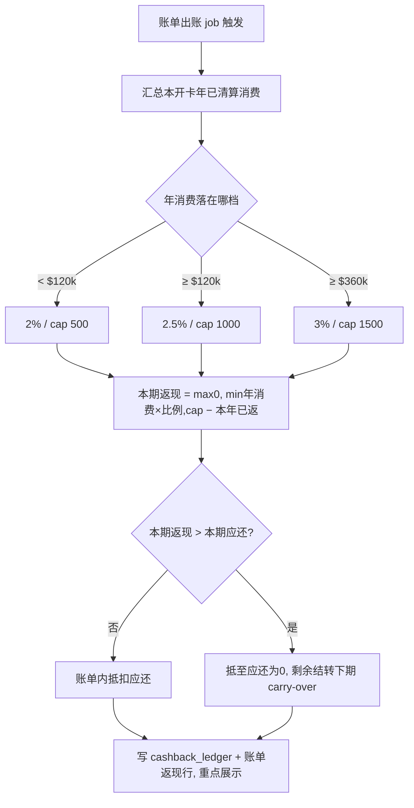
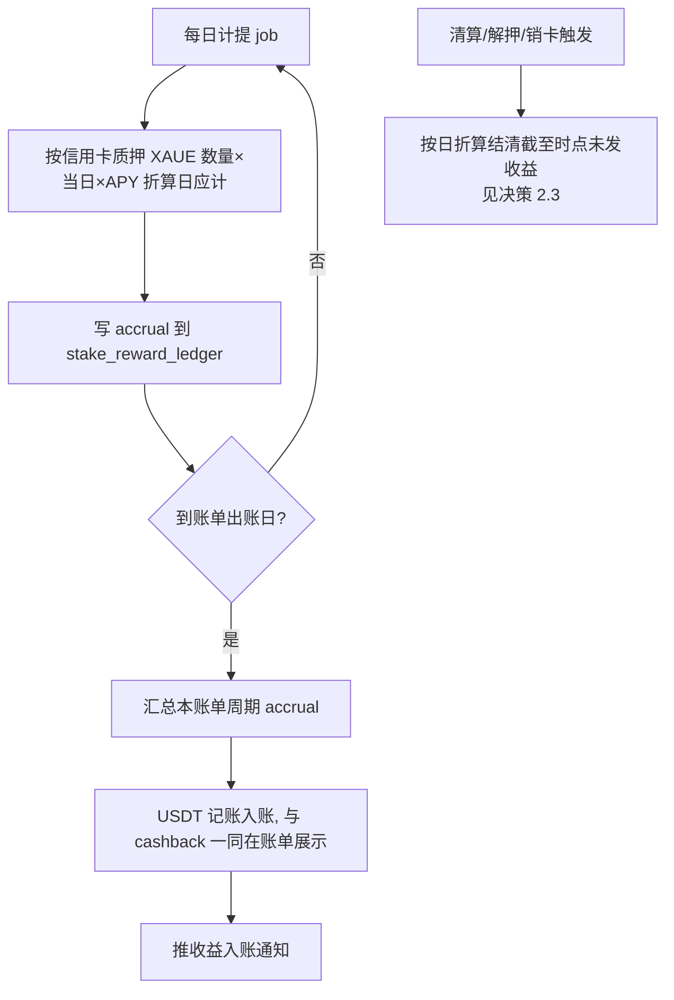
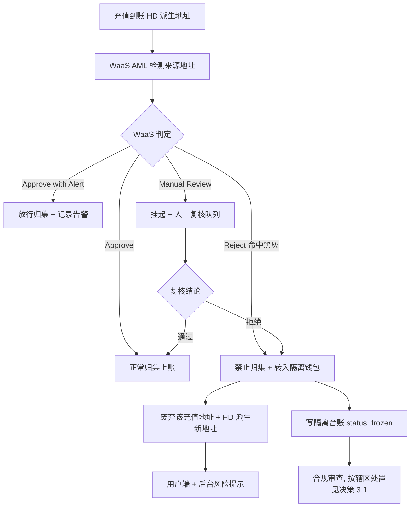
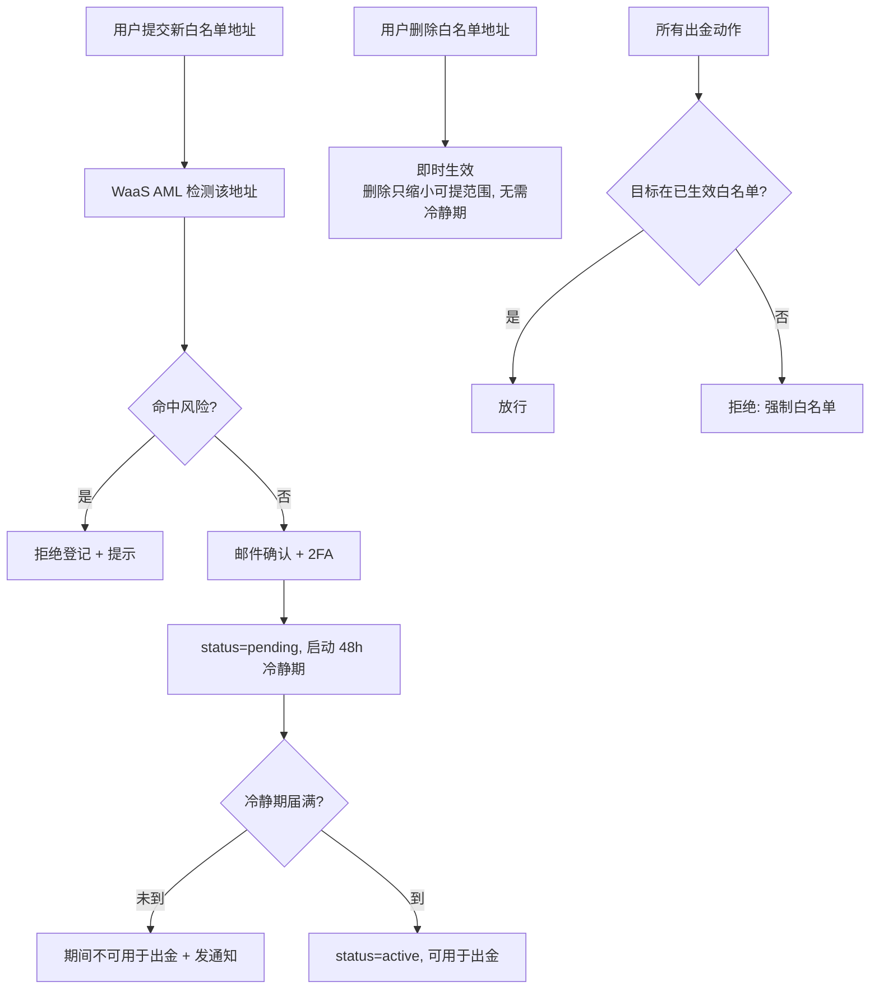

# XAUE 信用卡 · 0722 变更需求集（Cashback · XAUT Staking Reward · 白名单 + AML）

> **文档摘要**
> - 汇总 2026-07-22 mentor 提出的三条对客端新需求，拆为 4 条变更（AML 拆入金检测 + 出金白名单两条）。
> - **v2 修订**（据用户 2026-07-23 plannotator 标注 13 条）：① 确认无独立提现功能（"提现"系笔误），cashback 只做账单抵扣+展示；② Staking APY 竞品推翻重做（换"抵押品担保占用期收益率"锚，推荐 1.5%/2.0%），计息改随出账日；③ 白名单改强制白名单+仅新增地址冷静期；④ 隔离资金处置、罚息豁免、白名单始终自动等决策落定；⑤ 新增 2 份参考文档（担保期生息竞品、答疑与影响分析沉淀）。
> - 深度约定：**产品级 + 技术锚点**——业务规则/用户故事/验收/决策区写全；数据模型与接口只给关键字段和端点占位、标「开发阶段细化」。
>
> **🔑 决策状态**：✅ = 用户已拍板落定；🟡 = 据反馈已调整、待你二次确认；每个决策区带竞品+用户故事双底座，完整论证见 `决策依据-竞品与用户故事分析-0722.md`。
>
> **数据来源**：需求总参考（A 原话 / B 已确认 / C 推导 / D 待定）+ 三份产品功课简报 + 2 份参考文档。

---

## 0 · 关联文档与定位

| 关联 | 文件 | 本变更触达点 |
|---|---|---|
| 章节 PRD §5 账单/还款 | `chapters/ch5-billing.md` | CC-0722-01 返现计算入账 + 账单返现记账行与展示；CC-0722-02 reward 随出账日入账 |
| 章节 PRD §7 用户端 | `chapters/ch7-user-end.md` | CC-0722-01 账单返现明细；CC-0722-02 收益流水与质押概览；CC-0722-03 入金风险提示；CC-0722-04 出金白名单管理页 |
| 章节 PRD §8 平台后台 | `chapters/ch8-back-office.md` | CC-0722-01 返现报表；CC-0722-02 APY 配置与发放监控；CC-0722-03 风险地址管理与隔离台账 |
| 章节 PRD §11 钱包架构 | `chapters/ch11-wallets.md` | CC-0722-03 入金 AML 卡点、隔离钱包（第 5 个）、HD 换址；WaaS AML 接入 |
| 章节 PRD §13 通知 | `chapters/ch13-notify.md` | CC-0722-02 收益入账通知；CC-0722-03 地址风险/更换通知；CC-0722-04 白名单变更通知 |
| 质押 PRD | `prd-xaue-stake.md` | CC-0722-02 双层质押逻辑：第一层 XAUT→XAUE 已生息 ~4%；第二层信用卡质押独立 APY 必须低于它 |
| 担保期生息竞品 | `竞品补充-抵押品担保期生息-2026-07-23.md` | CC-0722-02 决策 2.1 APY 的竞品依据 |
| 答疑与影响分析 | `CC-0722-答疑与影响分析沉淀.md` | CC-0722-01 清算时点/资金池/后台影响分析 |
| S4 AML 章 | `S4-AML.md` | CC-0722-03/04 口径修订：接入 WaaS AML，黑灰标准以 WaaS 阈值为准 |

> **重要边界**：
> - 信用卡 live SPA 在 BitBucket `apps/web` + `apps/app` + `apps/admin`；本仓库为文档镜像（GitHub `credit-card/X` ↔ BitBucket `apps/docs/X`）。
> - **XAUE 双层质押**：第一层 用户 XAUT 质押入 Vault 得 XAUE（1:1000），**已生息 ~4%**（汇率增值类 stETH）；第二层 XAUE 再质押进信用卡换额度（LTV 60%），锁入 Collateral Vault（平台无单方出金私钥），**当前零息**（监管隔离不可挪用）。
> - **本批范围**：仅信用卡端。Shop 端不纳入（A3-12）。**无用户主动提现功能**（v2 确认，见 §2.1）。
> - 术语沿用既有定义（Collateral Vault / LTV / HD 派生 / 归集 / WaaS / RedotPay / LSP / 超额还款），不重复定义。

### 0.1 · 待定项填充依据说明

需求总参考 D 层待定项 + 用户故事简报 3 硬缺口，按用户反馈处理：能被竞品完全回答的写入业务规则；无法回答的做成决策区，每个推荐带竞品+用户故事双底座（完整论证见 `决策依据-竞品与用户故事分析-0722.md`）。

| 待定项/缺口 | 处理 | 落点 |
|---|---|---|
| D-3 竞品结算周期 | 简报完全回答 → 写入业务规则 | §2.3 + 答疑沉淀文档 疑问1 |
| D-1 APY | 竞品重做（担保占用锚）→ 决策 2.1 | §3.10 |
| D-1 计息/发放 | 据用户 #5 → 随出账日 | §3.10 决策 2.2 |
| D-2 WaaS 对接 | 超简报范围 → WaaS 问题清单 | §4.10 决策 3.2 + §6 |
| D-4 白名单细则 | 竞品锚 + 用户 #12 → 强制白名单单向 | §5.10 决策 4.1 |
| 硬缺口 1 返现>应还 | 无提现 → 结转下期 | §2.10 决策 1.2 |
| 硬缺口 2 清算时收益 | 按日折算 | §3.10 决策 2.3 |
| 硬缺口 3 隔离资金 | ✅ 用户采纳 | §4.10 决策 3.1 |

---

## 1 · 变更总览

| 编号 | 变更 | 侧 | 优先级 | 一句话目标 | 承接 |
|---|---|---|---|---|---|
| **CC-0722-01** | Cashback 消费返现 | C 端 + B 端 | **P0** | 按开卡年年消费阶梯返现，账单出账时按已清算流水计算、账单内 USDT 抵扣并重点展示（无提现） | 新增，扩展 ch5 |
| **CC-0722-02** | XAUT Staking Reward | C 端 + B 端 | **P0** | 给信用卡质押 XAUE 一个独立 APY（1.5%/2.0%，低于第一层 4%），随出账日以记账流水发放，激励用信用卡 | 新增模块，参照 prd-xaue-stake |
| **CC-0722-03** | 入金 AML 检测与资金隔离 | 平台 + B 端 | **P0** | 接入 WaaS AML，入金命中黑灰即禁归集、隔离、HD 换址，双端风险提示 | 修订 S4，扩展 ch11 |
| **CC-0722-04** | 出金白名单地址管理 | C 端 + B 端 | **P0** | 强制白名单：出金只能提到已登记白名单地址，新增地址过 AML + 冷静期 | 修订 S4，扩展 ch7/ch8 |

**参数**（全部 admin 后台可配置，下表为上线初始默认值，可调、不溯及既往、旧记录沿用快照）：

| 参数 | 初始默认值 | 配置项 key | 说明 |
|---|---|---|---|
| Cashback 档位 1/2/3 | 2.00%/cap500 · 2.50%/cap1000 · 3.00%/cap1500 | `cashback.tier.tN.{rate,cap}` | 年消费 <$120k / ≥$120k / ≥$360k（USDT/年） |
| Staking Reward APY | 🟡 **1.5%**（激进档 2.0%，待你确认） | `stake_reward.apy` | 独立 APY，必须 < 第一层 ~4% |
| Reward 发放时点 | 随账单出账日 | `stake_reward.payout=on_statement` | 日计提、出账日结算入账 |
| 白名单新增地址冷静期 | 48h（灵活档可配 24/48/72h） | `whitelist.cooldown.new_hours` | 仅新增有冷静期；删除即时生效 |
| 白名单地址上限 | 5（灵活档 10） | `whitelist.max_addresses` | 每用户 |
| 白名单人工审批 | ✅ 关闭（始终自动） | `whitelist.manual_review=off` | 用户已定：无人工，AML 自动检测+冷静期兜底 |
| 入金 AML 阈值 | 由 WaaS 平台阈值决定 | （WaaS 侧） | 黑灰标准以 WaaS 为准 |

### 1.1 · 🤔 决策区索引（全部决策 + 状态）

| 决策 | 位置 | 状态 | 结论 | 论证 |
|---|---|---|---|---|
| 1.1 返现到账时间点 | §2.10 | 🟡 待确认 | 随账单出账入账抵扣 | 决策依据 §1 |
| 1.2 返现>应还剩余 | §2.10 | 🟡 待确认 | 结转下期抵扣（无提现） | 决策依据 §2 |
| 2.1 Reward APY | §3.10 | 🟡 待选 A/B | **1.5%(保守) / 2.0%(激进)** | 决策依据 §3 + 担保期生息竞品文档 |
| 2.2 计息基数/发放 | §3.10 | 🟡 待确认 | 信用卡质押 XAUE 时长加权 / 随出账日 / USDT | 决策依据 §4 |
| 2.3 清算时收益结算 | §3.10 | 🟡 待确认 | 按日折算发放至终止时点 | 决策依据 §5 |
| 3.1 隔离资金处置 | §4.10 | ✅ 已采纳 | 冻结+审查+按辖区；误伤经核实豁免罚息 | 决策依据 §6 |
| 3.2 WaaS 对接清单 | §4.10 | 待发 WaaS | 7 项问题清单 | 决策依据 §7 |
| 4.1 白名单冷静期/上限 | §5.10 | 🟡 待确认 | 强制白名单 + 仅新增 48h 冷静期 / 上限 5 | 决策依据 §8 |
| 4.2 白名单人工审批 | §5.10 | ✅ 已定 | 始终自动、无人工 | 决策依据 §9 |

---

## 2 · CC-0722-01 — Cashback 消费返现（P0）

### 2.1 · 背景与目标

**背景**：现有信用卡产品无消费返现机制。mentor 要求引入 cashback 提升消费黏性。

> **v2 澄清（无提现功能）**：mentor 原话"在账单中给予用户提现也可以减少用户的还款"经分析为**「体现/抵现」笔误**（用户 2026-07-23 确认）——真正的"提现"会把钱拿走、不可能"减少还款"，整段主题是"用户感知"。故 cashback **只在账单内抵扣、并重点展示**，无独立提现功能。

**目标**：按开卡年年消费阶梯给 cashback，USDT 记账、账单内直接抵扣减少应还金额，并在账单样式重点展示让用户感知。

**成功标准**：
- 用户每期账单可见本期返现 + 年度累计返现/cap 进度。
- 返现只认已清算流水，与取消/退款解耦、无追回。
- 年度 cap 严格约束成本、可预测。

### 2.2 · 用户故事

- **US-01.1**（A1，P0）：作为持卡用户，我希望账单出账时自动获得阶梯返现并抵扣本期账单，以便直接减少应还金额。
- **US-01.2**（A2，P0）：作为持卡用户，我希望在账单里看到返现明细与年度累计/cap 进度。
- **US-01.3**（A3，P1）：作为运营/财务，我希望返现运营报表并能追溯单用户返现。

### 2.3 · 业务规则

- **档位**（按开卡年年消费，达档全量适用、含等于边界）：<$120k → 2.00%/cap 500；≥$120k → 2.50%/cap 1,000；≥$360k → 3.00%/cap 1,500。
- **每期返现公式**：`本期返现 = max(0, min(年累计已清算消费 × 当前档位比例, 当前档位 cap) − 本开卡年内已返总额)`（自然实现跳档补差、全量适用、年 cap 约束）。
- **返现基数**：仅计已清算流水（收到 `cardTransactionSuccess` Webhook）；确认中/取消/退款不计。
- **计算与到账时点**：递延到账单出账时统一计算入账；因只认清算终态 → 无返现追回。**月末跨月未清算的交易顺延计入下期**（对齐 Chase 惯例）。
- **发放形式**：USDT 记账，账单内直接抵扣应还，**无提现**；抵扣后如有剩余按决策 1.2 处理。
- 清算时点与出账日关系的完整分析：见 `CC-0722-答疑与影响分析沉淀.md 疑问1`。

### 2.4 · 数据模型（技术锚点，开发阶段细化）

- 新增 `cashback_ledger`：占位 `id / account_id / billing_period / cleared_spend_ytd / tier / rate / cap / period_reward / carry_over / created_at`。
- 账单表 `billing` 增 `cashback_offset_amount`（返现抵扣额）+ `cashback_carry_over`（结转余额）。

### 2.5 · 接口契约（技术锚点，开发阶段细化）

| 方法 | 路径（占位） | 侧 | 说明 |
|---|---|---|---|
| `GET` | `/api/cashback?account_id=&period=` | C 端 | 本期返现 + 年度累计/cap + carry-over |
| `GET` | `/admin/cashback?user_id=&from=&to=` | B 端 | 返现报表 + 单用户追溯 |

### 2.6 · 流程图（账单出账时 cashback 计算）

### 2.7 · 用户端展示要求

- 账单页「返现」区两行：本期返现 X USDT + 年度累计返现 Y / cap Z。
- 账单样式重点展示返现对应还的抵扣（呼应 B-5）；如有 carry-over 一并显示。

### 2.8 · admin 端展示要求（新增运营动作）

- 后台「返现报表」（挂 ch8 财务/对账）：按周期/用户/档位汇总成本；单用户追溯（下钻每期计算明细）。
- 导出 CSV 遵循 ch8 约定；权限：财务「返现报表查看」（ch9 RBAC）。
- **新增后台工作量**：定期核对返现成本 vs 预算；处理返现客诉（对照 mentor 关注点④）。

### 2.9 · 验收标准

| # | Given | When | Then |
|---|---|---|---|
| AC-01.1 | 本年已清算消费 $125,000 | 出账 | 按 2.5% 全量算，min($125k×2.5%,1000)−本年已返，账单内抵扣 |
| AC-01.2 | 年中从 $110k 跨到 $125k | 出账 | 自动补差全量重算为 2.5% |
| AC-01.3 | 有取消/退款交易 | 出账计算 | 该笔不计基数 |
| AC-01.4 | 本期返现 > 本期应还 | 抵扣 | 抵至应还为 0，剩余结转下期 carry-over（无提现） |
| AC-01.5 | 月末最后一天交易未清算 | 出账 | 顺延计入下期基数 |

### 2.10 · 🤔 决策区

**决策 1.1 · 返现到账时间点** 🟡
- 竞品：传统卡 statement-close 统一入账 / Nexo settle 后近即时 / Crypto.com 最长 2 周期。
- 用户故事：C 端要可预期节奏；业务上账单出账即清算终态；后台随账单算最简、免 clawback。
- **推荐**：随账单出账统一计算、当期账单内抵扣（到账 = 账单出账日）。详见决策依据 §1 + 答疑沉淀 疑问1。
- ☐ 采纳推荐　☐ 其他：________

**决策 1.2 · 返现 > 本期应还的剩余处理（硬缺口1）** 🟡
- 前提：无提现功能（"提现"系笔误），排除"转可提现"。
- 竞品：竞品返现均为独立余额不冲账单，"账单抵扣"模式无先例。
- 用户故事：C 端要返现不蒸发可累积；无提现则剩余只能账面递延（结转），对备付金无冲击；后台结转最简。

| 方案 | 内容 | 优 | 缺 |
|---|---|---|---|
| **推荐：结转下期抵扣** | 剩余挂 carry-over 下期抵 | 不蒸发、无提现负债、最简 | 极端累积需设上限 |
| 备选：当期清零 | 抵扣后作废 | 最简 | 用户视为吞返现 → 投诉 |

- 完整论证：决策依据 §2。
- ☐ 采纳推荐（结转下期）　☐ 备选（清零）　☐ 其他：________

### 2.11 · 依赖与影响面

- 依赖：ch5 出账 job（插入 cashback 计算）；清算状态判定。
- 影响：ch5 账单结构+出账逻辑；ch7 账单页；ch8 报表+RBAC。

---

## 3 · CC-0722-02 — XAUT Staking Reward（P0）

### 3.1 · 背景与目标

**背景（双层质押，v2 厘清）**：
- **第一层**：用户 XAUT 质押入 Vault 得 XAUE（1:1000），**已生息 ~4% APY**（XAUE 兑 XAUT 汇率增值，类 stETH，自由持有即生息）。
- **第二层**：XAUE 再质押进信用卡换额度（LTV 60%），锁入 Collateral Vault，**当前零息**（主 PRD §3.1 监管隔离不可挪用）。
- **本需求**：给第二层一个独立 APY，**目的是激励用户用信用卡**（B-6：独立奖励比例、低于纯质押）。

**目标**：给信用卡质押的 XAUE 一个独立 APY（低于第一层 4%），随出账日以记账流水发放、让用户明确感知。

**成功标准**：用户在账单/流水看到"本次 stake 收益 X"；APY 低于第一层、成本可控、合规文案安全。

### 3.2 · 用户故事

- **US-02.1**（B1，P0）：作为持卡用户，我希望以记账流水形式收到质押奖励收益。
- **US-02.2**（B2，P1）：作为持卡用户，我希望在质押概览看到累计收益并接收入账通知。
- **US-02.3**（B3，P0）：作为运营，我希望配置 APY 参数并监控发放。

### 3.3 · 业务规则

- 奖励对象 = 信用卡质押账户内的 XAUE（即换取额度的那部分）；独立 APY，**必须低于第一层 ~4%**。
- **计息基数** = 信用卡质押的 XAUE 数量，周期内质押量增减时按持仓天数加权。
- **发放** = 随账单出账日结算入账（与 cashback 同步、账单统一展示），**USDT 记账**。
- 收益是平台内账本"质押奖励"流水，不占用质押品、不影响 LTV 与清算前提。
- **合规硬约束**：定性为"平台激励奖励"（非资产收益），文案一律 "up to / variable / subject to change"，禁写死固定 APY（证券属性红线）。

### 3.4 · 数据模型（技术锚点，开发阶段细化）

- 新增 `stake_reward_ledger`：占位 `id / account_id / staked_xaue_weighted / accrual_date / accrued_amount_usdt / billing_period / status / created_at`（借鉴 Kraken earn ledger 科目 + dust threshold）。
- 参数表 `stake_reward_config`：`apy / basis / payout=on_statement / currency`（admin 可配）。

### 3.5 · 接口契约（技术锚点，开发阶段细化）

| 方法 | 路径（占位） | 侧 | 说明 |
|---|---|---|---|
| `GET` | `/api/stake-reward?account_id=` | C 端 | 收益流水 + 累计 |
| `GET/PUT` | `/admin/stake-reward/config` | B 端 | APY 等参数（双人复核） |

### 3.6 · 流程图（计息与随出账日发放）

### 3.7 · 用户端展示要求

- 收益随账单出账日入账，账单内与 cashback 一同展示（用户一处看清"用信用卡的综合好处"）。
- 收益流水列在交易/资金流水（每笔标「质押奖励」+ 金额）；质押概览加「累计收益」行。

### 3.8 · admin 端展示要求（新增运营动作）

- 后台「Staking Reward」模块：APY 参数配置（双人复核、不溯及既往、旧记录快照）；发放监控。
- 权限：运营「Reward 配置」+ 财务「发放监控」。
- **新增后台工作量**：定期核对 APY 成本、监控发放异常。

### 3.9 · 验收标准

| # | Given | When | Then |
|---|---|---|---|
| AC-02.1 | 用户信用卡质押 XAUE 一个账单周期 | 出账日 | 按 APY 时间加权折算，USDT 记账、账单内展示 + 通知 |
| AC-02.2 | admin 改 APY | 保存 | 双人复核后生效、不溯及既往 |
| AC-02.3 | 用户中途解押/被清算 | 结算 | 按日折算结清截至时点未发收益（决策 2.3） |
| AC-02.4 | 计息低于 dust threshold | 计提 | 不入账、仅导出可见 |

### 3.10 · 🤔 决策区

**决策 2.1 · APY 数值（D-1，竞品 v2 重做）** 🟡
- **竞品（换正确锚：抵押品担保占用期收益率）**：DeFi 生息资产作抵押 supply≈0% / Compound 明文抵押品不生息 / CeFi 主流(Crypto.com/Coinbase/Ledn)零息；市场担保占用收益**系统性趋近于零**。定价带 = 地板 ~0% ↔ 天花板 ~4%（第一层硬约束）。任何正 APY 本质是平台激励补贴。完整明细见 `竞品补充-抵押品担保期生息-2026-07-23.md`。
- **用户故事**：C 端从零到 1.5% 是质变、有感知；业务补贴成本可控；风控与第一层拉开差防套利。
- **合规增益**：定性"激励奖励"非"资产收益" → 证券属性更安全。

| 方案 | APY | 优 | 缺 |
|---|---|---|---|
| **A 保守（推荐）** | 1.5% | 有感知 + 成本可控 + 约第一层 3/8 | 激励中等 |
| B 激进 | 2.0% | 激励更强、恰第一层 1/2 | 成本更高 |

- 完整论证：决策依据 §3。
- ☐ 方案 A（1.5%）　☐ 方案 B（2.0%）　☐ 其他值：______%

**决策 2.2 · 计息基数/发放（D-1，据你 #5，逻辑已审核为正确）** 🟡
- 你的逻辑：reward 目的是激励用信用卡 → 基数用"质押换额度的 XAUE"、随出账日发、USDT。对照现有 PRD 成立。
- **推荐**：基数 = 信用卡质押 XAUE 数量（周期内增减按持仓天数加权）/ 发放随账单出账日（与 cashback 同步展示）/ USDT 记账。
- 完整论证：决策依据 §4。
- ☐ 采纳推荐　☐ 其他：________

**决策 2.3 · 清算/解押/销卡时未发收益结算（硬缺口2）** 🟡
- 「清算残值收益」大白话：强制清算 = 你的质押 XAUE 因跌破平仓线被卖去还债；卖了还完债的剩余叫残值（归你）；清算那刻这部分 XAUE 还有一小笔"已按天算好、没到发放日"的 reward——本决策定它归谁。（详见决策依据 §5）
- 竞品：多数 earn 解押即停息、无清算残值先例。
- 用户故事：清算高频且高压力，没收已计提收益 → 强投诉 + 增客服工作；按日折算最公平不阻碍清算。
- **推荐**：按日折算发放至终止时点（清算/解押/销卡结算环节结清已计提未发收益）。
- ☐ 采纳推荐（按日折算）　☐ 满周期才发　☐ 即时结清　☐ 其他：________

### 3.11 · 依赖与影响面

- 依赖：决策 2.1 APY 值拍板；信用卡质押账户数据；出账 job（并入 reward 结算）；清算/解押流程（插收益结算）。
- 影响：新增 reward 引擎模块；ch5 出账并入 reward；ch7 收益展示；ch8 配置+监控；ch13 收益通知。

---

## 4 · CC-0722-03 — 入金 AML 检测与资金隔离（P0）

### 4.1 · 背景与目标

**背景**：现有 S4 AML 只在"下单时查 sender 钱包"，**充值来源地址无审查**；充值走 HD 派生地址 ≤5 分钟自动归集，归集链路无 AML 卡点。mentor 要求接入 WaaS AML 补盲区。

**目标**：接入 WaaS AML，入金到账即检测；命中黑灰则禁归集、隔离、废弃并 HD 换新充值地址，双端风险提示。

**成功标准**：命中资金不进主归集池；双端可见风险提示；隔离资金有台账可追溯；黑灰标准以 WaaS 阈值为准。

### 4.2 · 用户故事

- **US-03.1**（C2，P0）：作为持卡用户，当充值命中风险时，我希望获得清晰风险提示与一个新充值地址，以便继续正常充值。
- **US-03.2**（C3，P0）：作为运营/合规，我希望有风险地址管理与隔离资金台账，以便审查、处置与合规上报。

### 4.3 · 业务规则

- 入金到账 → WaaS AML 检测 → 命中黑灰 → 禁归集 + 独立隔离记录 + **涉黑灰充值地址废弃并 HD 派生新地址**（回应 #9：地址被黑钱污染 → 立即弃用换新，防平台地址被连带标记）+ 双端风险提示。
- 四档处置借鉴 Cobo Screening：Approve / Approve with Alert / Reject（禁归集隔离）/ Manual Review。
- 黑灰标准 = WaaS 平台风控阈值（平台不自定）。
- 隔离资金终局处置见决策 3.1（已采纳）。

### 4.4 · 数据模型（技术锚点，开发阶段细化）

- 新增 `aml_screening_record`：`id / deposit_id / source_address / risk_level / disposition / waas_ref / created_at`。
- 新增 `isolated_fund_ledger`：`id / deposit_id / amount / isolation_wallet / status(frozen/under_review/disposed) / disposal_type / reviewer / created_at`。
- 隔离钱包 = 现有 4 钱包外的**第 5 个**（ch11 扩展）。充值地址表增 `status(active/retired)` + `retired_reason`。

### 4.5 · 接口契约（技术锚点，开发阶段细化）

| 方法 | 路径（占位） | 侧 | 说明 |
|---|---|---|---|
| （回调） | WaaS AML 检测结果回调 | 平台 | 同步/异步待 WaaS 确认（决策 3.2） |
| `GET` | `/api/deposit-address?account_id=` | C 端 | 获取当前有效充值地址（换址后取新） |
| `GET` | `/admin/aml/records` `/admin/aml/isolated` | B 端 | 风险记录 + 隔离台账查询与处置 |

### 4.6 · 流程图（入金 AML 检测与处置）

### 4.7 · 用户端展示要求

- 充值命中风险时：清晰提示（当前充值地址已停用、已生成新地址、如何继续），话术非指控性、提供申诉入口（防误伤，dYdX 教训）。
- **#9 场景**：用户的充值地址一旦收到黑钱被 AML 标记，系统自动废弃它并给用户一个全新充值地址（HD 派生零成本），用户照常充值即可，那笔黑钱进隔离钱包不影响用户后续正常资金。

### 4.8 · admin 端展示要求（新增运营动作）

- 后台「风险地址管理」（挂 ch8 + S4）：AML 记录查询；隔离台账（冻结/审查中/已处置）；人工复核队列（仅 Manual Review 档）；换址记录。
- 权限：合规「风险处置」。
- **新增后台工作量**（mentor 关注点④最重）：合规复核 Manual Review 队列；隔离资金调查与按辖区处置；申诉处理。

### 4.9 · 验收标准

| # | Given | When | Then |
|---|---|---|---|
| AC-03.1 | 充值来源命中黑灰 | WaaS 返回 Reject | 禁归集 + 转隔离 + 废址换新 + 双端提示 + 台账记录 |
| AC-03.2 | WaaS 返回 Manual Review | 检测完成 | 挂起进人工队列，复核后放行或隔离 |
| AC-03.3 | 隔离导致还款失败 → 逾期 | 逾期判定 | **误伤经核实豁免罚息**（决策 3.1） |
| AC-03.4 | 正常充值 | WaaS Approve | 正常归集上账、无感知 |

### 4.10 · 🤔 决策区

**决策 3.1 · 隔离资金终局处置（硬缺口3）** ✅ 用户已采纳
- 竞品/合规：Cobo Reject=冻结非退回；Binance 挂起复核；FATF 冻结+调查+SAR 上报；"退回原地址"已否决（协助转移赃款风险）。
- 用户故事：C 端误伤要救济；资金池要隔离防污染；合规要留痕上报。
- **已定**：冻结隔离 + 合规人工审查 + 按辖区处置（仅明确误判经复核才解冻，绝不无条件退回）；**隔离导致还款失败→逾期的，误伤经核实豁免罚息**。
- 完整论证：决策依据 §6。

**决策 3.2 · WaaS AML 对接清单（D-2）** 待发 WaaS
- 不给推荐值，列 7 项提给 WaaS 的问题（见 §6 待确认事项，完整决策依据 §7）。

### 4.11 · 依赖与影响面

- 依赖：WaaS AML 能力（D-2）；ch11 钱包（隔离钱包+换址）；HD 派生。
- 影响：S4 口径修订；ch11 钱包；ch8 风险管理；ch13 风险/换址通知。

---

## 5 · CC-0722-04 — 出金白名单地址管理（P0）

### 5.1 · 背景与目标

**背景**：web3 属性下入金无法限制地址（谁都能转入），但**出金可控**。mentor 要求登记出金白名单地址（A3-10）。

**目标**：**强制白名单**——出金只能提到已登记且已生效的白名单地址；新增地址过 AML + 冷静期。

**成功标准**：平台付款只发白名单地址；新增地址经 AML + 冷静期，堵盗号提币窗。

> **v2 说明（出金场景，无 cashback 提现）**：本批无用户主动提现功能。白名单管的是**现有的**向用户链上地址付款动作——解质押（Unstake，T+5）、主动减额、超额还款退回、清算残值退回等。白名单不依赖"cashback 提现"（那是笔误、不存在）。

### 5.2 · 用户故事

- **US-04.1**（C1，P0）：作为持卡用户，我希望登记与管理出金白名单地址，以便出金只会到我信任的地址、更安全。

### 5.3 · 业务规则

- **强制白名单**：所有出金（解质押到账、超额还款退回、清算残值退回等）只能发到已登记且已生效的白名单地址；**不存在"关闭白名单=可提任意地址"这个口子**。
- 登记地址过 WaaS AML 检测（命中则拒绝登记）。
- **仅新增地址有冷静期**；删除地址即时生效（删除只会缩小可提范围，非攻击面，见决策 4.1 + 决策依据 §8）。
- 白名单地址自动检测通过即进入冷静期，**无人工审批**（决策 4.2）。

### 5.4 · 数据模型（技术锚点，开发阶段细化）

- 新增 `withdrawal_whitelist`：`id / account_id / address / chain / status(pending/active) / whitelisted_at / cooldown_until / aml_ref / created_at`（借鉴 Binance whitelisted_at + 冷静期字段）。

### 5.5 · 接口契约（技术锚点，开发阶段细化）

| 方法 | 路径（占位） | 侧 | 说明 |
|---|---|---|---|
| `GET/POST/DELETE` | `/api/whitelist` | C 端 | 查/增（过 AML+冷静期）/删（即时） |
| `GET` | `/admin/whitelist?user_id=` | B 端 | 白名单查看 |

### 5.6 · 流程图（白名单登记生效，仅新增有冷静期）

### 5.7 · 用户端展示要求

- 出金白名单管理页：地址列表（状态/冷静期倒计时）；新增（邮件确认+2FA+48h 冷静期提示）；删除（即时）。

### 5.8 · admin 端展示要求

- 后台白名单查看（无人工审批环节）。
- **新增后台工作量**：几乎为零（始终自动，无人工复核队列）。

### 5.9 · 验收标准

| # | Given | When | Then |
|---|---|---|---|
| AC-04.1 | 用户加新地址 | 提交 | 过 AML + 邮件确认 + 2FA，进 pending + 48h 冷静期 |
| AC-04.2 | 冷静期未届满 | 有出金动作要发该地址 | 拒绝（地址未生效） |
| AC-04.3 | 用户删除地址 | 提交 | 即时生效（无冷静期） |
| AC-04.4 | 出金目标不在白名单 | 任何出金动作 | 拒绝（强制白名单） |
| AC-04.5 | 登记地址命中 AML | 提交 | 拒绝登记 + 提示 |

### 5.10 · 🤔 决策区

**决策 4.1 · 冷静期 / 上限 / 验证（D-4，据你 #11 #12 修正）** 🟡
- **#11 新地址冷静期（大白话）**：防盗号。有人盗号想提走你的钱，但出金只能到白名单地址，他只能加自己的地址进白名单——新地址 48h 冷静期让这个坏地址要等 48h 才能用，期间你收到通知能拦截。
- **#12 你的质疑成立**：因为我方用**强制白名单**（出金永远只能到白名单、没有"关闭=任意提"），所以盗号者删地址反而更提不出钱 → **删除不需要冷静期**，只给"新增地址"设冷静期即可。竞品的对称冷静期是针对"可选白名单"，我方不需要。
- 竞品：新增冷静期 Coinbase 48h/Bybit 24h/Binance 可配；上限 Binance 200/Nexo 可配。

| 方案 | 新增冷静期 | 上限 | 优 | 缺 |
|---|---|---|---|---|
| **A 标准档（推荐）** | 48h | 5 | 安全最强、逻辑最简 | 首次等待较长 |
| B 灵活档 | 可配 24/48/72h | 10 | 用户可自选 | 选 24h 时安全略降 |

- 完整论证：决策依据 §8。
- ☐ 方案 A（48h/上限5）　☐ 方案 B（可配/上限10）　☐ 其他：________

**决策 4.2 · 是否需人工审批（次级缺口）** ✅ 用户已定
- **已定：始终自动、无人工审核**。登记地址过 WaaS AML 自动检测，通过即进 48h 冷静期，届满自动生效。安全由「AML 自动检测 + 新增冷静期 + 强制白名单」三层保证。
- 完整论证：决策依据 §9。

### 5.11 · 依赖与影响面

- 依赖：WaaS AML（登记检测）；各出金动作（解质押/超额还款退回/清算残值退回）接白名单校验。
- 影响：ch7 白名单管理页；ch8 查看；S4；ch13 白名单变更通知。

---

## 6 · 待确认事项汇总

| # | 待确认 | 影响 | 提给 | 状态 |
|---|---|---|---|---|
| Q1 | Reward APY（1.5% / 2.0%） | CC-0722-02 开发前置 | mentor/业务 | 🟡 待选 |
| Q2 | WaaS AML 对接清单（检测同步/异步 SLA、Manual Review 支持、地址禁用 API、Travel Rule、存量复检、归集地址是否已 AML） | CC-0722-03/04 | WaaS 服务商 | 待发 |
| Q3 | 合规文案口径（"up to/variable"、staking reward 定性为激励奖励） | CC-0722-02 | 合规 | 待确认 |
| Q4 | cashback 提现="提现"是否笔误的最终确认 | CC-0722-01 | mentor | 🟡 建议口头核 |
| ~~Q~~ | ~~返现>应还转可提现~~ | —— | —— | 已排除（无提现） |
| ~~Q~~ | ~~白名单人工审批 SLA~~ | —— | —— | 已定始终自动 |

---

## 7 · 影响面与受影响章节

- **C 端**：账单页返现区 + staking 收益（同账单展示）；充值风险提示；出金白名单管理页。
- **B 端**：返现报表 / Staking Reward 配置监控 / 风险地址管理+隔离台账（3 个后台模块；白名单无人工审批故不新增审核模块）+ RBAC 权限点。
- **数据**：新增 cashback_ledger / stake_reward_ledger / aml_screening_record / isolated_fund_ledger / withdrawal_whitelist 5 张表；充值地址表加 status。
- **资金/账务**：账单增返现抵扣 + carry-over；staking reward 随出账日入账；新增第 5 个隔离钱包。
- **受影响章节**：ch5 账单、ch7 用户端、ch8 后台、ch11 钱包、ch13 通知；S4 AML 口径修订；新增 Staking Reward 引擎模块。

---

## 附录 · 竞品实现路径借鉴速查

| 借鉴点 | 竞品来源 | 用在哪 |
|---|---|---|
| 抵押品担保占用期收益率 ≈0%（定价带地板） | Aave/Compound/CeFi 主流 | CC-0722-02 决策 2.1（`竞品补充-抵押品担保期生息-2026-07-23.md`） |
| 收益独立会计科目（ledger type=reward + dust threshold） | Kraken | CC-0722-02 记账流水 |
| pending 交易 TTL + 只认清算终态 | Nexo Card | CC-0722-01 免 clawback |
| 白名单 pending/active + 新增地址冷静期 | Nexo/Binance | CC-0722-04 §5.6 |
| 命中资金四档处置（Approve/Alert/Reject/Manual） | Cobo Screening | CC-0722-03 §4.3 |

> 完整竞品明细：`竞品档案-cashback-reward-AML-2026-07-22.md`、`竞品补充-抵押品担保期生息-2026-07-23.md`。
