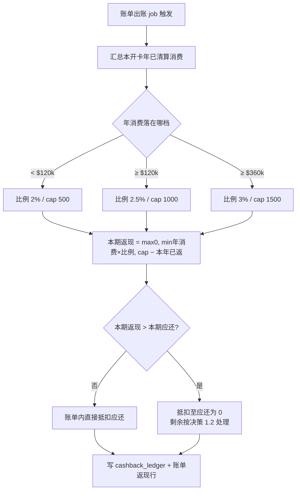
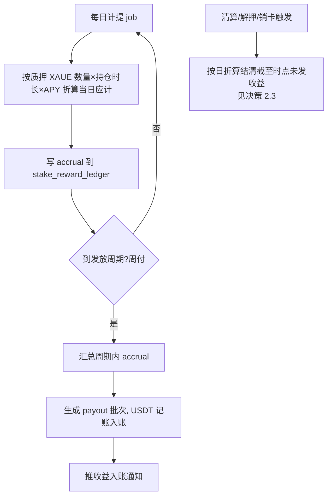
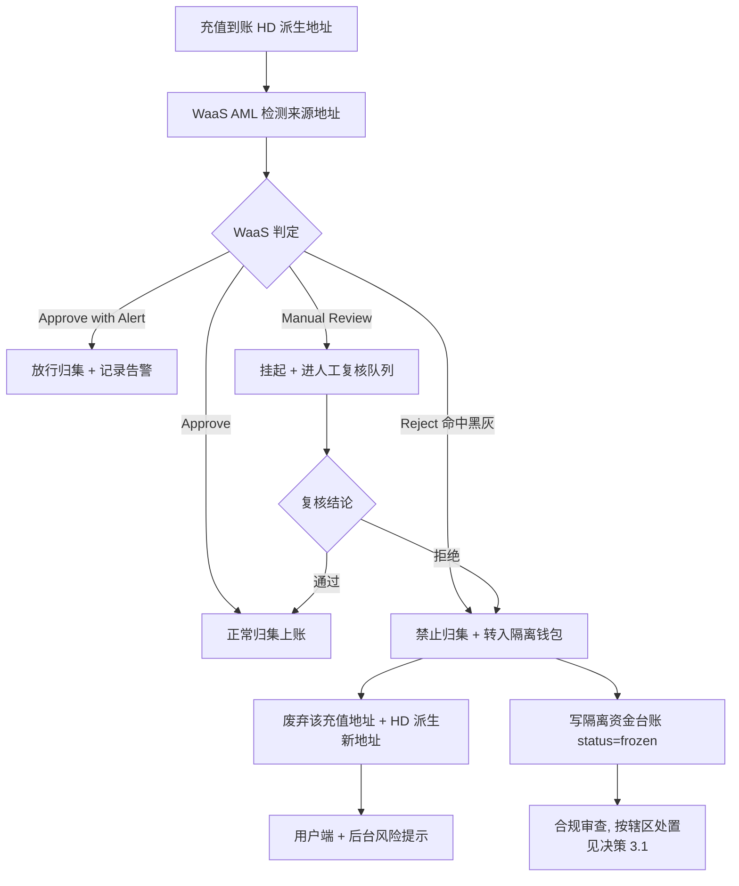
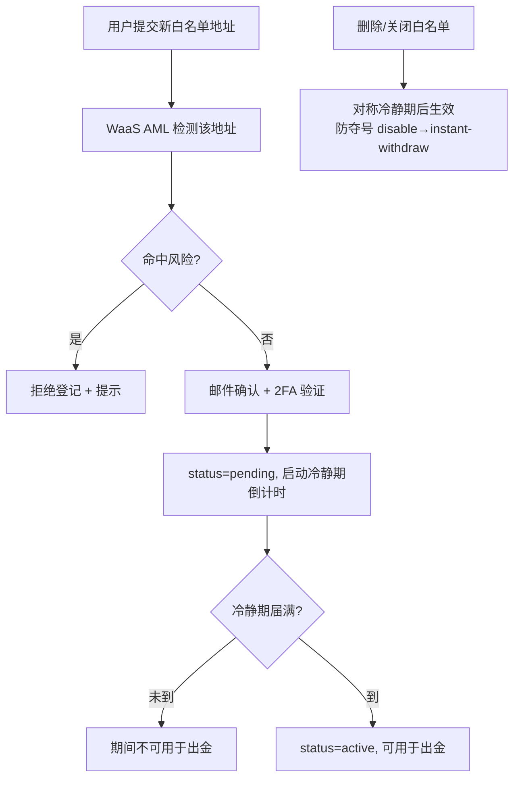

# XAUE 信用卡 · 0722 变更需求集（Cashback · XAUT Staking Reward · 白名单 + AML）

> **文档摘要**
> - 汇总 2026-07-22 mentor 提出的三条对客端新需求，拆为 4 条变更（AML 拆入金检测 + 出金白名单两条）。
> - 三条需求落地前均已完成 mentor 要求的两项功课（竞品调研 + 用户故事分析），产出三份简报（`~/Documents/xaue-产品功课/`）。
> - 文档遵循信用卡 PRD 既有结构：背景与目标 / 用户故事 / 业务规则 / 数据模型 / 接口 / 展示 / 验收 / 决策区 / 影响面。流程图一律 Mermaid。
> - **深度约定**：本文为**产品级 + 技术锚点**——业务规则/用户故事/验收/决策区写全；数据模型与接口只给关键字段和端点**占位**、标「开发阶段细化」，不代替开发详设。
>
> **🔑 每个待定项/缺口都做成「🤔 决策区」**：给推荐 + 备选 + 一句话双底座结论（竞品依据 + 用户故事依据）+「详见决策依据文档 §N」锚点。完整论证在 `决策依据-竞品与用户故事分析-0722.md`。mentor / 业务在决策区勾选后即定稿。
>
> **数据来源**：需求总参考（`三条新需求—需求总参考.md`，含 mentor 原话 A 层 / 已确认 B 层 / 推导 C 层 / 待定 D 层）+ 三份产品功课简报（竞品数据抓取日 2026-07-22）。

---

## 0 · 关联文档与定位

| 关联 | 文件 | 本变更触达点 |
|---|---|---|
| 章节 PRD §5 账单/还款 | `chapters/ch5-billing.md` | CC-0722-01 返现计算入账（出账 job 增 cashback 步骤）+ 账单返现记账行与展示 |
| 章节 PRD §7 用户端 | `chapters/ch7-user-end.md` | CC-0722-01 账单返现明细；CC-0722-02 收益流水与质押概览；CC-0722-03 入金风险提示；CC-0722-04 出金白名单管理页 |
| 章节 PRD §8 平台后台 | `chapters/ch8-back-office.md` | CC-0722-01 返现运营报表；CC-0722-02 APY 配置与发放监控；CC-0722-03 风险地址管理与隔离台账；CC-0722-04 白名单审核 |
| 章节 PRD §11 钱包架构 | `chapters/ch11-wallets.md` | CC-0722-03 入金 AML 卡点、隔离钱包（第 5 个）、HD 换址；WaaS AML 接入 |
| 章节 PRD §13 通知 | `chapters/ch13-notify.md` | CC-0722-02 收益入账通知；CC-0722-03 地址风险/更换通知；CC-0722-04 白名单变更通知（扩展现有 23 场景矩阵） |
| 质押 PRD | `prd-xaue-stake.md` | CC-0722-02 收益机制对照（新档必须低于 stake 4%）；收益展示设计参照 §4.1 |
| S4 AML 章 | `S4-AML.md` | CC-0722-03/04 口径修订：由「自建接 Chainalysis」改为「接入 WaaS AML」，黑灰标准以 WaaS 阈值为准 |
| 费用体系需求 | `CC_FEE_REQUIREMENTS.md` | CC-0722-04 出金网络费与既有提币费用体系对齐 |

> **重要边界（与既有记忆对齐）**：
> - 信用卡 live SPA 在 BitBucket `apps/web` + `apps/app` + `apps/admin`；本仓库为文档/PRD 镜像（GitHub `credit-card/X` ↔ BitBucket `apps/docs/X`）。
> - XAUE 资金路径为「链上 USDT/XAUT 充值 → HD 派生地址 → 平台归集 → BIN Sponsor 结算」；质押物锁入抵押品金库合约（Collateral Vault，平台无单方出金私钥），清算移交清算业务方（LSP）。
> - **本批次范围**：仅信用卡端。Shop 端（stake/borrow 钱包直连合约）与信用卡端无直接关系，AML 不纳入本期（需求总参考 A3-12）。
> - 术语沿用既有定义（Collateral Vault / LTV / HD 派生 / 归集 / WaaS / RedotPay / LSP / 超额还款），不重复定义。

### 0.1 · 待定项填充依据说明

需求总参考的 D 层待定项 + 用户故事简报的 3 硬缺口，本文档按 mentor 反馈（2026-07-23）处理：**能被竞品调研完全回答的直接写入业务规则；无法回答的做成决策区**，每个决策的推荐都带竞品分析 + 用户故事分析双底座，完整论证见 `决策依据-竞品与用户故事分析-0722.md`。

| 待定项/缺口 | 处理 | 落点 |
|---|---|---|
| D-3 竞品结算周期 | 简报完全回答 → 写入业务规则 | CC-0722-01 §2.3 |
| D-1 APY/计息/周期/币种 | 竞品给锚，业务定值 → 决策区 | CC-0722-02 §3.10 决策 2.1/2.2 |
| D-2 WaaS 对接清单 | 超简报范围 → 提给 WaaS 问题清单 | CC-0722-03 §4.10 决策 3.2 + §6 |
| D-4 白名单细则 | 竞品给锚 → 决策区两方案 | CC-0722-04 §5.10 决策 4.1 |
| 硬缺口 1 返现>应还 | 需拍板 → 决策区 | CC-0722-01 §2.10 决策 1.2 |
| 硬缺口 2 清算时收益结算 | 需拍板 → 决策区 | CC-0722-02 §3.10 决策 2.3 |
| 硬缺口 3 隔离资金处置 | 需拍板 → 决策区 | CC-0722-03 §4.10 决策 3.1 |

---

## 1 · 变更总览

| 编号 | 变更 | 侧 | 优先级 | 一句话目标 | 承接 |
|---|---|---|---|---|---|
| **CC-0722-01** | Cashback 消费返现 | C 端 + B 端 | **P0** | 按开卡年年消费阶梯返现，账单出账时按已清算流水计算、账单内 USDT 抵扣 | 新增，扩展 ch5 账单 |
| **CC-0722-02** | XAUT Staking Reward | C 端 + B 端 | **P0** | 给信用卡质押 XAUE 一个独立 APY（低于 stake 产品），以记账流水形式发放让用户感知 | 新增模块，参照 prd-xaue-stake §4.1 |
| **CC-0722-03** | 入金 AML 检测与资金隔离 | 平台 + B 端 | **P0** | 接入 WaaS AML，入金命中黑灰即禁归集、隔离、HD 换址，用户端+后台风险提示 | 修订 S4 AML，扩展 ch11 钱包 |
| **CC-0722-04** | 出金白名单地址管理 | C 端 + B 端 | **P0** | 用户登记出金白名单地址，平台只向白名单付款，登记时过 AML | 修订 S4 AML，扩展 ch7/ch8 |

**参数**（全部 admin 后台可配置，PRD 不写死；下表为**上线初始默认值**，可后台调整、不溯及既往、旧记录沿用快照）：

| 参数 | 初始默认值 | 配置项 key | 说明 |
|---|---|---|---|
| Cashback 档位 1 | 2.00%，cap 500 USDT/年 | `cashback.tier.t1.{rate,cap}` | 年消费 < $120,000 |
| Cashback 档位 2 | 2.50%，cap 1,000 USDT/年 | `cashback.tier.t2.{rate,cap}` | 年消费 ≥ $120,000 |
| Cashback 档位 3 | 3.00%，cap 1,500 USDT/年 | `cashback.tier.t3.{rate,cap}` | 年消费 ≥ $360,000 |
| Staking Reward APY | **待决策**（推荐 1.5%，见决策 2.1） | `stake_reward.apy` | 独立 APY，必须 < stake 产品 4% |
| Reward 发放周期 | **待决策**（推荐 周付） | `stake_reward.payout_cycle` | 日计提 + 周发放 |
| 白名单新地址冷静期 | **待决策**（推荐 48h） | `whitelist.cooldown.new_hours` | 见决策 4.1 |
| 白名单删除/关闭冷静期 | **待决策**（推荐 48h，对称） | `whitelist.cooldown.remove_hours` | 必须与新增对称 |
| 白名单地址上限 | **待决策**（推荐 5） | `whitelist.max_addresses` | 每用户 |
| 入金最小 AML 检测阈值 | 由 WaaS 平台阈值决定 | （WaaS 侧） | 黑灰标准以 WaaS 为准 |

### 1.1 · 🤔 决策区索引（全部待拍板点汇总）

> 下表汇总本文档所有需 mentor / 业务 / WaaS 拍板的决策点，指向正文决策区 + 决策依据文档对应节。**建议 mentor 逐条勾选后本文档即可定稿。**

| 决策 | 位置 | 类型 | 推荐 | 论证 |
|---|---|---|---|---|
| 1.1 返现到账时间点 | §2.10 | D-3 已答 | 随账单出账入账抵扣 | 决策依据 §1 |
| 1.2 返现>应还剩余处理 | §2.10 | 硬缺口1 | 结转下期（不转可提现） | 决策依据 §2 |
| 2.1 Reward APY 数值 | §3.10 | D-1 | 方案A 1.5% / 方案B 2.5% | 决策依据 §3 |
| 2.2 计息基数/周期/币种 | §3.10 | D-1 | XAUE 时间加权/周付/USDT | 决策依据 §4 |
| 2.3 清算时收益结算 | §3.10 | 硬缺口2 | 按日折算发放至终止时点 | 决策依据 §5 |
| 3.1 隔离资金终局处置 | §4.10 | 硬缺口3 | 冻结+审查+按辖区处置 | 决策依据 §6 |
| 3.2 WaaS 对接清单 | §4.10 | D-2 | 提给 WaaS 的问题清单 | 决策依据 §7 |
| 4.1 白名单冷静期/上限/验证 | §5.10 | D-4 | 方案A 标准档 | 决策依据 §8 |
| 4.2 白名单是否人工审批 | §5.10 | 次级缺口 | 预留开关，初期开 | 决策依据 §9 |

---

## 2 · CC-0722-01 — Cashback 消费返现（P0）

### 2.1 · 背景与目标

**背景**：现有信用卡产品无任何消费返现机制（既有文档零命中，最接近的 P1 积分系统 C-E01 仅规划未实现）。mentor 要求引入消费返现提升用户消费黏性。

**目标**：按开卡年年消费阶梯给予 cashback，以 USDT 记账、账单内直接抵扣，减少用户应还金额并在账单重点展示。

**成功标准**：
- 用户每期账单可见本期返现与年度累计返现/cap 进度。（总返现额度如何分配到每一期的账单中呢：每期返现一部分，返现的额度是总共需要返现的额度-已返现的额度）
- 返现计算只认已清算流水，与交易取消/退款解耦、无追回场景。
- cashback 成本受年度 cap 严格约束、可预测。

### 2.2 · 用户故事

- **US-01.1**（A1，P0）：作为持卡用户，我希望账单出账时自动获得阶梯返现并抵扣本期账单，以便直接减少应还金额。
- **US-01.2**（A2，P0）：作为持卡用户，我希望在账单里看到返现明细与年度累计/cap 进度，以便了解返了多少、还能返多少。
- **US-01.3**（A3，P1）：作为运营/财务，我希望有返现运营报表并能追溯单用户返现，以便核算成本与处理客诉。

### 2.3 · 业务规则

- **档位（按开卡年年消费，达档全量适用、含等于边界）**：
  - 年消费 < $120,000 → 2.00%，年 cap 500 USDT
  - 年消费 ≥ $120,000 → 2.50%，年 cap 1,000 USDT
  - 年消费 ≥ $360,000 → 3.00%，年 cap 1,500 USDT
- **每期返现公式**（需求总参考 C-1）：
  `本期返现 = max(0, min(年累计已清算消费 × 当前档位比例, 当前档位 cap) − 本开卡年内已返总额)`
  该式自然实现：年中跳档自动补差（跨过 $120k 后全量按 2.5% 重算）、全量适用、年度 cap 约束。
- **返现基数**：仅计入**已完成清算**的消费流水；确认中/取消/退款状态不计入（对齐竞品全行业惯例，详见决策依据 §1）。
- **计算与到账时点**：递延到**账单出账时**统一计算入账（规避交易取消/退款不确定性）；因基数只认清算终态 → 无返现追回场景（免 clawback，相较 Crypto.com 更简）。
- **发放形式**：USDT 记账，账单内直接抵扣应还金额。

### 2.4 · 数据模型（技术锚点，开发阶段细化）

- 新增 `cashback_ledger`（返现流水）：关键字段占位 `id / account_id / billing_period / cleared_spend_ytd / tier / rate / cap / period_reward / ytd_reward / created_at`。
- 账单表 `billing` 增返现抵扣字段占位：`cashback_offset_amount`。
> 完整字段类型/枚举/校验 → 开发阶段细化，参照 ch5-billing.md 现有 repayment/billing 表规范。

### 2.5 · 接口契约（技术锚点，开发阶段细化）

| 方法    | 路径（占位）                               | 侧   | 说明                |
| ----- | ------------------------------------ | --- | ----------------- |
| `GET` | `/api/cashback?account_id=&period=`  | C 端 | 本期返现明细 + 年度累计/cap |
| `GET` | `/admin/cashback?user_id=&from=&to=` | B 端 | 返现运营报表 + 单用户追溯    |
> 出账 job 内部新增 cashback 计算步骤（非独立对外接口），开发阶段细化。

### 2.6 · 流程图（账单出账时 cashback 计算）

### 2.7 · 用户端展示要求

- 账单页尾部「返现」区，两行：本期返现 X USDT + 年度累计返现 Y / cap Z（进度）。
- 账单样式中重点展示返现对应还金额的抵扣（呼应 B-5）。

### 2.8 · admin 端展示要求（新增运营动作）

- 后台「返现报表」模块（挂 ch8 财务/对账分组）：按周期/用户/档位汇总返现成本；单用户返现追溯（可下钻每期计算明细）。
- 导出 CSV 遵循 ch8 共性约定（≤1 万行同步/超出异步、写 event_log）。
- 权限：财务「返现报表查看」权限点（ch9 RBAC）。
- **新增后台工作量**：定期核对返现成本 vs 预算；处理返现相关客诉（对照 mentor 关注点④）。

### 2.9 · 验收标准

| # | Given | When | Then |
|---|---|---|---|
| AC-01.1 | 用户本年已清算消费 $125,000 | 账单出账 | 按 2.5% 全量算，min($125k×2.5%,1000)−本年已返；账单内抵扣 |
| AC-01.2 | 年中从 $110k 跨到 $125k | 出账 | 自动补差（全量重算为 2.5%），补差额入本期返现 |
| AC-01.3 | 有取消/退款交易 | 出账计算 | 该笔不计入返现基数 |
| AC-01.4 | 本期返现 > 本期应还 | 抵扣 | 抵至应还为 0，剩余按决策 1.2（结转下期）处理 |
| AC-01.5 | 无「返现报表」权限 | 访问后台模块 | 菜单不可见 / 403 |

### 2.10 · 🤔 决策区

**决策 1.1 · 返现到账时间点**
- 问题：返现何时入账、何时可用？
- **竞品依据**：传统卡 statement-close 统一入账 / Nexo settle 后近即时 / Crypto.com 最长 2 周期（决策依据 §1）。
- **用户故事依据**：C 端要可预期节奏；业务上账单出账即清算终态；后台随账单算对账最简、免 clawback。
- **推荐**：随账单出账统一计算、当期账单内抵扣（到账时点 = 账单出账日）。
- 备选：交易后滚动即时发放（体验快但与账单抵扣模式冲突、引入回滚复杂度）。
- 完整论证：决策依据 §1。
- ☐ 采纳推荐　☐ 备选滚动发放　☐ 其他：________

**决策 1.2 · 返现 > 本期应还的剩余处理（硬缺口1）**
- 问题：返现抵完账单后仍有剩余，怎么办？
- **竞品依据**：竞品返现均为独立余额不冲账单，"账单抵扣"模式无直接先例（决策依据 §2）。
- **用户故事依据**：C 端要返现不蒸发可累积；资金池怕可提现负债冲击备付金；后台结转实现最简。

| 方案 | 内容 | 优 | 缺/风险 |
|---|---|---|---|
| **推荐：结转下期抵扣** | 剩余挂 carry-over，下期优先抵扣 | 返现不蒸发；无即时提现压力；工程最简 | 极端累积需设上限 |
| 备选 A：转 USDT 可提现 | 剩余进可提现余额 | 用户体验最强 | 资金池即时负债；需接提现+AML+网络费 |
| 备选 B：当期清零 | 抵扣后剩余作废 | 成本最低 | 用户视为吞返现 → 强投诉，不可取 |

- 完整论证：决策依据 §2。
- ☐ 采纳推荐（结转下期）　☐ 备选 A（可提现）　☐ 备选 B（清零）　☐ 其他：________

### 2.11 · 依赖与影响面

- 依赖：ch5 出账 job（需插入 cashback 计算步骤）；清算状态判定（区分已清算/pending）。
- 影响：ch5 账单结构 + 出账逻辑；ch7 账单页；ch8 报表 + RBAC。

---

## 3 · CC-0722-02 — XAUT Staking Reward（P0）

### 3.1 · 背景与目标

**背景**：需求总参考 B-6 定调——给信用卡质押品一个**独立 APY 的新奖励机制**（低于 stake 产品 4%），非把已有质押收益做前端展示（此前理解已作废）。现状主 PRD §3.1 明确信用卡质押 XAUE「收益：无（仅用于授信）」，本需求覆盖之。

**目标**：给信用卡质押的 XAUE 一个独立 APY，以记账流水形式定期发放、让用户有明确感知（A3-7）。

**成功标准**：
- 用户能在收益流水看到每次「本次 stake 收益 X」。
- APY 显著低于 stake 产品、成本受控、合规文案合规。

### 3.2 · 用户故事

- **US-02.1**（B1，P0）：作为持卡用户，我希望以记账流水形式收到质押奖励收益，以便清楚看到每次收益。
- **US-02.2**（B2，P1）：作为持卡用户，我希望在质押概览看到累计收益并接收入账通知，以便掌握收益进展。
- **US-02.3**（B3，P0）：作为运营，我希望配置 APY 参数并监控发放，以便控制成本与排查异常。

### 3.3 · 业务规则

- 奖励对象 = 信用卡质押账户内的 XAUE（本批语境）；独立 APY，**必须低于 stake 产品 4%**。
- 收益作为平台内账本「质押奖励」流水类型，不改变质押品本身（不占用、不影响 LTV 与清算前提）。
- 具体 APY 值 / 计息基数 / 周期 / 币种 / 终态结算 见决策区（§3.10）。
- **合规硬约束**：APY 文案一律 "up to / variable / subject to change"，禁写死固定 APY（证券属性红线，决策依据 §3）。

### 3.4 · 数据模型（技术锚点，开发阶段细化）

- 新增 `stake_reward_ledger`：关键字段占位 `id / account_id / staked_xaue / accrual_date / accrued_amount_usdt / payout_batch_id / status / created_at`（借鉴 Kraken earn ledger 科目：type=reward + dust threshold）。
- 参数表 `stake_reward_config`：`apy / payout_cycle / basis / currency`（全 admin 可配）。
> 计息精度（dust threshold）、时间加权算法 → 开发阶段细化。

### 3.5 · 接口契约（技术锚点，开发阶段细化）

| 方法 | 路径（占位） | 侧 | 说明 |
|---|---|---|---|
| `GET` | `/api/stake-reward?account_id=` | C 端 | 收益流水 + 累计 |
| `GET/PUT` | `/admin/stake-reward/config` | B 端 | APY 等参数配置（双人复核） |
| `GET` | `/admin/stake-reward/payouts` | B 端 | 发放批次监控 |

### 3.6 · 流程图（计息与发放）

### 3.7 · 用户端展示要求

- 收益流水列在交易/资金流水列表（每笔标「质押奖励」+ 金额）。
- 质押概览区加「累计收益」行（参照 prd-xaue-stake §4.1 展示设计）。

### 3.8 · admin 端展示要求（新增运营动作）

- 后台「Staking Reward」模块：APY 等参数配置（双人复核、不溯及既往、旧记录快照）；发放批次监控（成功/失败/重放）。
- 权限：运营「Reward 配置」+ 财务「发放监控」权限点。
- **新增后台工作量**：定期核对 APY 成本、监控发放批次异常（对照 mentor 关注点④）。

### 3.9 · 验收标准

| # | Given | When | Then |
|---|---|---|---|
| AC-02.1 | 用户质押 XAUE 满一周期 | 周付发放 | 按 APY 时间加权折算，USDT 记账入账 + 通知 |
| AC-02.2 | admin 改 APY | 保存 | 双人复核后生效、不溯及既往、旧记录沿用快照 |
| AC-02.3 | 用户中途解押 | 结算 | 按日折算结清截至时点未发收益（决策 2.3） |
| AC-02.4 | 计息金额低于 dust threshold | 计提 | 不入账、仅可导出可见 |

### 3.10 · 🤔 决策区

**决策 2.1 · APY 数值（D-1）**
- 问题：独立 APY 定多少？
- **竞品依据**：黄金代币真实收益地板 Kraken 0.1%/Binance PAXG 0.65%；借贷模式 Nexo up to 5.5%/Falcon 3-5%；自家 stake 4%（硬约束上限）。
- **用户故事依据**：C 端要有感知（不能贴地板）；业务要控成本（资金借来的）；风控要与 stake 拉开差防套利。

| 方案 | APY | 优 | 缺/风险 |
|---|---|---|---|
| **方案 A 保守（推荐）** | 1.5% | 有感知 + 成本可控 + 与 stake 拉开差 | 激励中等 |
| 方案 B 激进 | 2.5% | 激励更强 | 成本翻倍、资金池压力大 |

- 完整论证 + 锚点全表：决策依据 §3。
- ☐ 方案 A（1.5%）　☐ 方案 B（2.5%）　☐ 其他值：______ %

**决策 2.2 · 计息基数 / 周期 / 币种（D-1）**
- **竞品依据**：Kraken 持仓时长比例 + 日计提周付 + in-kind；USDT 记账避免脱锚。
- **用户故事依据**：周付感知强；USDT 用户看得懂；按 XAUE 数量基数稳定。
- **推荐**：计息基数 = XAUE 数量时间加权 / 周期 = 日计提+周发放 / 币种 = USDT 记账。
- 备选：计息基数按 USDT 估值（随金价波动、基数不稳）。
- 完整论证：决策依据 §4。
- ☐ 采纳推荐　☐ 基数改 USDT 估值　☐ 周期改月付　☐ 其他：________

**决策 2.3 · 清算/解押/销卡时未发收益结算（硬缺口2）**
- **竞品依据**：多数平台解押即停息，无清算残值收益先例（决策依据 §5）。
- **用户故事依据**：清算高频且高压力，没收已计提收益 → 强投诉 + 增客服工作；按日折算最公平不阻碍清算。

| 方案 | 内容 | 优 | 缺/风险 |
|---|---|---|---|
| **推荐：按日折算至终止时点** | 结算环节结清已计提未发收益 | 最公平、最少客诉 | 三种终止路径都加结算步骤 |
| 备选 A：满周期才发 | 未满周期不发 | 实现最简 | 没收收益 → 强投诉 |
| 备选 B：即时结清 | 每次终止触发完整批次 | 公平 | 工程更重 |

- 完整论证：决策依据 §5。
- ☐ 采纳推荐（按日折算）　☐ 备选 A（满周期）　☐ 备选 B（即时结清）　☐ 其他：________

### 3.11 · 依赖与影响面

- 依赖：D-1 参数拍板后方可开发；质押账户数据；清算/解押流程（插收益结算）。
- 影响：新增 reward 引擎模块；ch7 收益展示；ch8 配置+监控；ch13 收益通知。

---

## 4 · CC-0722-03 — 入金 AML 检测与资金隔离（P0）

### 4.1 · 背景与目标

**背景**：现有 S4 AML 检查时机是「下单时查 sender 钱包」，**充值来源地址无审查规则**；充值走 HD 派生地址 ≤5 分钟自动归集进托管钱包，归集链路无 AML 卡点。mentor 要求接入 WaaS AML 补此盲区。

**目标**：接入 WaaS AML 能力，入金到账即检测；命中黑灰则禁止归集上账、隔离资金、废弃并 HD 换新充值地址，用户端与后台同时风险提示。

**成功标准**：
- 命中黑灰的充值不进入主归集池（防污染平台地址）。
- 用户端与后台均可见风险提示；隔离资金有台账、可追溯。
- 黑灰标准以 WaaS 阈值为准，平台不自定。

### 4.2 · 用户故事

- **US-03.1**（C2，P0）：作为持卡用户，当我的充值命中风险时，我希望获得清晰风险提示与一个新的充值地址，以便继续正常充值。
- **US-03.2**（C3，P0）：作为运营/合规，我希望有风险地址管理与隔离资金台账，以便审查、处置与合规上报。

### 4.3 · 业务规则

- 入金到账 → WaaS AML 检测 → 命中黑灰 → 禁止归集上账 + 独立隔离记录 + 涉黑灰充值地址废弃并 HD 派生新地址 + 用户端与后台风险提示（需求总参考 C-5）。
- 四档处置借鉴 Cobo Screening：Approve / Approve with Alert / Reject（禁归集隔离）/ Manual Review（人工复核）。
- 黑灰判定标准 = WaaS 平台风控阈值（平台不自定，S4 原数值分/分类映射不一致问题随之消解）。
- 隔离资金终局处置见决策区（§4.10 决策 3.1）。

### 4.4 · 数据模型（技术锚点，开发阶段细化）

- 新增 `aml_screening_record`：占位 `id / deposit_id / source_address / risk_level / disposition(Approve/Alert/Reject/Manual) / waas_ref / created_at`。
- 新增 `isolated_fund_ledger`（隔离资金台账）：占位 `id / deposit_id / amount / isolation_wallet / status(frozen/under_review/disposed) / disposal_type / reviewer / created_at`。
- 隔离钱包 = 现有 4 钱包架构外的**第 5 个**（ch11 扩展）。
- 充值地址表增 `status(active/retired)` + `retired_reason`。

### 4.5 · 接口契约（技术锚点，开发阶段细化）

| 方法 | 路径（占位） | 侧 | 说明 |
|---|---|---|---|
| （回调） | WaaS AML 检测结果回调 | 平台 | 同步/异步待 WaaS 确认（决策 3.2） |
| `GET` | `/api/deposit-address?account_id=` | C 端 | 获取当前有效充值地址（换址后取新地址） |
| `GET` | `/admin/aml/records` `/admin/aml/isolated` | B 端 | 风险记录 + 隔离台账查询与处置 |

### 4.6 · 流程图（入金 AML 检测与处置）

### 4.7 · 用户端展示要求

- 充值命中风险时：清晰提示（当前充值地址已停用、已生成新地址、如何继续），话术避免指控性措辞、提供申诉入口（防误伤，dYdX 教训）。

### 4.8 · admin 端展示要求（新增运营动作）

- 后台「风险地址管理」模块（挂 ch8 + S4）：AML 记录查询；隔离资金台账（冻结/审查中/已处置）；人工复核队列；换址记录。
- 权限：合规「风险处置」权限点。
- **新增后台工作量**（mentor 关注点④，最重一块）：合规人工复核 Manual Review 队列；隔离资金调查与按辖区处置；申诉处理。

### 4.9 · 验收标准

| # | Given | When | Then |
|---|---|---|---|
| AC-03.1 | 充值来源命中黑灰 | WaaS 返回 Reject | 禁归集 + 转隔离钱包 + 废址换新 + 双端提示 + 台账记录 |
| AC-03.2 | WaaS 返回 Manual Review | 检测完成 | 挂起进人工队列，复核后放行或隔离 |
| AC-03.3 | 隔离导致还款失败 | 账单逾期判定 | 按决策 3.1 连带规则处理罚息豁免 |
| AC-03.4 | 正常充值 | WaaS Approve | 正常归集上账、无感知 |

### 4.10 · 🤔 决策区

**决策 3.1 · 隔离资金终局处置（硬缺口3）**
- 问题：命中黑灰、隔离后的资金最终怎么办？
- **竞品/合规依据**：Cobo Reject=冻结非退回；Binance 挂起复核；FATF 通例冻结+调查+SAR 上报；**"退回原地址"可能违反冻结义务/协助转移赃款——已否决**（决策依据 §6）。
- **用户故事依据**：C 端（误伤）要救济与申诉；资金池要隔离防污染；合规要留痕上报。

| 方案 | 内容 | 优 | 缺/风险 |
|---|---|---|---|
| **推荐：冻结+审查+按辖区处置** | 隔离→人工复核→按辖区（上报/冻结/误判解冻） | 合规合法、可救济 | 合规人工工作量大（必需成本） |
| 备选 A：长期冻结 | 一律无限期冻结 | 最简 | 用户资产悬空无救济 → 客诉/纠纷 |
| ~~退回原地址~~ | —— | —— | **合规红线，已否决** |

- 完整论证：决策依据 §6。
- ☐ 采纳推荐　☐ 备选 A（长期冻结）　☐ 其他：________
- 连带需拍板：隔离导致还款失败→逾期的**罚息豁免规则**？☐ 误伤经核实豁免　☐ 其他：________

**决策 3.2 · WaaS AML 对接清单（D-2）**
- 说明：同步/异步时序、Manual Review 支持度等超出简报可答范围，**不给推荐值**，列为提给 WaaS 的问题清单（见 §6 待确认事项，完整清单决策依据 §7）。
- ☐ 确认按 §6 清单向 WaaS 发起对接

### 4.11 · 依赖与影响面

- 依赖：WaaS AML 能力（D-2 对接）；ch11 钱包架构（加隔离钱包 + 换址）；HD 派生机制。
- 影响：S4 AML 口径修订；ch11 钱包；ch8 风险管理模块；ch13 风险/换址通知。

---

## 5 · CC-0722-04 — 出金白名单地址管理（P0）

### 5.1 · 背景与目标

**背景**：web3 属性决定入金无法限制地址（谁都能转入），但**出金可控**。mentor 要求用户登记出金白名单地址，平台只向白名单付款。

**目标**：用户登记/管理出金白名单地址，登记时过 AML；平台仅向白名单地址付款；变更经安全冷静期。

**成功标准**：
- 平台付款只发白名单地址。
- 白名单变更（增/删/关）经对称冷静期，堵盗号提币攻击窗。

**说明**：当前信用卡 PRD 无用户主动提现功能，出金白名单的生效场景 = 后续任何向用户链上地址付款的动作（提现上线时、退款到链上时）。

### 5.2 · 用户故事

- **US-04.1**（C1，P0）：作为持卡用户，我希望登记与管理出金白名单地址，以便安全地把资产提到我信任的地址。

### 5.3 · 业务规则

- 白名单管**出金**；入金不做地址限制（web3 属性）。
- 登记地址同样过 WaaS AML 检测（命中则拒绝登记）。
- 新地址冷静期 + 删除/关闭对称冷静期 + 地址上限 + 登记验证方式见决策区（§5.10）。
- 是否需人工审批见决策 4.2。

### 5.4 · 数据模型（技术锚点，开发阶段细化）

- 新增 `withdrawal_whitelist`：占位 `id / account_id / address / chain / status(pending/active/removing) / whitelisted_at / cooldown_until / aml_ref / created_at`（借鉴 Binance whitelisted_at + 冷静期字段、Nexo pending/active 状态机）。

### 5.5 · 接口契约（技术锚点，开发阶段细化）

| 方法 | 路径（占位） | 侧 | 说明 |
|---|---|---|---|
| `GET/POST/DELETE` | `/api/whitelist` | C 端 | 查/增/删白名单（增删经冷静期） |
| `GET` | `/admin/whitelist?user_id=` | B 端 | 白名单审核/查看 |

### 5.6 · 流程图（白名单登记生效）

### 5.7 · 用户端展示要求

- 出金白名单管理页：地址列表（状态/冷静期倒计时）；新增（邮件确认+2FA）；删除（提示对称冷静期）。

### 5.8 · admin 端展示要求（新增运营动作）

- 后台白名单查看/审核（人工复核开关开启时）。
- 权限：合规「白名单审核」权限点。
- **新增后台工作量**：人工复核开关开启期的白名单审核（对照 mentor 关注点④）。

### 5.9 · 验收标准

| # | Given | When | Then |
|---|---|---|---|
| AC-04.1 | 用户加新地址 | 提交 | 过 AML + 邮件确认 + 2FA，进 pending + 冷静期倒计时 |
| AC-04.2 | 冷静期未届满 | 发起出金到该地址 | 拒绝（地址未生效） |
| AC-04.3 | 用户删除/关闭白名单 | 提交 | 经对称冷静期后才生效 |
| AC-04.4 | 登记地址命中 AML | 提交 | 拒绝登记 + 提示 |

### 5.10 · 🤔 决策区

**决策 4.1 · 冷静期 / 地址上限 / 登记验证（D-4）**
- **竞品依据**：新地址冷静期 Coinbase 48h/Bybit 24h/Binance 可配；对称关闭 Crypto.com/Binance 均有；上限 Binance 200/Nexo 可配；验证 Nexo 邮件/Kraken GSL（决策依据 §8）。
- **用户故事依据**：C 端安全↔便利权衡；资金安全要堵盗提窗；后台怕冷静期太短压力大。

| 方案 | 冷静期 | 上限 | 验证 | 优 | 缺 |
|---|---|---|---|---|---|
| **方案 A 标准档（推荐）** | 48h 对称 | 5 | 邮件+2FA | 安全最强、管理成本低 | 首次等待较长 |
| 方案 B 灵活档 | 可配 24/48/72h | 10 | 邮件+可配 | 用户可自选 | 选 24h 时安全略降 |

- **必须项（非可选）**：对称冷静期——删除/关闭也经冷静期，安全底线。
- 完整论证：决策依据 §8。
- ☐ 方案 A（标准档）　☐ 方案 B（灵活档）　☐ 其他：________

**决策 4.2 · 是否需人工审批（次级缺口）**
- **竞品依据**：零售所自动通过即生效；高价值托管有人工复核（决策依据 §9）。
- **用户故事依据**：合规想初期人工兜底 ↔ 用户要快速生效。
- **推荐**：预留人工复核开关，上线初期开、稳定后关。
- ☐ 采纳推荐（开关，初期开）　☐ 始终自动　☐ 始终人工　☐ 其他：________

### 5.11 · 依赖与影响面

- 依赖：WaaS AML（登记检测）；出金/付款流程（生效场景）。
- 影响：ch7 白名单管理页；ch8 审核；S4 AML；ch13 白名单变更通知。

---

## 6 · 待确认事项汇总

> 按提给对象分组。决策区（§2.10/§3.10/§4.10/§5.10）是 mentor/业务勾选项；本表额外汇总需对外确认的项。

| # | 待确认 | 影响 | 提给 | 优先级 |
|---|---|---|---|---|
| Q1 | Reward APY 最终值（1.5% / 2.5% / 其他） | CC-0722-02 开发前置 | mentor/业务 | 关键阻塞 |
| Q2 | 返现>应还剩余处理（结转/可提现/清零） | CC-0722-01 出账 job | mentor/业务 | 关键阻塞 |
| Q3 | 清算时未发收益结算规则 | CC-0722-02 清算流程 | mentor/业务 | 关键 |
| Q4 | 隔离资金终局处置 + 罚息豁免 | CC-0722-03 合规流程 | mentor/合规 | 关键 |
| Q5 | WaaS AML 对接清单（检测同步/异步 SLA、Manual Review 支持、地址禁用 API、Travel Rule、存量复检、归集地址是否已 AML） | CC-0722-03/04 | WaaS 服务商 | 关键阻塞 |
| Q6 | 白名单冷静期/上限/验证（方案 A/B） | CC-0722-04 | mentor/业务 | 关键 |
| Q7 | 白名单是否人工审批 + SLA | CC-0722-04 | mentor/合规 | 中 |
| Q8 | 合规文案口径（"up to/variable"，避免固定 APY 承诺） | CC-0722-02 | 合规 | 中 |

---

## 7 · 影响面与受影响章节

- **C 端**：账单页返现区（新）；收益流水 + 质押概览收益行（新）；充值风险提示（新）；出金白名单管理页（新）。
- **B 端**：返现报表 / Staking Reward 配置监控 / 风险地址管理 + 隔离台账 / 白名单审核（4 个后台模块新增）+ 对应 RBAC 权限点。
- **数据**：新增 cashback_ledger / stake_reward_ledger / aml_screening_record / isolated_fund_ledger / withdrawal_whitelist 5 张表（字段开发细化）；充值地址表加 status。
- **资金/账务**：账单增返现抵扣；新增 reward 发放；新增第 5 个隔离钱包。
- **受影响章节**：ch5 账单、ch7 用户端、ch8 后台、ch11 钱包、ch13 通知；S4 AML 口径修订；新增 Staking Reward 引擎模块。

---

## 附录 · 竞品实现路径借鉴速查（从竞品档案反推）

| 借鉴点 | 竞品来源 | 用在哪 |
|---|---|---|
| 收益独立会计科目（ledger type=reward + dust threshold） | Kraken XAUT Auto-Earn | CC-0722-02 记账流水（工程风险最低） |
| 日计提 + 周发放两段式（解耦计息与发放） | Kraken | CC-0722-02 §3.6 |
| pending 交易 TTL + 过期扫描（只认清算终态） | Nexo Card | CC-0722-01 免 clawback 的实现基础 |
| clawback 按原 token 数量扣（币种维度记账） | Crypto.com | CC-0722-01 反面参照（我方免此复杂度） |
| 白名单 pending/active 状态机 + 冷静期倒计时 | Nexo / Binance | CC-0722-04 §5.6 |
| 关闭白名单也触发对称冷静期（防夺号攻击窗） | Crypto.com / Binance | CC-0722-04 必须项 |
| 命中资金四档处置（Approve/Alert/Reject/Manual） | Cobo Screening | CC-0722-03 §4.3 |

> 完整竞品明细与实现路径反推见 `~/Documents/xaue-产品功课/竞品档案-cashback-reward-AML-2026-07-22.md`。
