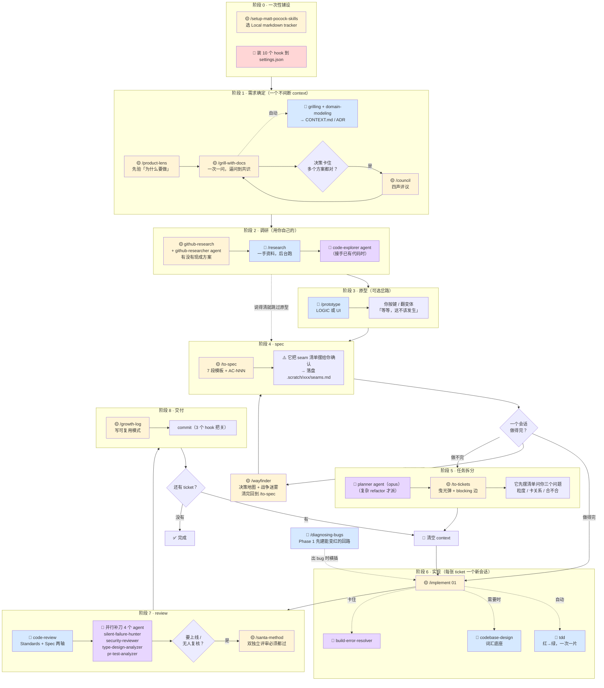
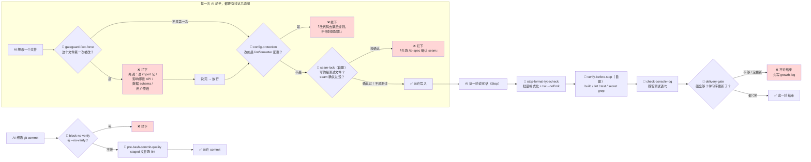
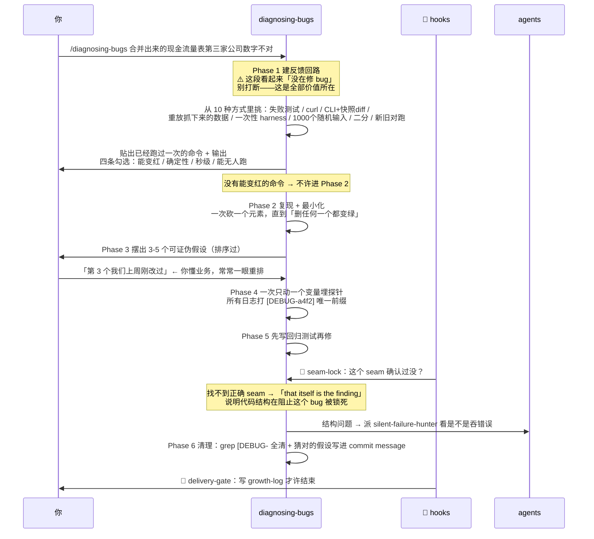
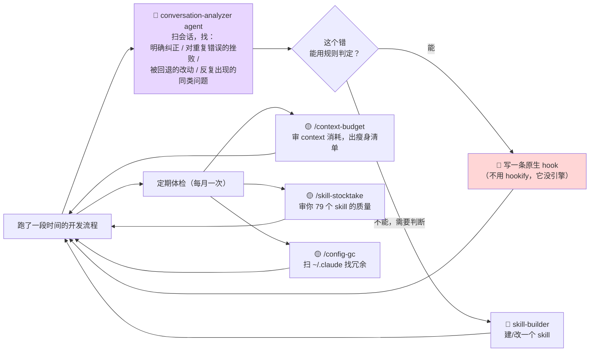

# 开发流程 v1 — 工具清单与编排

> 来源：[[../mattpocock skills 研究/00 索引 - 从这里开始|mattpocock/skills]]（方法论骨架）+ [[../ECC Harness 研究/00 索引 - 从这里开始|affaan-m/ECC]]（hooks 执法 + agents 分身）
> 依据：两个仓库的浅克隆只读源码，`~/harness-research/`。每条结论标了出处文件
> 日期：2026-08-04　|　状态：设计稿，未实施

---

## TL;DR

**分工是清楚的：matt 给方法论和流程骨架，ECC 给执法手段和专家分身，调研环节用你自己已有的工具。**

这套流程一共用 **22 个 skill + 9 个 agent + 10 个 hook**，其中只有 **3 件需要自建**，其余都是订阅或拷贝。

---

## 🔑 设计骨架：三层执法强度

整套设计只有一条主线原则——**按「这件事必须发生的程度」选层，不是按「哪个好用」选层**。

| 层 | 执法强度 | 谁触发 | 放什么 |
|---|---|---|---|
| **hook** | **100%**，宿主执行，模型碰不到、绕不过 | 事件（工具调用前后 / Stop / 会话开始） | 能用规则判定的纪律：不许改 lint 配置、不许 `--no-verify`、动文件前先说事实、Stop 前必须格式化 + typecheck |
| **user-invoked skill** | **100%**，但要你记得打字 | 只有你打 `/xxx` | 需要**你拍板**的流程节点：要不要 grilling、spec 定了没、ticket 怎么切 |
| **model-invoked skill** | **概率性**，靠 description 匹配 | 模型自己判断，或你打字 | 干活时随时要拉进来的**参考**：怎么写测试、怎么诊断 bug、深模块词汇 |

### 由此推出三条设计规则

1. **能用 hook 表达的纪律，绝不写进 SKILL.md。** ECC 的 `verification-loop` 是反例——它 6 个 phase 全是「跑 build / typecheck / lint / test / grep secret / 看 diff」，这正好是 hook 该干的，写成 skill 靠模型自觉执行等于放弃
2. **需要人拍板的节点做成 user-invoked，不给模型自主权。** 这是 matt 解决「AI 会不会漏调用」的办法——他 9/17 个 skill 是 user-invoked（`disable-model-invocation: true`），ECC 43 个一个都没用这个字段
3. **matt 定「该怎么做」，ECC 定「不做会被拦」。** 两边不是竞争关系：matt 的 `tdd` 说「不在未确认的 seam 上写测试」，但没有任何东西执行它；ECC 的 hook 机制能把它变成硬拦

---

## ⚠️ 三个必须先知道的

### 1. ECC 的 `hookify-rules` 是空转的——它没有引擎

你把它列进了「直接重点关注」，但**这个 skill 在 ECC 里不能用**。

它教你写 `.claude/hookify.{name}.local.md` 格式的规则文件，配了 4 个 command（`/hookify`、`/hookify-list`、`/hookify-configure`、`/hookify-help`）。但我全仓搜过（`grep -rn "hookify" --include="*.js" --include="*.py"`，排除 node_modules），**没有任何代码读这些规则文件**。只有 `package.json` 的打包清单、`COMMAND-REGISTRY.json` 的命令注册、和 dashboard 的分类映射提到 hookify。

> **结论**：写完的规则文件没有东西去执行它。hookify 是个独立开源项目，ECC 只搬了「写规则的语法文档 + 命令壳」。

**替代路径（我推荐这条）**：`conversation-analyzer` agent 是真实存在的，它能从对话里找出**明确纠正、对重复错误的挫败反应、被回退的改动、反复出现的同类问题**。用它找模式，然后**直接写原生 Claude Code hook**（`~/.claude/settings.json` 的 `hooks` 段），跳过 hookify 这一层。

你可以自己验：
```bash
grep -rn "hookify" --include="*.js" --include="*.py" ~/harness-research/ECC | grep -v node_modules
```

### 2. ECC hook 手动安装是否生效，我没有实测过

置信度约 **65%**。ECC 的 `hooks/hooks.json` 是给 plugin 安装用的（每条命令都是一段自解析 `CLAUDE_PLUGIN_ROOT` 的 bootstrap），手动拷到 `~/.claude/settings.json` 后能不能跑，我没找到证据链。

**验证动作**（落地第一步就该做）：先只装 1 个最简单的 hook（`config-protection`，176 行、零外部依赖），然后故意让 Claude 去改 `.eslintrc.js`，看有没有被拦。拦住了再装其余的。

### 3. 大部分不用自建——只有 3 件要写

你说「帮我构建一套 skills」，但正确答案是**组装为主**：

| | 数量 | 怎么来 |
|---|---|---|
| matt 的 skill | 17 + 5 | **一条命令订阅**，只读托管，作者发版自动更新 |
| ECC 的 skill | 7 | 手动拷目录到 `~/.claude/skills/` |
| ECC 的 agent | 9 | 手动拷 md 到 `~/.claude/agents/` |
| ECC 的 hook | 8 | 拷脚本 + 改 `settings.json` |
| **自建** | **3** | ① 路由 skill `dev-flow` ② 2 个自建 hook |

自己写的越少越好——订阅的东西不腐烂，自己写的要维护。

---

# 一、工具清单

## 1.1 skills（22 个）

### 来自 mattpocock（14 个）—— 流程骨架 + 方法论

| skill | 触发 | 功能 |
|---|---|---|
| `grill-with-docs` | 🟡你打字 | 逼问式需求打磨，产出沉淀进 `CONTEXT.md` + ADR |
| `grilling` | 🔵自动 | 逼问原语：一次一问、自带推荐答案、事实自查、不许提前动手 |
| `domain-modeling` | 🔵自动 | 维护领域词汇表（带 `_Avoid_` 禁用词）+ ADR 三条判据 |
| `prototype` | 🔵 | 一次性代码回答一个设计问题。LOGIC（终端小程序）/ UI（3 个变体）两分支 |
| `research` | 🔵 | 派后台 agent 只读一手来源，产出带引用的 md |
| `to-spec` | 🟡 | 对话 → spec，**并主动画 seam 找你确认** |
| `to-tickets` | 🟡 | spec → N 张曳光弹 ticket + blocking 边；宽重构走 expand-contract |
| `implement` | 🟡 | 按 ticket 建造，内部驱动 tdd，收尾自动 code-review |
| `tdd` | 🔵自动 | 红绿循环 + 「不在未确认的 seam 上写测试」+ 3 个反模式。**refactor 移出循环** |
| `code-review` | 🔵自动 | 两轴并行 subagent：Standards（含 12 条 Fowler smell 兜底）+ Spec |
| `codebase-design` | 🔵 | 深模块词汇底座（module/interface/depth/seam/adapter/leverage/locality） |
| `diagnosing-bugs` | 🔵 | 6 阶段：**先建能变红的反馈回路**（10 种方式），无回路不许猜 |
| `wayfinder` | 🟡 | 超大工程：决策 ticket 地图 + 战争迷雾，产出决策不产出交付物 |
| `handoff` | 🟡 | 把对话压成 md 文件供新会话引用。**`/handoff` 分叉，`/compact` 继续** |

### 来自 ECC（7 个）—— 补 matt 缺的环节

| skill | 触发 | 功能 | 为什么要它 |
|---|---|---|---|
| `product-lens` | 🟡 | 建之前先验「为什么要做」，产品诊断 + 方向压力测试 | matt 的主流程从「你有个想法」开始，**没有质疑想法本身的环节** |
| `council` | 🟡 | 四声评议：歧义决策 / trade-off / go-no-go 时的结构化异议 | grilling 是一对一逼问，council 是多视角。**决策卡住时用** |
| `delivery-gate` | 🔧hook | Stop 硬拦：磁盘 <15GB / ≥3 学习库过期 / growth-log 过期；4 条 RATIONALIZE 正则（只警告） | matt **完全没有交付门** |
| `growth-log` | 🟡 | 教你写可复用模式而不是日记。「失败的营养密度高于成功」 | 配合 delivery-gate 的硬拦，两者是一对 |
| `strategic-compact` | 🔵 | 在逻辑断点建议手动压缩，而不是让系统在任意点自动压 | 唯一被两条独立证据链（GitHub issue 情感 + HN 真实用户）都正评的 ECC skill |
| `context-budget` | 🟡 | 审 context 消耗（agent/skill/MCP/rules），出优先级排序的瘦身建议 | 你 79 个 skill 平铺，这是体检工具 |
| `santa-method` | 🟡 | **对抗验证**：两个独立评审 agent（同一套 rubric、零共享上下文）**必须都通过**才放行，否则进修复循环直到收敛 | 「单个 agent 审自己的产出，共享的正是产生这个产出的偏见和知识盲区」。**只在要上线 / 无人复核时用**——它自己写明：内部草稿、探索性研究、有确定性验证手段（build/test/lint）的场景不要用 |

### 自建（1 个）

| skill | 触发 | 功能 |
|---|---|---|
| **`dev-flow`** | 🟡 | 你自己的路由器。仿 `ask-matt` 的形态，但地图是**这份文档定的流程**，而不是 matt 的原版流程。忘了下一步打这个 |

---

## 1.2 agents（9 个，全部来自 ECC）

ECC 67 个 agent 里，40+ 个是语言专用 reviewer / build-resolver，与你无关。挑出来的是语言无关的、或对你技术栈（Python 数据处理）相关的：

| agent | 模型 | 功能 | 在哪个阶段用 |
|---|---|---|---|
| `code-explorer` | sonnet | 追执行路径、画架构层、映射已有 feature | 调研（接手已有代码） |
| `planner` | **opus** | 复杂 feature / refactor 的规划专家 | 任务拆分（复杂时） |
| **`silent-failure-hunter`** ⭐ | sonnet | 查**静默失败、被吞掉的错误、坏 fallback、缺失的错误传播** | review |
| `security-reviewer` | sonnet | 安全漏洞检测 + 修复 | review |
| `type-design-analyzer` | sonnet | 类型设计的封装性、不变量表达、是否真被强制 | review |
| `pr-test-analyzer` | sonnet | 测试覆盖**质量**——强调**行为覆盖**而非行覆盖 | review |
| `build-error-resolver` | sonnet | build / 类型错误解决 | 实现（卡住时） |
| **`conversation-analyzer`** ⭐ | haiku | 从对话里找**值得用 hook 防住的行为** | 自我进化（横切） |
| `python-reviewer` | sonnet | PEP 8 / Pythonic 惯例 / 类型标注 / 安全 | review（Python 项目） |

> ⭐ 两个最值得的：
> - **`silent-failure-hunter`** —— AI 生成代码最常见的病就是「try/except 吞掉异常然后返回一个看似正常的默认值」。你不懂代码时最难自己发现的，正是这类。**它是这 9 个里对你个人最对症的**
> - **`conversation-analyzer`** —— 它是「让流程自己进化」的入口：跑一段时间后，用它扫会话找出 AI 反复犯的错，把每个错变成一条 hook

---

## 1.3 hooks（10 个）—— 这是 ECC 的真正价值所在

### 从 ECC 拷（8 个）

| hook | 事件 | 干什么 | 强度 |
|---|---|---|---|
| **`config-protection`** ⭐⭐⭐ | PreToolUse: Write\|Edit\|MultiEdit | **阻止修改 lint / formatter 配置文件**（ESLint / Prettier / Biome / Ruff / stylelint / markdownlint 共 30 个文件名）。首次创建允许，修改已有的拦 | **exit 2 硬拦** |
| **`gateguard-fact-force`** ⭐⭐⭐ | PreToolUse: Edit\|Write\|MultiEdit | **每个文件第一次被改时拦下**，要求先说出：谁 import 了它、影响哪些公开 API、数据 schema 是什么、用户的原话是什么。说了才放行（每文件每会话一次） | **exit 2 硬拦** |
| **`block-no-verify`** ⭐⭐⭐ | PreToolUse: Bash | 阻止 `git commit --no-verify` 和 `-c core.hooksPath=`——防 AI 绕过 git hook | **exit 2 硬拦** |
| `pre-bash-commit-quality` | PreToolUse: Bash | commit 前对 staged 文件跑 lint + 查 console.log/TODO + 校验 commit message 格式 | exit 2 硬拦 |
| **`stop-format-typecheck`** ⭐⭐ | Stop | 批量格式化 + typecheck 这一轮改过的所有文件。**在 Stop 跑一次，而不是每次 Edit 后跑** | 报错 |
| `check-console-log` | Stop | 查改过的文件里残留的 `console.log`（排除测试 / config / scripts） | 警告 |
| **`delivery-gate/quality-gate.py`** ⭐⭐ | Stop | 三重检查：磁盘 <15GB 拦 / ≥3 个学习库过期拦 / growth-log 过期 + 复杂任务拦；外加 4 条 RATIONALIZE 正则（只警告不拦） | **exit 2 硬拦** |
| `suggest-compact` + `pre-compact` | PreToolUse + PreCompact | 在逻辑断点建议压缩；压缩前保存状态 | 提醒 |

### 自建（2 个）

| hook | 事件 | 干什么 | 为什么两边都没有 |
|---|---|---|---|
| **`verify-before-stop`** | Stop | 把 ECC `verification-loop` 那 6 个 phase 变成确定性 Stop hook：build → typecheck → lint → test → secret grep → diff 统计。任一失败 exit 2 | ECC 把它写成了 skill，靠模型自觉跑。**跑命令这件事不该交给概率** |
| **`seam-lock`** | PreToolUse: Write\|Edit（测试文件） | 检查项目里有没有 `.scratch/<feature>/seams.md`（`to-spec` 确认 seam 时落盘）。要写测试但这个文件不存在或不含目标 seam → exit 2，提示「先跑 `/to-spec` 确认 seam」 | **matt 的 `tdd` 只是「要求」不在未确认的 seam 上写测试，没有任何东西执行它。ECC 有执法手段但没有这条纪律。这是「结合」最典型的一处** |

> `seam-lock` 是这套设计里唯一的原创机制。它把 matt 最好的一条纪律变成硬拦，正好解决你问过的「我不懂开发怎么知道什么 seam 是我想要的」——**流程强制你在写测试前经过那道确认。**

---

## 1.4 你自己已有的（3 个，调研环节全用它们）

两个仓库在「调研外部方案」这一环都很弱。ECC 的 `iterative-retrieval` 解决的是**派 subagent 时的上下文精炼**（4 阶段 DISPATCH→EVALUATE→REFINE→LOOP，最多 3 轮），不是外部调研。matt 的 `research` 只有 12 行，就是「派后台 agent 读一手资料」。

**你自己的工具明显更强，这一环直接用你的：**

| 工具 | 用在哪 |
|---|---|
| `github-research` skill + `github-researcher` agent | 「有没有人做过 / 找参考实现 / 借鉴移植」——6 步流程 + 15 个领域锚点库 |
| `skill-fetch-researcher` agent | 需要现成 skill 时的 4 源市场搜索 |
| `skill-builder` | 自建那 1 个 skill 和后续优化时走它（你的全局 CLAUDE.md §5 强制） |

---

# 二、编排流转（重点）

## 2.1 主流程全图



> 🟡 user-invoked（你打字）　🔵 model-invoked（自动或你打）　🤖 agent（派分身）　🔧 hook（宿主强制）

---

## 2.2 hook 在流程里的把关点（这是 ECC 独有的一层）

上面那张图只画了 skill 和 agent。**hook 不在流程里，它横切在流程下面**——每一次工具调用都要过它。



### 为什么这一层是 ECC 的真正贡献

三个 hook 的注释里写着 ECC 作者真正的洞察：

**① `gateguard-fact-force` 的核心命题**（源码注释原文）：

> "Instead of asking 'are you sure?' (which LLMs always answer 'yes'), this hook demands concrete facts: importers, public API, data schemas.
> **The act of investigation creates awareness that self-evaluation never did.**"

翻译：问 AI「你确定吗」毫无意义——它永远答「确定」。要它**去查**，查这个动作本身产生了自评产生不了的清醒。

**② `config-protection` 的命题**（源码注释原文）：

> "Agents frequently modify these to make checks pass instead of fixing the actual code. This hook steers the agent back to fixing the source."

翻译：AI 遇到 lint 报错的第一反应是**改规则让报错消失**，不是改代码。这是 AI 独有的作弊路径，人不会这么干（因为人知道会被 review 骂）。

**③ `stop-format-typecheck` 的工程巧思**：

不在每次 Edit 后格式化，改成**在 Stop 时批量处理这一轮改过的所有文件**——按 project root 分组，一个 root 跑一次 formatter；按 tsconfig 目录分组，一个 tsconfig 跑一次 `tsc --noEmit`。省的是每次 Edit 都启动一次工具链的开销。

---

## 2.3 三条真实路径

### 路径 A · 从零做一个新工具（最长的路）

场景：把 6 家公司的财报 docx 读进来，输出一张合并现金流量表。

| 步 | 你打什么 | 自动发生什么 | hook 在哪把关 | 产出 |
|---|---|---|---|---|
| 0 | `/setup-matt-pocock-skills` | 探测 repo，问 3 个问题 | — | `docs/agents/*.md` + CLAUDE.md 一段 |
| 1 | `/product-lens 我要做一个合并现金流量表工具` | 压力测试「为什么要做、给谁用、不做会怎样」 | — | 一段方向判断 |
| 2 | `/grill-with-docs` + 需求一句话 | 拉 grilling 一次一问；拉 domain-modeling 挑你的用词（「报表」是 statement 还是 report？）当场写 `CONTEXT.md` | — | `CONTEXT.md` + 可能 1-2 个 ADR |
| 3 | 卡在「科目对不上该报错/跳过/猜」 → `/council` | 四声评议给出结构化异议 | — | 一个决定 + 理由 |
| 4 | `github-research 有没有现成的财报科目映射方案` | 派 `github-researcher`，6 步调研，回传精简候选 | — | 调研报告 |
| 5 | 仍说不清 → `/prototype` | 建终端小程序，你按键喂脏数据 | — | 一次性代码（用完推丢弃分支） |
| 6 | `/to-spec` | 读对话 + 代码库写 spec；**把 seam 清单摆给你确认** | — | `.scratch/xxx/spec.md` + **`seams.md`** |
| 7 | `/to-tickets` | 摆清单问你 3 个问题，批准后写文件 | — | `issues/01..03.md` |
| — | 🧹 清空 context | — | — | — |
| 8 | `/implement 01`（新会话） | 拉 tdd 红→绿；卡住派 `build-error-resolver` | 🔧 每个新文件第一次被改 → `gateguard-fact-force` 拦；写测试 → `seam-lock` 查 `seams.md` | 代码 + 测试 |
| 9 | （自动）`code-review` | 两轴并行 subagent | 🔧 Stop 时 `stop-format-typecheck` + `verify-before-stop` | 两份报告 |
| 10 | 派 4 个 agent 并行补刀 | `silent-failure-hunter` / `security-reviewer` / `type-design-analyzer` / `pr-test-analyzer` | — | 4 份补充发现 |
| 11 | `/growth-log` | 教你写可复用模式 | 🔧 `delivery-gate` 不写就不许结束 | 一条学习记录 |
| 12 | commit | — | 🔧 `block-no-verify` + `pre-bash-commit-quality` | commit |
| — | 🧹 清空 → 回到第 8 步做 ticket 02 | | | |

**⚠️ context 纪律**：第 1-7 步必须在**一个不间断的 context** 里（不许 compact）。接近 **smart zone ≈ 120k token** 就 `/handoff` 换线程，不要在退化状态下硬撑。第 8 步起每张 ticket 一个全新会话。

---

### 路径 B · 给已有项目加一个 feature（最常走的路）

比路径 A 短，砍掉 3 个环节，多 1 个：

| 砍掉 | 理由 |
|---|---|
| `/product-lens` | 项目方向已定，只是加功能 |
| `/wayfinder` | 范围清楚，不需要地图 |
| `/to-tickets`（如果一个会话做得完） | matt 原话：单会话做得完就直接 `/implement` |

| 加上 | 理由 |
|---|---|
| **`code-explorer` agent 前置** | 你（和 AI）不熟悉这块代码。它追执行路径、映射架构层，产出比自己 grep 强得多。**在 grilling 之前派** |

流程：
```
code-explorer agent（摸清现状）
  → /grill-with-docs（磨清要加什么）
  → /to-spec（画 seam）
  → 做得完 → /implement ｜ 做不完 → /to-tickets → /implement × N
  → code-review + 4 个 agent
  → /growth-log → commit
```

---

### 路径 C · 修一个 bug（完全不同的路）

**不走主流程。** `diagnosing-bugs` 是横插进来的独立流程。



**这条路径的关键**：Phase 1 之前**禁止任何理论推测**（原文：「If you catch yourself reading code to build a theory before this command exists, **stop**」）。你的「2 轮收手」是止损，这条是防损。

---

## 2.4 横切层 · 让流程自己进化（ECC 独有，matt 完全没有）

matt 的仓库是**静态的**——skill 是他手写的，你只能用。ECC 有一整套「跑完之后改进自己」的机制，这是它真正值得学的第二件事（第一件是 hooks）。



### 这个闭环怎么用

**每次遇到 AI 反复犯的错，先问一句：这个错能用规则判定吗？**

| 能用规则判定 → 写 hook | 需要判断 → 写 skill |
|---|---|
| 「AI 老是改 `.eslintrc` 让报错消失」→ `config-protection` | 「AI 需求没问清就动手」→ grilling 类 skill |
| 「AI 老是 `git commit --no-verify`」→ `block-no-verify` | 「AI 不知道该测哪儿」→ tdd 的 seam 约定 |
| 「AI 老是留 `console.log`」→ `check-console-log` | 「AI 的方案过度设计」→ codebase-design 词汇 |
| 「AI 改文件前不看谁 import 它」→ `gateguard-fact-force` | 「AI 写的测试是同义反复」→ tdd 反模式清单 |

> **这条判据是整套设计的操作手柄。** 你以后每次对 AI 不满意，先走一遍这个判断，而不是直接去写 skill。

---

## 2.5 执法强度总表 —— 每个阶段谁强制、谁提醒、谁自愿

| 阶段 | 强制发生（hook） | 你必须打字（user-invoked） | 模型自愿（model-invoked） |
|---|---|---|---|
| 0 铺设 | — | setup | — |
| 1 需求 | — | product-lens / grill-with-docs / council | grilling / domain-modeling |
| 2 调研 | — | github-research | research |
| 3 原型 | — | — | prototype |
| 4 spec | — | **to-spec** | — |
| 5 拆分 | — | **to-tickets** / wayfinder | — |
| 6 实现 | 🔧 gateguard-fact-force<br/>🔧 config-protection<br/>🔧 seam-lock<br/>🔧 stop-format-typecheck | **implement** | tdd / codebase-design |
| 7 review | 🔧 verify-before-stop<br/>🔧 check-console-log | santa-method（高风险时） | code-review |
| 8 交付 | 🔧 delivery-gate<br/>🔧 block-no-verify<br/>🔧 pre-bash-commit-quality | growth-log | — |
| 横切 context | 🔧 suggest-compact / pre-compact | handoff / context-budget | strategic-compact |
| 横切 进化 | — | skill-stocktake / config-gc | — |

### 读这张表的方法

- **hook 全部集中在阶段 6-8**——因为前 5 个阶段产出的是文档和决策，没有可以机器判定的东西。**代码一旦开始写，执法就必须变成硬的**
- **你必须打字的一共 4 个主流程词**：`/grill-with-docs` → `/to-spec` → `/to-tickets` → `/implement`。其余都是可选或自动
- **模型自愿那一列全是「参考」**——怎么写测试、怎么诊断、什么词汇。**这些漏了不会毁掉流程**，因为流程骨架靠你打字和 hook 撑着

---

# 三、落地清单（分 4 批，逐批验证）

## 👉 批次 1 · 订阅 matt 全套（5 分钟）

```bash
claude plugins install mattpocock-skills
```

⚠️ **别同时用 skills.sh 装**——README 明确警告会让每个 skill 出现两次。

然后在项目里跑一次：
```
/setup-matt-pocock-skills
```
Section A 选 **Local markdown**，B 选 **yes**，C 默认。

**验证**：打 `/ask-matt` 看它是否响应。

---

## 👉 批次 2 · 装第 1 个 hook 验证机制（关键，别跳）

**只装 `config-protection`**，因为它是 176 行、零外部依赖、行为最好验证的一个。

```bash
mkdir -p ~/.claude/scripts/hooks
cp /Users/aa00158/harness-research/ECC/scripts/hooks/config-protection.js ~/.claude/scripts/hooks/
```

在 `~/.claude/settings.json` 的 `hooks` 段加：
```json
{
  "hooks": {
    "PreToolUse": [
      {
        "matcher": "Write|Edit|MultiEdit",
        "hooks": [
          { "type": "command", "command": "node ~/.claude/scripts/hooks/config-protection.js" }
        ]
      }
    ]
  }
}
```

**验证动作**：在一个有 `.eslintrc.js` 的项目里，让 Claude 改那个文件。应该看到：

```
BLOCKED: Modifying .eslintrc.js is not allowed. Fix the source code to
satisfy linter/formatter rules instead of weakening the config.
```

> 🔑 **拦住了，才继续批次 3。没拦住，说明手动装 hook 这条路不通**——那整套 hook 层要换方案（用 plugin 形式装 ECC，或全部自己重写）。这是整个设计里唯一的单点风险，所以放在第 2 批就验。

---

## 👉 批次 3 · 装其余 hook + agents（拦住了再做）

```bash
# 其余 7 个 ECC hook
cd /Users/aa00158/harness-research/ECC/scripts/hooks
cp gateguard-fact-force.js block-no-verify.js pre-bash-commit-quality.js \
   stop-format-typecheck.js check-console-log.js suggest-compact.js pre-compact.js \
   ~/.claude/scripts/hooks/

# gateguard 依赖 lib/
mkdir -p ~/.claude/scripts/lib
cp /Users/aa00158/harness-research/ECC/scripts/lib/shell-substitution.js \
   /Users/aa00158/harness-research/ECC/scripts/lib/shell-split.js \
   /Users/aa00158/harness-research/ECC/scripts/lib/utils.js \
   /Users/aa00158/harness-research/ECC/scripts/lib/resolve-formatter.js \
   ~/.claude/scripts/lib/

# delivery-gate 的 python hook
cp /Users/aa00158/harness-research/ECC/skills/delivery-gate/hooks/quality-gate.py \
   ~/.claude/scripts/

# 9 个 agent
cd /Users/aa00158/harness-research/ECC/agents
cp code-explorer.md planner.md silent-failure-hunter.md security-reviewer.md \
   type-design-analyzer.md pr-test-analyzer.md build-error-resolver.md \
   conversation-analyzer.md python-reviewer.md \
   ~/.claude/agents/

# 7 个 ECC skill
cd /Users/aa00158/harness-research/ECC/skills
cp -R product-lens council delivery-gate growth-log strategic-compact context-budget santa-method \
   ~/.claude/skills/
```

⚠️ **`gateguard-fact-force.js` 有 1278 行且依赖 4 个 lib 文件**。如果拷完报 `MODULE_NOT_FOUND`，先跑：
```bash
node ~/.claude/scripts/hooks/gateguard-fact-force.js < /dev/null
```
看它抱怨缺哪个模块，再补拷。

⚠️ **`agents/*.md` 拷进去后不会立刻进派发列表**——你已经踩过这个坑（记忆 `claude_code_subagent_gotchas`：2.1.196 新 agent 文件下一轮次才加载）。重启一次 Claude Code。

---

## 👉 批次 4 · 自建 3 件（走 skill-builder）

| 要建的 | 是什么 | 走哪条路 |
|---|---|---|
| `dev-flow` skill | 你自己的路由器，仿 `ask-matt` 形态，地图是**这份文档定的流程** | **skill-builder**（你的全局 CLAUDE.md §5 强制） |
| `verify-before-stop` hook | verification-loop 的 6 phase 变成 Stop hook | 直接写 JS，参考 `stop-format-typecheck.js` 的结构 |
| `seam-lock` hook | 写测试前查 `seams.md` 里有没有这个 seam | 直接写 JS，参考 `config-protection.js` 的结构（最简单的那个模板） |

外加一个**模板补丁**：把 ECC `intent-driven-development` 的 **AC-NNN 格式**偷进 `to-spec` 的模板。

matt 的 User Stories 是「作为 X，我想要 Y，以便 Z」——好读但不可验证。ECC 的 AC-NNN 六个字段更硬：

```
AC-001: 导出的文件表头正确
- 起始条件：已登录用户，至少一行可见数据
- 触发：点击「导出 CSV」
- 期望：浏览器下载文件，列为 [id, name, created_at]
- 禁止的副作用：不暴露内部字段，不包含其他用户的行
- 验证方法：自动化集成测试 + 手工抽查 schema
- 优先级：Required
```

> **「禁止的副作用」这一行是 matt 的模板完全没有的，而它恰恰是 AI 最容易出问题的地方**——功能做对了，顺手多做了点别的。

---

# 四、明确不用的（和理由）

不列这一节，你以后会反复怀疑「是不是漏了什么」。

## 4.1 ECC 里被替代的

| 不用 | 用什么替代 | 理由 |
|---|---|---|
| `tdd-workflow`（584 行） | matt 的 `tdd`（37 行 + 2 附件） | ECC 要 **80%+ 覆盖率**——一个容易被 Goodhart 化的指标（为数字写无意义测试）。matt 要「先约定测哪些 seam」，承认「你测不完所有东西」。而且 matt 有 3 个反模式各带识别信号，ECC 没有 |
| `tdd-guide` agent | 同上 | 和 matt 的 tdd 同一层，且同样是覆盖率导向 |
| `verification-loop` skill | **自建 `verify-before-stop` hook** | 它 6 个 phase 全是跑命令。跑命令这件事交给概率性的 model-invoked skill 是浪费执法机会 |
| `architecture-decision-records` | matt 的 `domain-modeling` 里的 ADR 部分 | ECC 会「auto-detect decision moments」——听起来好，实际会产出一堆噪音 ADR。matt 的三条判据（难撤回 + 会让人困惑 + 真实权衡，**三条同时成立**）更能保证 ADR 有用。而且模板极简：1-3 句话 |
| `plankton-code-quality` | ECC 的 `stop-format-typecheck` hook | 效果一样（写时格式化 + lint），但 plankton 是外部工具，多一层依赖 |
| `hookify-rules` | `conversation-analyzer` agent + 直接写原生 hook | **ECC 里没有引擎，规则写完不会被执行**（见开头 ⚠️ 1） |
| `intent-driven-development`（360 行） | 只偷它的 **AC-NNN 格式**进 to-spec | 整个 skill 装进来会和 `to-spec` 抢同一个位置。格式是精华，流程是重复 |
| `code-reviewer` agent | matt 的 `code-review` skill | 后者已经派两个 general-purpose subagent 跑两轴，覆盖了 |
| GAN 三件套（`gan-planner`/`generator`/`evaluator`） | `santa-method`（只在高风险用） | 重型，需要一个能跑起来的应用 + Playwright。你的工具类项目用不上 |
| 40+ 个语言专用 reviewer / build-resolver | 只留 `python-reviewer` + `build-error-resolver` | 你不写 Rust / Swift / Kotlin / F# |

## 4.2 你自己标为「清楚但不重要」的（我同意，全部不用）

`windows-desktop-e2e`（你不做 Windows 桌面）、`error-handling`、`continuous-learning` / `continuous-learning-v2`（`growth-log` + `delivery-gate` 已覆盖，且 v1/v2 并存本身是个坏信号）、`agent-sort`、`inherit-legacy-style`。

## 4.3 你标为「不清楚」但我判断暂时不用的

| skill | 判断 |
|---|---|
| `click-path-audit`（245 行） | 追踪每个按钮的完整状态变化序列，找「单个函数都对但互相抵消」的 bug。**设计很好但只对有 UI 的应用有意义**。你做工具类程序时先不用，以后做界面再回来看 |
| `codehealth-mcp` | 需要装 MCP server，多一层依赖。等主流程跑顺了再评估 |
| `eval-harness` / `ai-regression-testing` / `production-audit` / `e2e-testing` / `browser-qa` | 全是「有了在跑的产品之后」才有意义的。**你现在处于「还没有产品」阶段，装了会吃 catalog token 且不会被触发** |
| `repo-scan` / `codebase-onboarding` / `code-tour` | 接手别人代码时才用。`code-explorer` agent 已经覆盖了 80% 的场景，需要生成给人看的文档时再回来拷 |
| `ck` | 持久化项目记忆。和你已有的 Honcho 自托管 + `~/.claude/projects/*/memory` 撞车，**先别叠第三套** |
| `rules-distill` / `skill-scout` | 元治理，跟这套开发流程不在一条线上。`skill-fetch-researcher` 已经覆盖 skill-scout 的职能 |
| `agent-self-evaluation` / `agent-introspection-debugging` | 自评类。matt 的立场是「自评没用，要外部对抗验证」——`code-review` 两轴 + 4 个 agent 补刀 + `santa-method` 已经是外部验证。**自评在这套设计里是冗余的** |
| `loop-design-check` | 只在你要建自主 agent loop 时才用。不在开发流程主线上 |
| `git-workflow`（716 行） | 内容是通用 git 知识（分支策略 / commit 约定 / merge vs rebase）。**你已经有 3 个 hook 在 commit 环节把关**，比一份 716 行的知识文档更管用 |
| `skill-stocktake` / `config-gc` | ✅ 要用，但是**月度体检**，不在开发流程里。见 2.4 横切层 |

---

# 五、这套设计里「结合」体现在哪

一句话：**matt 说「该怎么做」，ECC 让「不做就过不去」。**

| 具体的结合点 | matt 提供 | ECC 提供 | 结果 |
|---|---|---|---|
| **seam 纪律** | 「不在未确认的 seam 上写测试」这条命题 | hook 的 exit 2 机制 | 自建 `seam-lock`——把命题变成硬拦 |
| **验证** | 「先建能变红的回路，无回路不许猜」 | Stop hook 机制 | 自建 `verify-before-stop`——把 verification-loop 从概率变确定 |
| **spec 质量** | 7 段模板 + seam 确认 | AC-NNN 六字段（含「禁止的副作用」） | 模板补丁 |
| **review** | 两轴分离 + 12 条 Fowler smell 兜底 | 4 个专家 agent 并行补刀 | 一个流程 + 五路视角 |
| **需求** | grilling 一次一问 + 领域词汇表 | product-lens 先验「为什么」+ council 四声评议 | 前置一道方向闸 + 一个卡住时的出口 |
| **交付** | （完全没有交付门） | delivery-gate Stop 硬拦 + growth-log | 补上 matt 最大的缺口 |
| **进化** | （完全静态） | conversation-analyzer + 月度体检三件套 | 流程能自己长 |

### 一条判据留给你以后用

以后你看到任何一个新 skill，先问：

> **它要求的这件事，能用规则判定吗？**
>
> - **能** → 别装这个 skill，写一条 hook。100% 执行
> - **不能，需要判断** → 装，但要想清楚是 user-invoked（你拍板）还是 model-invoked（参考）

这条判据是这次两个仓库对比之后最值钱的产出。ECC 的 skill 之所以质量参差，很大一部分原因是**把该做成 hook 的东西写成了 skill**（verification-loop 是最典型的）；matt 的 skill 之所以干净，是因为他只写「需要判断」的东西，但代价是**他完全放弃了执法**。

---

> **相关文档**
> mattpocock 侧：[[../mattpocock skills 研究/01 engineering 17 个 skill 深度详解]]｜[[../mattpocock skills 研究/03 我的问题逐条解答 + 落地流程实例]]
> ECC 侧：[[../ECC Harness 研究/01 ECC 工程化流程与工具分类]]｜[[../ECC Harness 研究/05 workflow-quality 模块深度解析]]｜[[../ECC Harness 研究/06 workflow-quality 重点 skill 详解与调用时序]]
> 对比：[[../mattpocock skills 研究/02 mattpocock vs ECC 设计对比]]
